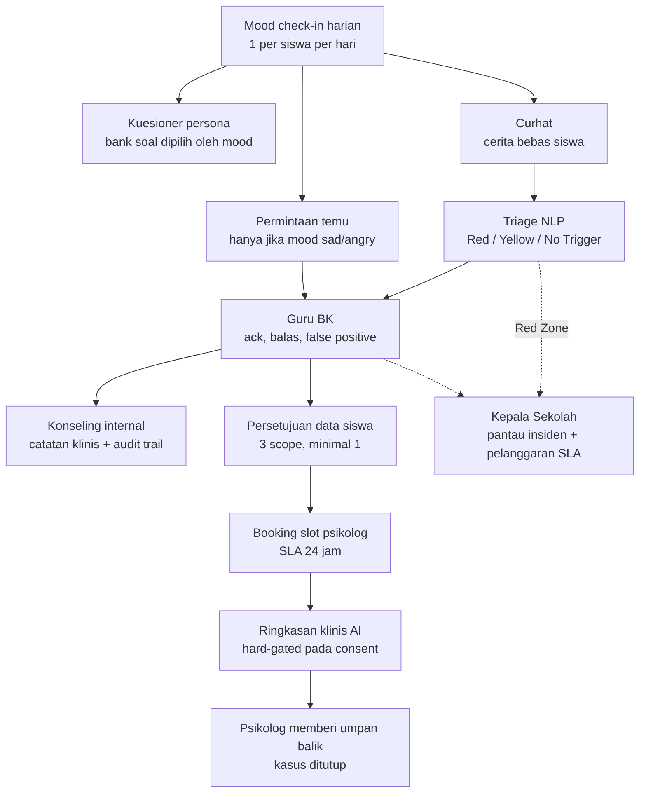

# Product Overview

<!-- verified: branch=dev commit=266f860 date=2026-10-09 scope=README.md,app,routes,config -->
> **Terverifikasi terhadap:** `dev` @ `266f860` · 2026-10-09
> **Sumber:** [`README.md`](../../README.md) · [`app/`](../../app/) · [`config/app.php`](../../config/app.php) · [`docs/tasks/`](../tasks/)

## Apa itu APPIKS

APPIKS.ID adalah platform pemantauan dan intervensi kesehatan mental siswa untuk SMA di Indonesia, dibangun oleh **Novaren Tech**. Repo ini adalah backend-nya.

Masalah yang diselesaikan: sekolah umumnya baru mengetahui seorang siswa sedang dalam krisis setelah terlambat. Guru BK tidak punya cara sistematis untuk menemukan siswa yang perlu perhatian di antara ratusan siswa, dan ketika sebuah kasus melampaui kapasitas sekolah, rujukan ke psikolog profesional dilakukan secara informal — tanpa jejak, tanpa persetujuan tertulis dari siswa, dan tanpa serah-terima informasi yang terstruktur.

Konteks kepatuhan yang disebut dalam spesifikasi internal ([`docs/tasks/`](../tasks/)) adalah **Permendikbudristek 46/2023** tentang pencegahan dan penanganan kekerasan di lingkungan satuan pendidikan.

Pendekatan APPIKS: ubah kebiasaan harian siswa menjadi sinyal, lalu alirkan sinyal itu ke orang yang berwenang menanganinya, dengan batas waktu yang terukur dan batas privasi yang eksplisit.

## Rantai intervensi

Secara ringkas: siswa mencatat mood tiap hari, yang menentukan asesmen persona mana yang disajikan dan apakah ia boleh meminta pertemuan. Ketika siswa menulis curhat, sebuah layanan NLP eksternal menilai tingkat risikonya dan menetapkan tenggat tindak lanjut — dua jam untuk Zona Merah, 72 jam untuk Zona Kuning. Guru BK menangani, membalas, atau menandai alert sebagai keliru. Kasus yang perlu penanganan terstruktur menjadi sesi konseling dengan catatan klinis terenkripsi dan jejak audit yang hanya bisa ditambah. Kasus yang melampaui kapasitas sekolah dirujuk ke Psikolog Mitra — tapi **tidak ada satu byte data siswa yang berpindah sebelum siswa memilih sendiri apa yang boleh dibagikan**. Kepala Sekolah memantau agregat dan pelanggaran tenggat, tanpa pernah membaca isi curhat.

Detail tiap alur ada di [`05-user-flows.md`](05-user-flows.md).

## Modul

| Modul | Inti | Dokumen |
|---|---|---|
| Mood ecosystem | Check-in harian, streak, rekap mingguan/bulanan, tren sekolah, export Excel | [`07-data-model/02`](07-data-model/02-wellbeing-and-assessment.md) |
| Kuesioner persona | Dua bank soal; jalur deterministik dan jalur hybrid AI | [`07-data-model/02`](07-data-model/02-wellbeing-and-assessment.md) |
| Curhat & triage NLP | Deteksi dini berbasis zona risiko dengan SLA | [`07-data-model/03`](07-data-model/03-sharing-triage-and-counseling.md) |
| Konseling & audit trail | Catatan klinis terenkripsi, riwayat perubahan append-only | [`07-data-model/03`](07-data-model/03-sharing-triage-and-counseling.md) |
| Rujukan & consent granular | Persetujuan berbasis scope, booking slot, ringkasan AI | [`07-data-model/04`](07-data-model/04-referral-and-consent.md) |
| Self-help | Empat latihan mandiri berbasis jurnal | [`07-data-model/05`](07-data-model/05-content-and-engagement.md) |
| Gamifikasi Cirrus | Hewan peliharaan awan: level, XP, Tetesan Air, streak | [`07-data-model/05`](07-data-model/05-content-and-engagement.md) |
| Konten edukasi | Video YouTube, artikel, quote tersinkron mood — per sekolah | [`07-data-model/05`](07-data-model/05-content-and-engagement.md) |
| Dashboard per role | Lima dashboard peran + Principal Awareness Dashboard | [`09-api-surface.md`](09-api-surface.md) |
| Administrasi | Provisioning akun, import Excel, master wilayah | [`02-actors-and-scoping.md`](02-actors-and-scoping.md) |

## Batas sistem

**Yang ada di repo ini:** sebuah REST API. Tidak ada `resources/`, tidak ada Blade, Inertia, Livewire, maupun `package.json`. Satu-satunya halaman web adalah dokumentasi OpenAPI yang dihasilkan runtime oleh Dedoc Scramble di `/docs`.

**Yang tidak ada di repo ini:** web Next.js 16 dan klien mobile — keduanya repo terpisah. Kontrak integrasinya ada di [`agent/technical-reference.md`](../../agent/technical-reference.md).

> Catatan: seluruh desain Figma berukuran desktop 1512px dan **tidak memuat layar mobile apa pun**, sementara `agent/technical-reference.md` menyebut ada klien mobile. Lihat [`12-ui-contract.md`](12-ui-contract.md). Pertentangan ini belum terselesaikan.

**Yang secara sengaja berada di luar lingkup produk:**

- **Diagnosis.** Sistem tidak pernah mendiagnosis. AI secara eksplisit dilarang menyebut label gangguan mental atau merekomendasikan terapi.
- **Telemedicine.** Tidak ada video call, chat, atau resep di dalam sistem. Sesi konseling terjadi di luar aplikasi; yang dicatat hanya metadata dan hasilnya.
- **Orang tua / wali sebagai pengguna.** Tidak ada role, tabel, atau endpoint untuk mereka. Pemberi persetujuan data selalu siswa sendiri. Desain mewajibkan pernyataan bahwa orang tua sudah dihubungi, tapi backend tidak merekamnya.
- **Riwayat asesmen per siswa.** Jawaban kuesioner tidak pernah disimpan — lihat invarian di bawah.
- **Registrasi mandiri dan reset password.** Akun di-provision top-down; tidak ada alur lupa password.

## Postur non-fungsional

| Aspek | Nilai | Konsekuensi |
|---|---|---|
| Stack | Laravel 12, PHP 8.4, MySQL | |
| Autentikasi | JWT (`tymon/jwt-auth`), guard `api`. `laravel/sanctum` terpasang tapi tidak dipakai | Claim identitas disuntikkan saat login dan merupakan **snapshot** — perubahan kelas atau Guru BK tidak tercermin sampai login ulang |
| Zona waktu & lokal | `Asia/Jakarta`, `locale=id`, `faker_locale=id_ID` | Semua perhitungan "hari ini" (mood harian, streak, SLA) memakai zona Jakarta |
| Queue | `database` | **Analisis NLP dan ringkasan AI tidak jalan tanpa worker.** Tanpa `queue:work`, curhat tetap tersimpan tapi tidak pernah ditriage |
| Scheduler | Dua command: `cutdown:clear` (10 menit), `referrals:expire-pending` (15 menit) | Tanpa `schedule:work`, booking tidak pernah kadaluarsa dan timer SLA tidak pernah dibersihkan |
| Multi-tenancy | Kolom `school_id`, **tanpa global scope** | Pemisahan antar sekolah manual di setiap controller. Satu filter yang terlewat membocorkan data sekolah lain |
| Desain kegagalan NLP | Fail-open | Layanan NLP mati → curhat tetap tersimpan, tapi tanpa prioritas dan tanpa SLA. Kasus kritis bisa lolos tanpa penanda |
| Email | Driver default `log` | Notifikasi tidak benar-benar terkirim di lingkungan default |
| Dokumentasi API | Dedoc Scramble, runtime | `/docs` dan `/api/docs.json` selalu sesuai kode |

## Invarian desain yang tidak boleh dilanggar

Tujuh aturan yang membentuk karakter sistem ini. Melanggar salah satunya mengubah produk, bukan hanya memperbaiki kode.

**1. Jawaban kuesioner tidak pernah disimpan.**
Pilihan siswa diubah menjadi kunci huruf (mis. `ABCDA`); hanya interpretasi AI yang di-cache di `ai_generated`, dan cache itu dipakai bersama oleh semua siswa yang menjawab sama. Artinya: tidak ada riwayat asesmen per siswa, dan tidak mungkin ada tanpa menambah tabel baru. Ini pilihan privasi sekaligus penghematan kuota API.

**2. Payload rujukan dan ringkasan AI dikunci pada consent yang granted.**
[`GenerateGeminiReferralSummaryJob`](../../app/Jobs/GenerateGeminiReferralSummaryJob.php) berhenti total kalau `latestConsent` bukan `granted`. Setiap modul data di dalam payload dikunci lagi pada scope-nya masing-masing. Identitas asli siswa hanya terbuka ke psikolog melalui endpoint yang mensyaratkan consent.

**3. AI dilarang mendiagnosis.**
System prompt di [`GenerateGeminiReferralSummaryJob.php:35-56`](../../app/Jobs/GenerateGeminiReferralSummaryJob.php) memuat lima aturan: hanya memakai fakta yang ada di payload, merangkum **hanya** kutipan Yellow dan Red Zone, **dilarang** melakukan diagnosis atau menyebut label gangguan, **dilarang** memberi rekomendasi tindakan atau terapi (CBT disebut eksplisit), wajib diakhiri disclaimer, dan keluarannya satu paragraf yang dibuka dengan `"Siswa kelas [Tingkat], dirujuk Guru BK dengan tingkat keparahan [...]"`. Output dipotong di 200 kata dengan cara yang menjaga disclaimer tetap utuh.

**4. Guru BK membalas curhat sekali saja.**
[`ReplySharingRequest::authorize`](../../app/Http/Requests/ReplySharingRequest.php) menolak balasan kedua. Balasan bukan percakapan — kalau butuh dialog, jalurnya adalah sesi konseling.

**5. Permintaan bertemu butuh mood negatif.**
`ReportPolicy::create` mensyaratkan `last_mood ∈ {sad, angry}`. Siswa yang belum check-in hari ini tidak bisa membuat permintaan sama sekali. Ini mengikat sinyal ke kebiasaan harian.

**6. `counseling_log_histories` hanya bisa ditambah.**
Tidak ada soft delete di tabel itu, dan barisnya ditulis otomatis oleh observer, bukan controller. Setiap perubahan catatan klinis menyimpan nilai lamanya beserta siapa yang mengubah. Ini jejak audit klinis.

**7. Kepala Sekolah tidak pernah membaca isi curhat.**
[`PrincipalDashboardController`](../../app/Http/Controllers/PrincipalDashboardController.php) sengaja hanya memilih kolom metadata — `title`, `description`, dan `reply` tidak pernah dikirim. Kepala Sekolah melihat bahwa ada insiden dan apakah tenggatnya terlampaui, bukan apa yang diceritakan siswa.

## Integrasi eksternal

| Layanan | Fungsi | Catatan |
|---|---|---|
| **Microservice NLP (Flask)** | Triage zona risiko dari teks curhat | Bukan LLM — penilaian berbasis kata kunci berbobot. Mengembalikan `{total_score, zone_status, matched_keywords}` |
| **Google Gemini — jalur A** | Ringkasan klinis rujukan (`gemini-3.1-flash-lite`) | Dikunci pada consent; memakai `GEMINI_API_KEY` langsung |
| **Google Gemini — jalur B** | Persona dan misi dari kuesioner (`gemini-2.0-flash`) | Memakai pool rotasi multi-API-key di tabel `gemini_api_token` |
| **YouTube Data API** | Metadata video otomatis | Admin hanya memasukkan id video |
| **Image compressor eksternal** | Kompresi thumbnail artikel | Lewat command terpisah |

Dua jalur Gemini sepenuhnya terpisah — model berbeda, mekanisme kunci API berbeda, dan tidak berbagi kode. Detailnya di [`10-architecture-and-integrations.md`](10-architecture-and-integrations.md).

## Status implementasi secara garis besar

Mood, self-help, konten, gamifikasi, dan konseling internal sudah mapan. Pipeline rujukan — consent, slot, booking, ringkasan AI — adalah area yang paling aktif dikerjakan sepanjang Juli–Oktober 2026, dan masih memuat beberapa bagian yang dirancang tapi belum terpasang:

- **Notifikasi Red Zone tidak pernah terkirim.** [`ZoneNotificationDispatcher`](../../app/Jobs/ZoneNotificationDispatcher.php) dan [`RedZoneAlertNotification`](../../app/Notifications/RedZoneAlertNotification.php) ada, tapi tidak ada kode yang memanggil job itu. `[PARTIAL]`
- **Penyamaran kata sensitif dimatikan.** Fungsinya ada; call site-nya dikomentari. `[PARTIAL]`
- **Consent tidak bisa dicabut.** Tidak ada state `revoked`. `[SPEC-ONLY]`
- **Siklus laporan via endpoint confirm/reschedule/close/cancel tidak bisa dijalankan** — guard-nya membandingkan dengan kosakata status lama. `[DEAD]`
- **Tidak ada test.** `tests/` dihapus di commit `266f860`.

Masing-masing dijelaskan di dokumen yang relevan, dengan label dan sitasi file.
