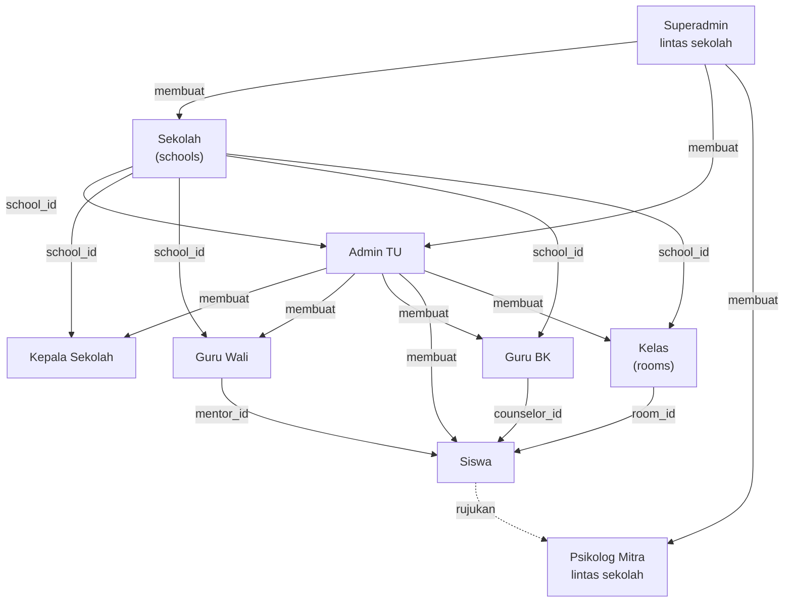
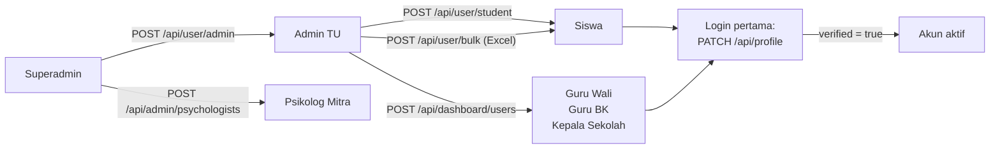

# Aktor & Scoping

<!-- verified: branch=dev commit=266f860 date=2026-10-09 scope=app/Enums/UserRole.php,app/Http/Requests,app/Models/User.php -->
> **Terverifikasi terhadap:** `dev` @ `266f860` · 2026-10-09
> **Sumber:** [`app/Enums/UserRole.php`](../../app/Enums/UserRole.php) · [`app/Models/User.php`](../../app/Models/User.php) · [`app/Http/Requests/`](../../app/Http/Requests/)

Siapa saja yang ada di sistem, bagaimana mereka terhubung, dan data siapa yang boleh mereka lihat. Untuk **apa** yang boleh mereka lakukan per endpoint, lihat [`03-authorization.md`](03-authorization.md).

Seluruh peran disimpan di satu kolom: `users.role`. Tidak ada tabel permission, tidak ada paket RBAC.

---

## Tujuh aktor

| Aktor | Enum case | Akunnya dibuat oleh | Tanggung jawab utama |
|---|---|---|---|
| **Siswa** | `UserRole::STUDENT` | Admin TU (satu per satu atau import Excel) | Mood check-in harian, mengisi kuesioner, menulis curhat, mengajukan pertemuan, memberi persetujuan data, memilih jadwal rujukan, self-help, Cirrus |
| **Guru BK** | `UserRole::COUNSELOR` | Admin TU | **Aktor pivotal.** Triage curhat dalam batas SLA, membalas, menandai false positive, menjadwalkan konseling, mencatat hasil konseling, memutuskan rujukan |
| **Guru Wali** | `UserRole::TEACHER` | Admin TU | Memantau pola mood dan riwayat self-help siswa yang diwalikannya. Peran paling pasif — tidak menangani kasus |
| **Kepala Sekolah** | `UserRole::HEADTEACHER` | Admin TU | Memantau insiden tingkat sekolah dan pelanggaran SLA. **Hanya metadata, tidak pernah melihat isi curhat** |
| **Admin TU** | `UserRole::ADMIN` | Superadmin | Menyediakan akun staf & siswa, mengelola kelas, mengelola seluruh konten edukasi sekolahnya |
| **Psikolog Mitra** | `UserRole::PSYCHOLOGIST` | Superadmin | Mempublikasikan slot konsultasi, menerima atau menjadwalkan ulang rujukan masuk, membaca ringkasan klinis AI, memberi catatan & umpan balik |
| **Superadmin** | `UserRole::SUPER` | Seeder (tidak ada endpoint) | Mengelola sekolah dan akun psikolog mitra lintas sekolah |

**Orang tua / wali bukan aktor sistem.** Tidak ada role, tabel, maupun endpoint untuk mereka. Pemberi persetujuan data selalu siswa sendiri. `[SPEC-ONLY]` Desain Figma memuat pernyataan wajib "Orang tua/wali siswa telah dihubungi dan menyetujui proses pengajuan rujukan konseling" sebelum rujukan diajukan — backend tidak merekam pernyataan itu dalam bentuk apa pun.

---

## Graf relasi aktor

Garis putus-putus adalah satu-satunya jalur keluar dari batas sekolah: rujukan. Psikolog mitra tidak punya `school_id`.

---

## Kolom scoping

Lima kolom di `users` menentukan siapa melihat apa. Semuanya nullable, dan beberapa di antaranya memang harus diisi agar fitur berjalan.

| Kolom | Diisi oleh | Fungsinya | Yang rusak kalau null |
|---|---|---|---|
| `school_id` | Pembuat akun | Batas tenancy. Hampir semua query daftar memfilter dengan ini. | Pengguna "tanpa sekolah". Query yang memfilter `school_id` akan mengembalikan kosong, atau — kalau filternya lupa ditulis — mengembalikan data semua sekolah |
| `room_id` | Admin TU, lewat **`rooms.code`** bukan id | Menentukan kelas siswa, dipakai untuk filter dan label `Kelas {level} {name}` | Siswa tidak muncul di daftar per kelas; `student_grade` di payload rujukan jadi `N/A` |
| `mentor_id` | Admin TU, lewat **NIP Guru Wali** | Menghubungkan siswa ke wali kelasnya | Guru Wali tidak melihat siswa itu sama sekali — `mentored()` kosong |
| `counselor_id` | Admin TU, lewat **NIP Guru BK** | Menghubungkan siswa ke Guru BK penanggung jawabnya | **Paling berdampak.** Curhat siswa tidak masuk antrean triage siapa pun, dan nomor kontak BK tidak bisa dikembalikan saat siswa menulis curhat |
| `verified` | Sistem, saat login pertama selesai | Menandai profil sudah dilengkapi | `false` berarti pengguna masih memakai password default bersama |

Catatan penting: saat membuat siswa, API menerima **identifier dan kode**, bukan ID numerik — `mentor_id` dan `counselor_id` divalidasi dengan `exists:users,identifier`, dan `room_id` dengan `exists:rooms,code`. Lihat [`CreateStudentRequest`](../../app/Http/Requests/CreateStudentRequest.php).

### Tidak ada global scope

`grep -rn addGlobalScope app/` tidak menghasilkan apa pun. Pemisahan antar sekolah **tidak otomatis** — setiap controller harus memfilter `school_id` sendiri. Satu query daftar yang lupa memfilter akan membocorkan data sekolah lain, dan tidak ada lapisan yang menangkapnya. Ini hal paling penting untuk diingat saat menambah endpoint baru.

---

## Provisioning akun

Tidak ada registrasi publik, tidak ada OTP, dan **tidak ada alur lupa password**. Tabel `password_reset_tokens` ada tapi tidak dipakai. Akun selalu dibuat dari atas ke bawah.

Siapa boleh membuat siapa, ditegakkan di `FormRequest::authorize()`:

| Request | Syarat | Batasan |
|---|---|---|
| [`CreateAdminRequest`](../../app/Http/Requests/CreateAdminRequest.php) | `role == super` | `identifier` 16–25 digit, `school_id` wajib ada |
| [`CreateUserRequest`](../../app/Http/Requests/CreateUserRequest.php) | `role == admin` | `identifier` tepat 18 digit, `role` dibatasi `teacher`, `headteacher`, `counselor` — jadi Admin TU **tidak bisa** membuat admin atau super |
| [`CreateStudentRequest`](../../app/Http/Requests/CreateStudentRequest.php) | `role == admin` | `identifier` tepat 10 digit (NISN). **Tanpa field password** — siswa memakai password default |

> **Cacat validasi.** Di [`CreateUserRequest`](../../app/Http/Requests/CreateUserRequest.php), aturan untuk `phone` adalah `unique:users,username` — memeriksa keunikan terhadap kolom **`username`**, bukan `phone`. Akibatnya nomor telepon duplikat bisa lolos, sementara nomor yang kebetulan sama dengan sebuah username akan ditolak. Dicatat apa adanya; tidak diubah di pass dokumentasi ini.

### Login pertama wajib

[`UserFirstLoginRequest`](../../app/Http/Requests/UserFirstLoginRequest.php) meng-`authorize()` dengan `!Auth::user()->verified` — jadi endpoint `PATCH /api/profile` hanya bisa dipakai sekali. Setelah itu responsnya: *"Kamu sudah merubah profile"*.

Yang wajib diganti: `password` (minimal 8 karakter, harus memuat huruf kecil, huruf besar, dan angka), `username` (unik), dan `phone` (unik, 10–15 digit). Setelah berhasil, `verified` menjadi `true`.

> `[SPEC-ONLY]` Tidak ada desain Figma untuk layar login pertama maupun lupa password — hanya ada layar login dan sebuah tautan "Forgot password?" di form login psikolog yang tidak menuju ke mana-mana di backend.

### Password default

Kolom `password` di migrasi `users` punya default berupa hash dari `config('app.default_password')` (`DEFAULT_PASSWORD`, nilai bawaan `password`). Artinya baris user yang dibuat tanpa menyertakan password **tetap bisa login** memakai password bersama itu. Siswa yang dibuat lewat `POST /api/user/student` dan import Excel berada dalam kondisi ini sampai login pertama diselesaikan.

Konsekuensinya: **`verified = false` setara dengan "akun ini masih bisa diakses siapa pun yang tahu password default dan username-nya".** Pertimbangkan ini saat mengekspos daftar username.

---

## Psikolog Mitra: dua lapis identitas

Psikolog adalah satu-satunya aktor yang butuh dua baris data:

1. Baris di `users` dengan `role = psychologist`. `username` diisi email, `identifier` diisi nomor STR.
2. Baris di `psychologist_profiles` dengan `str_number`, `institution_name`, `specialization`, `phone_number`, `is_active`.

Tanpa baris profil, seluruh endpoint psikolog menolak dengan 403 dan pesan *"Hanya psikolog yang dapat mengakses halaman ini."*

Ini juga sumber jebakan `psychologist_id` yang dibahas di [`07-data-model/README.md`](07-data-model/README.md): slot menunjuk ke **profil**, sedangkan konseling menunjuk ke **user**.

`is_active` dikendalikan superadmin lewat `PATCH /api/admin/psychologists/{psychologist}/toggle`.

---

## Identitas di JWT

Login menghasilkan token yang **sudah memuat identitas pengguna sebagai claim** — frontend membaca peran langsung dari token tanpa memanggil `GET /api/me`.

Claim yang disuntikkan: `name`, `username`, `identifier`, `role`, `verified`, `room` (nama kelas), `mentor` (nama Guru Wali), `school` (nama sekolah).

Dua hal yang perlu diketahui:

1. Claim ini ditambahkan di [`app/Actions/LoginAction.php`](../../app/Actions/LoginAction.php) melalui `Auth::claims(...)->attempt(...)`, **bukan** di model. `User::getJWTCustomClaims()` mengembalikan array kosong. Jalur kode lain yang menerbitkan token akan menghasilkan token tanpa claim tersebut.
2. Claim adalah **snapshot saat login**. Kalau Admin TU memindahkan siswa ke kelas lain atau mengganti Guru BK-nya, token yang sudah beredar tetap memuat nilai lama sampai pengguna login ulang.

Masa hidup token diatur `JWT_TTL`; tidak ada mekanisme refresh token menurut [`agent/RULE_OF_ARCHITECT.md`](../../agent/RULE_OF_ARCHITECT.md) §5, meskipun endpoint `POST /api/refresh` ada.
