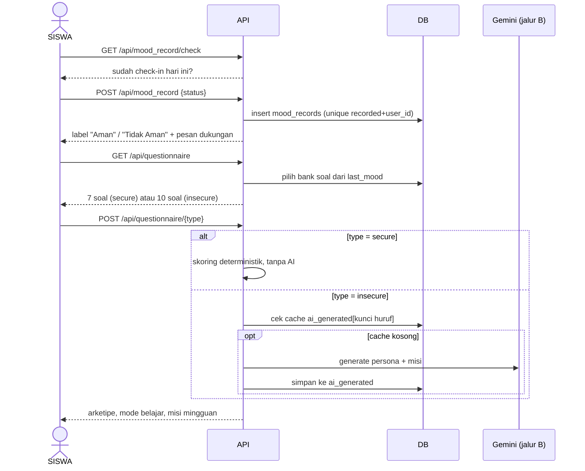
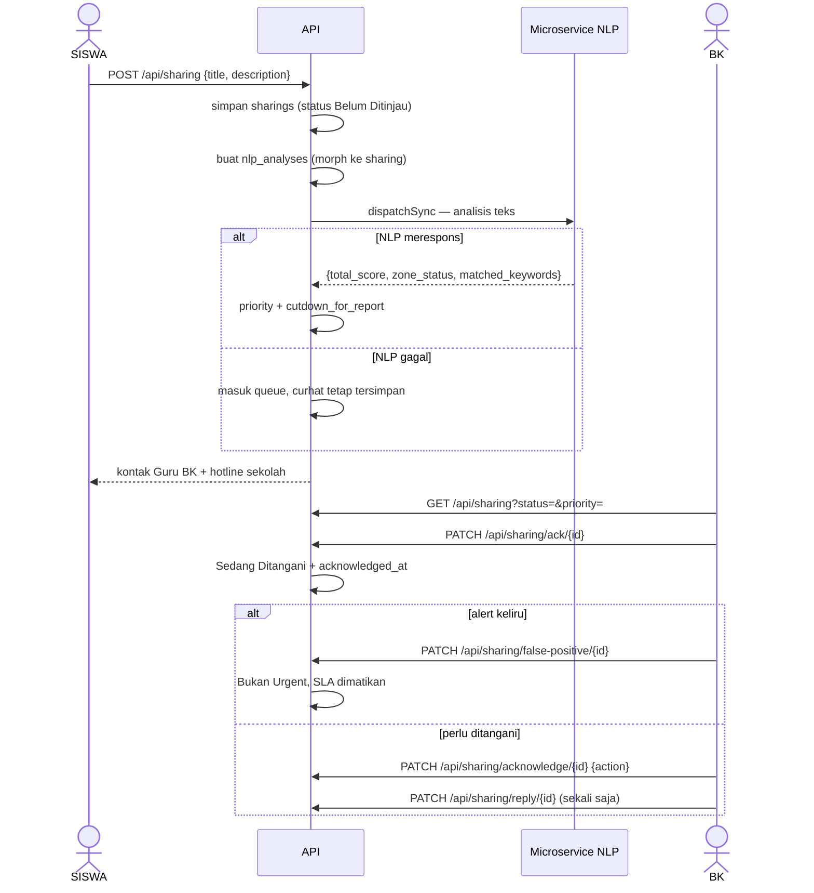
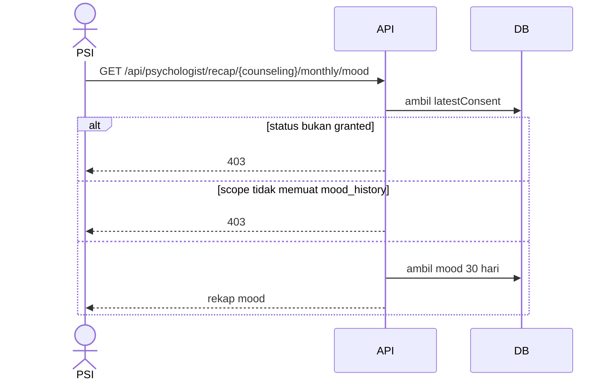
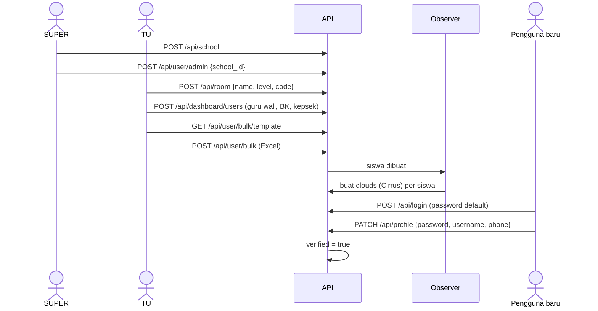
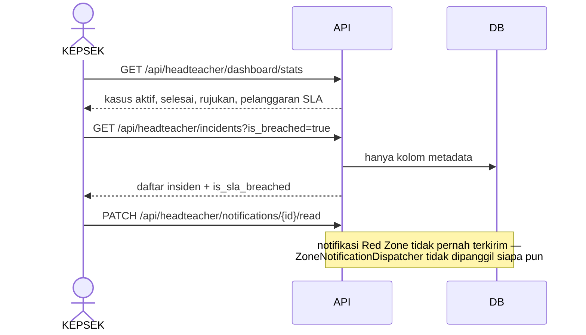

# User Flows

<!-- verified: branch=dev commit=266f860 date=2026-10-09 scope=app/Http/Controllers,app/Actions,app/Jobs,app/Observers,app/Console/Commands -->
> **Terverifikasi terhadap:** `dev` @ `266f860` · 2026-10-09
> **Sumber:** controller, action, job, dan observer yang disitasi di masing-masing alur

Dokumen ini menjelaskan **serah-terima antar orang** — bagaimana satu kasus berpindah tangan dari siswa ke Guru BK ke psikolog, dan apa yang terjadi di sistem pada setiap perpindahan. Untuk daftar tugas satu aktor, lihat [`06-user-activities.md`](06-user-activities.md).

> **Dua tingkat keyakinan.** Urutan **pemanggilan API** dan efek sampingnya terverifikasi dari kode. Urutan **layar** hanya inferensi: file Figma tidak memuat data prototype yang bisa dibaca, jadi urutan screen disusun dari nama frame, posisi, dan copy tombol. Lihat [`12-ui-contract.md`](12-ui-contract.md). Nama screen disertakan sebagai penunjuk, bukan sebagai spesifikasi navigasi.

Peran dalam diagram: `SISWA` · `BK` (Guru BK) · `PSI` (Psikolog Mitra) · `KEPSEK` · `TU` (Admin TU) · `SUPER` · `SYS` (job, observer, scheduler).

---

## FLOW-1 · Mood check-in harian → kuesioner persona

**Pemicu:** siswa membuka aplikasi. **Aktor:** siswa saja.



**Langkah dan efeknya**

| # | Endpoint | Yang terjadi |
|---|---|---|
| 1 | `GET /api/mood_record/check` · `/today` · `/streaks` | Baca status check-in hari ini dan streak |
| 2 | `POST /api/mood_record` | [`MoodRecordSendRequest`](../../app/Http/Requests/MoodRecordSendRequest.php) menolak kalau sudah check-in hari ini. Respons memuat label dari `MoodStatus::label()` dan pesan acak dari [`app/Data/MoodResponses.php`](../../app/Data/MoodResponses.php) |
| 3 | `GET /api/questionnaire` | **Bank soal dipilih oleh mood hari itu**, bukan oleh parameter: `MoodStatus::from($user->last_mood)->isSecure()` |
| 4 | `POST /api/questionnaire/{type}` | [`ConvertAnswersToAlphabetAction`](../../app/Actions/ConvertAnswersToAlphabetAction.php) mengubah teks jawaban kembali menjadi huruf A–D |
| 5a | jalur `secure` | [`AnalyzeSecureQuestionnaireAction`](../../app/Actions/AnalyzeSecureQuestionnaireAction.php) — tally A/B/C/D ke empat arketipe (`The Strategist`, `The Advocate`, `The Innovator`, `The Builder`), ambil primer + sekunder. **Tanpa AI**, seluruh interpretasi hardcoded |
| 5b | jalur `insecure` | [`AnalyzeInsecureQuestionnaireAction`](../../app/Actions/AnalyzeInsecureQuestionnaireAction.php) memecah ke tiga: soal 1–5 → persona lewat Gemini (`The Sage (Sang Bijak)` dan tiga lainnya), soal 6–8 → mode belajar deterministik (Auditori/Visual/Kinestetik), soal 9–10 → bahan bakar motivasi + dua misi mingguan lewat Gemini |

**Yang tidak terjadi:** tidak ada baris jawaban yang disimpan. Tidak ada job, event, atau notifikasi. Siswa yang mencatat `angry` tiga puluh hari berturut-turut **tidak memicu apa pun** — hanya curhat yang memicu triage.

**Cabang kegagalan:** kalau Gemini gagal atau kuncinya kosong, jalur `insecure` bergantung pada cache; entri cache yang masih `null` akan menghasilkan interpretasi kosong. `php artisan generate:archtype` ada untuk memanaskan cache, tapi entri schedulernya dikomentari.

**Screen terkait (inferensi):** `Mood Check In #279:837` → `isi angket #279:1863` → `Isi Angket - Hasil #883:15879` → `Misi Eksplorasi #899:16227` → `Quote Of The Day #603:25237`. Komponen `Stepper` di design system punya varian persis tiga langkah ini.

**Urutan panggilan untuk frontend:** `mood_record/check` → `POST mood_record` → `GET questionnaire` → `POST questionnaire/{type}` → `GET quote/mood`.

---

## FLOW-2 · Curhat → triage NLP → tindak lanjut Guru BK

**Pemicu:** siswa menulis curhat. **Aktor:** siswa, sistem, Guru BK. Ini alur paling penting di produk.



**Pemetaan triage** ([`ProcessNlpAnalysisJob`](../../app/Jobs/ProcessNlpAnalysisJob.php)):

| `zone_status` | `priority` | `cutdown_for_report` |
|---|---|---|
| `Red Zone` | `tinggi` | `now() + 2 jam` |
| `Yellow Zone` | `sedang` | `now() + 72 jam` |
| `No Trigger` | `rendah` | `now()` + status → `Belum Ditanggapi` |

**Tiga keputusan tindak lanjut** pada `PATCH /api/sharing/acknowledge/{sharing}`:

| `action` | Status curhat menjadi |
|---|---|
| `konseling_mandiri` | `Sedang Ditangani` — berlanjut ke FLOW-3 atau FLOW-4 |
| `penanganan_medis` | `Diselesaikan` — dirujuk ke IGD/faskes di luar sistem |
| `lainnya` | `Diselesaikan` |

**Detail penting yang mudah terlewat**

- **Siswa tanpa Guru BK tidak bisa curhat sama sekali.** [`CreateSharingRequest::passedValidation`](../../app/Http/Requests/CreateSharingRequest.php) membaca `Auth::user()->counselor->name`, dan controller menyusun respons dari `$sharing->user->counselor->name` dan `->phone`. Kalau `counselor_id` null, keduanya error — bukan 4xx yang rapi, tapi kegagalan tipe. Mengisi `counselor_id` adalah prasyarat fungsional, bukan sekadar kerapian data.
- **Analisis NLP berjalan inline.** `dispatchSync` dipanggil di dalam request, jadi siswa menunggu layanan NLP merespons. Hanya kalau itu gagal, job masuk queue.
- **Fail-open punya konsekuensi nyata.** Saat NLP mati, curhat tersimpan tanpa prioritas dan **tanpa `cutdown_for_report`** — jadi kasus Zona Merah bisa masuk antrean tanpa tenggat dan tanpa penanda apa pun.
- **Respons sukses selalu memuat kontak darurat**: nama dan nomor Guru BK, digabung dengan `schools.emergency_contacts` (hotline `119`). Ini ditampilkan apa pun zonanya.
- **`ack` dan `acknowledge` adalah dua endpoint berbeda** dengan nama yang hampir sama. `ack` hanya menandai sedang ditangani dan menghentikan jam SLA Kepala Sekolah; `acknowledge` mencatat keputusan tindak lanjut.
- **Balasan hanya sekali.** Percobaan kedua ditolak oleh `authorize()`.
- **Hanya `false-positive` yang dibatasi state.** Transisi lain tidak memeriksa status saat ini — balasan ke curhat yang sudah ditutup tetap diterima.

**Screen terkait (inferensi):** `siswa curhat #5505:53469` → modal zona (`Red Zone Detected #5505:53600` / `Yellow Zone #5505:54339` / `Zona Aman #5505:53814`) → `Lihat Kontak Bantuan #4852:31147`. Sisi BK: `zona merah - kritis #4049:32424` → `Mulai Penanganan Kasus? #4108:33264` → `4 Keputusan Tindak Lanjut #5448:13161`.

---

## FLOW-3 · Permintaan temu → konseling internal → catatan klinis

**Pemicu:** siswa dengan mood negatif meminta bertemu, atau Guru BK menjadwalkan dari sebuah laporan. **Aktor:** siswa, Guru BK.

```mermaid
%% Sumber: app/Http/Controllers/ReportController.php, CounselingController.php,
%% app/Actions/ScheduleReportCounselingAction.php, StoreCounselingLogAction.php,
%% app/Observers/CounselingLogObserver.php
sequenceDiagram
    actor SISWA
    participant API
    actor BK
    participant SYS as Observer

    SISWA->>API: POST /api/report {topic, date, time}
    Note over API: ditolak kalau last_mood bukan sad/angry
    API->>API: reports: Belum Ditinjau; event ReportCreated
    SYS->>API: curhat siswa hari ini → priority tinggi
    BK->>API: POST /api/report/{id}/schedule-meeting
    API->>API: counselings: menunggu, source_type nlp_incident
    API->>API: curhat tertaut → Menunggu Persetujuan Siswa
    SISWA->>API: PATCH /api/student/counselings/{id}/acknowledge
    alt accept
        API->>API: counseling dijadwalkan; curhat Konseling Dijadwalkan
    else decline
        API->>API: counseling ditolak; curhat Jadwal Ditolak Siswa
    end
    Note over BK,SISWA: sesi berlangsung di luar sistem
    BK->>API: POST /api/counseling-logs
    API->>API: CounselingLog (clinical_notes terenkripsi)
    API->>API: counseling selesai + resolution + method
    API->>API: report tertaut → Diselesaikan
    SYS->>API: setiap edit catatan → counseling_log_histories
```

**Langkah dan efeknya**

| # | Endpoint | Catatan |
|---|---|---|
| 1 | `POST /api/report` | `ReportPolicy::create` mensyaratkan `last_mood ∈ {sad, angry}`. Memicu `ReportCreated` → [`UpdateRelatedSharingPriority`](../../app/Listeners/UpdateRelatedSharingPriority.php) yang menaikkan prioritas **semua** curhat siswa itu hari ini menjadi `tinggi` — tanpa menyentuh `cutdown_for_report`, jadi prioritas naik tanpa tenggat |
| 2 | `POST /api/report/{report}/schedule-meeting` | Boleh oleh super, admin, kepala sekolah, atau Guru BK yang ditugaskan. Membuat counseling `type=internal`, `source_type=nlp_incident`, status `menunggu`. Status laporan **tidak berubah** |
| 3 | `PATCH /api/student/counselings/{counseling}/acknowledge` | ⚠️ **Tanpa pemeriksaan otorisasi** — siapa pun yang terautentikasi bisa menyetujui atau menolak konseling mana pun. Lihat [`03-authorization.md`](03-authorization.md) |
| 4 | `POST /api/counseling-logs` | Hanya Guru BK yang ditugaskan. Menulis catatan klinis terenkripsi, `resolution`, `method`; menutup counseling dan laporan tertaut |

**Resolusi menentukan ke mana kasus pergi.** [`CounselingResolution`](../../app/Enums/CounselingResolution.php) punya tiga nilai; `'Perlu Rujukan Professional'` adalah sinyal bahwa kasus perlu FLOW-4. Dua lainnya menutup kasus.

**Audit trail bekerja diam-diam.** [`CounselingLogObserver::updating`](../../app/Observers/CounselingLogObserver.php) menyimpan nilai lama `clinical_notes` setiap kali diubah, beserta `updated_by`. Tidak ada controller yang menulis ke `counseling_log_histories`, dan tabelnya tidak punya soft delete.

> **Jangan pakai endpoint confirm/reschedule/close/cancel pada laporan.** Keempatnya `[DEAD]` — guard-nya membandingkan status dengan kosakata lama (`'menunggu'`, `'disetujui'`, `'dijadwalkan'`) yang bukan nilai `ReportStatus`, sehingga selalu 403. Laporan maju lewat `schedule-meeting` dan ditutup lewat `counseling-logs`. Lihat [`08-state-machines.md`](08-state-machines.md).

---

## FLOW-4 · Rujukan eksternal end-to-end

**Pemicu:** Guru BK menilai kasus melampaui kapasitas sekolah. **Aktor:** Guru BK, siswa, psikolog, sistem. Alur terpanjang dan paling sensitif.

```mermaid
%% Sumber: app/Observers/CounselingObserver.php, app/Actions/UpdateConsentAction.php,
%% GetAvailableDatesAction.php, CreateBookingScheduleAction.php,
%% app/Actions/Psychologist/DecideReferralAction.php, app/Jobs/GenerateGeminiReferralSummaryJob.php
sequenceDiagram
    actor BK
    actor SISWA
    actor PSI
    participant API
    participant SYS as Job & Scheduler

    BK->>API: POST /api/counseling {psychologist_id, reason}
    API->>API: type=external; observer buat consent pending
    API->>API: curhat tertaut → Menunggu Persetujuan Siswa
    SISWA->>API: GET /api/student/counselings/{id}/consent
    SISWA->>API: PATCH /api/student/consents/{id} {is_granted, scopes[]}
    API->>API: granted + scopes, atau rejected + scopes dinolkan
    SISWA->>API: GET .../available-dates (slot >= H+2)
    SISWA->>API: GET .../available-slots?date=
    SISWA->>API: POST /api/student/bookings {slot_id}
    API->>API: lockForUpdate; booking pending; deadline +24 jam
    par Tenggat 24 jam berjalan
        SYS->>API: referrals:expire-pending tiap 15 menit
    and Psikolog memutuskan
        PSI->>API: PATCH /api/psychologist/referrals/{booking}/decide
    end
    alt confirm
        API->>API: booking + slot confirmed
        API->>SYS: GenerateGeminiReferralSummaryJob
        SYS->>SYS: abort kalau consent bukan granted
        SYS->>API: clinical_summaries (summary_data + raw_payload)
    else reschedule
        API->>API: booking lama rejected + reject_reason
        API->>API: booking BARU langsung confirmed
    else lewat tenggat
        SYS->>API: booking expired; slot kembali available
    end
    PSI->>API: GET /api/psychologist/referrals/{counseling}/summary
    PSI->>API: POST .../feedback {clinical_notes, rating}
    API->>API: booking finished, counseling selesai, curhat Diselesaikan
```

**Langkah, guard, dan efek**

| # | Langkah | Guard | Efek samping |
|---|---|---|---|
| 1 | Guru BK membuat rujukan | `CreateCounselingRequest` — hanya counselor; `reason` wajib bila ada `psychologist_id` | [`CounselingObserver`](../../app/Observers/CounselingObserver.php) membuat consent `pending` **dan** membalik curhat ke `Menunggu Persetujuan Siswa` |
| 2 | Siswa membaca permintaan consent | `CounselingPolicy::viewStudent` — siswa, psikolog, atau konselor pada kasus itu | — |
| 3 | Siswa memberi persetujuan | `CounselingConsentPolicy::update` — hanya siswa pemilik; minimal 1 scope | `granted` menulis `scopes` + `granted_at`; `rejected` **menolkan `scopes`** + `rejected_at` |
| 4 | Siswa menelusuri slot | controller: milik sendiri, `type=external` | [`GetAvailableDatesAction`](../../app/Actions/GetAvailableDatesAction.php) hanya menawarkan slot `slot_date >= now()+2 hari` yang belum punya booking `pending`/`confirmed` |
| 5 | Siswa mengajukan booking | sama | [`CreateBookingScheduleAction`](../../app/Actions/CreateBookingScheduleAction.php) memakai `lockForUpdate()` agar tidak ada dua siswa merebut slot sama; `deadline_at = now()+24 jam`; memicu `BookingScheduleCreated` (**tanpa listener**) |
| 6a | Psikolog konfirmasi | `BookingSchedulePolicy::decide` + status harus `pending` | Booking dan slot → `confirmed`; [`GenerateGeminiReferralSummaryJob`](../../app/Jobs/GenerateGeminiReferralSummaryJob.php) dijalankan |
| 6b | Psikolog mengajukan jadwal lain | `decide` | Booking lama `rejected` + `reject_reason`; **booking baru dibuat langsung `confirmed`** |
| 6c | Tenggat lewat | `deadline_at <= now()` dan status `pending` | Booking `expired`, slot kembali `available`, memicu `BookingExpired` (**tanpa listener**) |
| 7 | Psikolog membaca ringkasan | psikolog yang ditugaskan + consent `granted` | Identitas asli siswa (nama, NISN, kelas) terbuka di sini |
| 8 | Psikolog memberi umpan balik | sama | Menutup empat record sekaligus: booking `finished`, counseling `selesai`, curhat `Diselesaikan`, dan menyimpan catatan + rating di `clinical_summaries` |

**Apa yang benar-benar dikirim ke AI.** [`ReferralPayloadBuilder`](../../app/Services/ReferralPayloadBuilder.php) selalu menyertakan metadata ter-pseudonimisasi (`ref_` dan `stu_` + potongan md5, tingkat kelas, tingkat keparahan, daftar scope yang diberikan dan yang ditahan), lalu menambahkan modul data **hanya untuk scope yang diizinkan**. Scope yang ditahan muncul sebagai array kosong plus entri di `not_shared_categories`.

| Scope | Modul yang terbuka |
|---|---|
| `mood_history` | Distribusi mood 30 hari + streak "tidak aman" maksimum dan terkini |
| `sharing_history` | Kutipan curhat 30 hari dengan zonanya + jumlah Red/Yellow |
| `assesment_logs` | Catatan asesmen Guru BK + riwayat intervensi aktif |

**Tiga hal yang perlu diketahui tentang alur ini**

1. **`[GAP]` Reschedule melewati siswa.** Booking pengganti dibuat sudah `confirmed`, dengan `deadline_at` sengaja di masa lalu. Siswa tidak pernah menyetujui jadwal baru, padahal desain menggambarkan jabat tangan dua arah ("Psikolog mengajukan perubahan jadwal" → siswa menyetujui/menolak).
2. **`[PARTIAL]` Penyamaran kata sensitif dimatikan.** Field tetap bernama `masked_text`, tapi call site `maskDynamicNlpKeywords()` dikomentari di [`ReferralPayloadBuilder.php:81`](../../app/Services/ReferralPayloadBuilder.php) — isinya curhat verbatim. Ini konsisten dengan prompt sistem yang memerintahkan "tanpa melakukan penyamaran kata sensitif", tapi nama field-nya kini menyesatkan.
3. **`[SPEC-ONLY]` Consent tidak bisa dicabut.** Tidak ada state `revoked`, tidak ada endpoint. Setelah diberikan, akses psikolog tidak bisa ditarik lewat API.

**Juga: tidak ada yang diberi tahu apa pun.** Keempat event di alur ini (`BookingScheduleCreated`, `BookingExpired`, `CounselingScheduled`, `CounselingLogStored`) tidak punya listener. Siswa yang booking-nya kadaluarsa tidak mendapat pemberitahuan — ia hanya akan melihatnya saat membuka aplikasi lagi.

**Screen terkait (inferensi):** `Rujukan Psikolog #5609:38502` → `Review Persetujuan #5609:38576` → `Persetujuan Berhasil #5609:38649` → `Pilih Jadwal Konsultasi #5609:38900` → `ConfirmationModal #5609:39132` → `Jadwal Berhasil Dibuat #5609:38679` → `Menunggu Konfirmasi #5609:39236` → `Terkonfirmasi #5609:39306` → `Rujukan selesai #5613:41781`. Cabang: `Psikolog mengajukan perubahan jadwal #5609:39677`.

---

## FLOW-5 · Penegakan consent saat psikolog membaca data

**Pemicu:** psikolog membuka rekap bulanan. Alur pendek tapi penting — ini titik tempat privasi benar-benar ditegakkan.



Dua titik penegakan, **independen satu sama lain**:

| Titik | Melindungi | Mekanisme |
|---|---|---|
| [`ReferralPayloadBuilder`](../../app/Services/ReferralPayloadBuilder.php) | Apa yang dikirim ke Gemini | Setiap modul dibungkus pemeriksaan scope |
| `PsychologistSummaryController::authorizeConsentScope` | Apa yang dibaca psikolog langsung | `abort(403)` per endpoint |

| Endpoint | Scope wajib |
|---|---|
| `GET .../monthly/mood` | `mood_history` |
| `GET .../monthly/sharing` | `sharing_history` |
| `GET .../monthly/counseling` | `assesment_logs` |

Karena keduanya terpisah, memperbaiki salah satu **tidak** melindungi yang lain. Menambah modul data baru berarti menambah guard di dua tempat.

---

## FLOW-6 · Provisioning & onboarding

**Pemicu:** sekolah baru bergabung. **Aktor:** Superadmin, Admin TU, pengguna baru.



**Detail yang menentukan keberhasilan onboarding**

- **Urutannya mengikat.** Sekolah → kelas → staf → siswa. Membuat siswa butuh NIP Guru Wali dan NIP Guru BK yang **sudah ada**, serta `code` kelas — divalidasi dengan `exists:users,identifier` dan `exists:rooms,code`, bukan dengan ID.
- **Siswa dibuat tanpa password.** Kolomnya punya default berupa hash `DEFAULT_PASSWORD`. Jadi setiap akun dengan `verified = false` bisa diakses siapa pun yang tahu username dan password default itu.
- **Login pertama wajib dan sekali pakai.** `PATCH /api/profile` hanya lolos saat `verified` masih false.
- **`counselor_id` adalah prasyarat fungsional.** Siswa tanpa Guru BK tidak bisa mengirim curhat — lihat FLOW-2.
- **Template Excel bisa diunduh tanpa login.** `GET /api/user/bulk/template` berada di luar `auth:api`.
- **Cirrus dibuatkan otomatis** oleh [`UserObserver`](../../app/Observers/UserObserver.php). Siswa yang disisipkan langsung lewat SQL tidak punya Cirrus dan endpoint game-nya akan gagal.
- **Tidak ada desain untuk login pertama maupun lupa password**, dan tidak ada alur reset password di API.

---

## FLOW-7 · Pemantauan Kepala Sekolah

**Pemicu:** Kepala Sekolah membuka dashboard. **Aktor:** Kepala Sekolah.



**Yang dilihat dan tidak dilihat.** `incidents` sengaja memilih kolom metadata saja — `title`, `description`, dan `reply` tidak pernah dikirim. Kepala Sekolah tahu **bahwa** ada insiden, prioritasnya, siapa Guru BK yang menangani, dan apakah tenggatnya terlampaui. Ia tidak tahu apa yang diceritakan siswa. `is_sla_breached` dihitung sebagai insiden yang belum di-`ack` selama ≥ 2 jam.

Filter yang tersedia: `?page`, `?per_page`, `?name`, `?status` (menerima alias Indonesia yang longgar), `?is_breached`, dan `?counselor_name` / `?counselor` / `?assigned_counselor`.

> **`[PARTIAL]` Jalur notifikasi tidak tersambung.** [`ZoneNotificationDispatcher`](../../app/Jobs/ZoneNotificationDispatcher.php) menyusun penerima (Guru BK yang ditugaskan + semua kepala sekolah di sekolah yang sama) dan mengirim [`RedZoneAlertNotification`](../../app/Notifications/RedZoneAlertNotification.php) lewat channel `database` dan `mail`. **Tidak ada kode yang memanggil job ini.** Jadi tabel `notifications` hanya terisi lewat seeder atau pemanggilan manual, dan endpoint read-receipt bekerja pada data yang tidak pernah dibuat. Driver mail juga default `log`.

Praktisnya: Kepala Sekolah harus membuka dashboard untuk mengetahui ada kasus kritis. Tidak ada yang mendorong informasi itu kepadanya.

---

## Alur yang tidak ada

Supaya jelas apa yang bukan sekadar belum terdokumentasi:

| Alur | Status |
|---|---|
| Pencabutan consent oleh siswa | `[SPEC-ONLY]` — dispesifikasikan di `AND-1`, tidak ada di kode |
| Push notification / WhatsApp / SMS | Tidak ada integrasi apa pun |
| Reset atau lupa password | Tidak ada. Tabel `password_reset_tokens` tidak dipakai |
| Pemantauan isi jurnal self-help | Jurnal tidak pernah dianalisis NLP, padahal teksnya bebas |
| Alert dari pola mood | Mood tidak memicu apa pun; hanya curhat yang memicu |
| Persetujuan ulang siswa atas jadwal usulan psikolog | `[GAP]` — lihat FLOW-4 |
| Penandaan false negative pada NLP | Hanya seeder yang bisa menulisnya; tidak ada endpoint |
