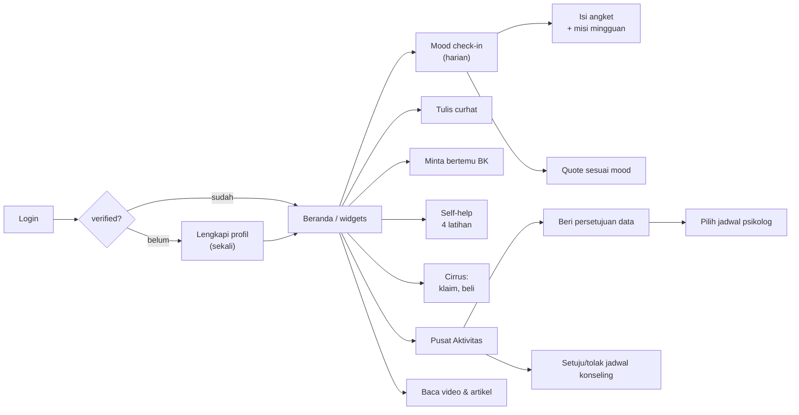
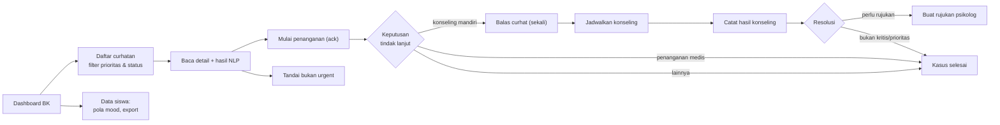
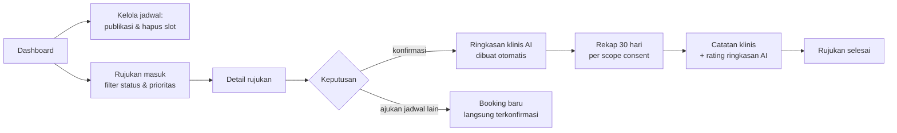
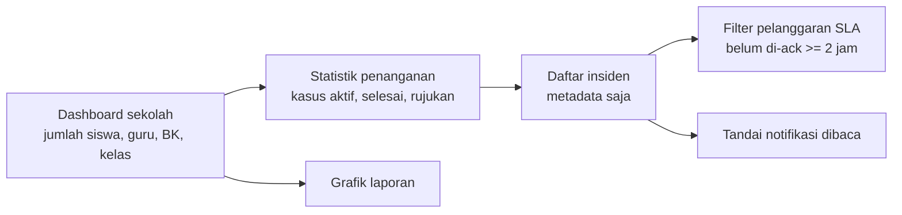
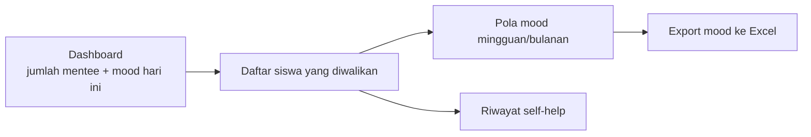
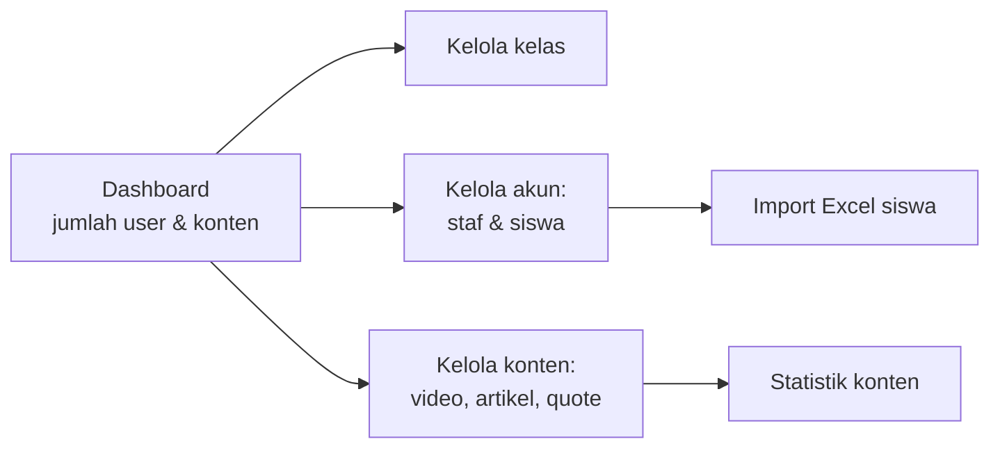
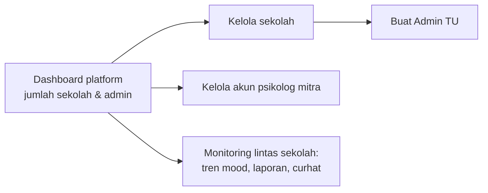

# User Activities

<!-- verified: branch=dev commit=266f860 date=2026-10-09 scope=routes/api.php,app/Http/Controllers,app/Policies -->
> **Terverifikasi terhadap:** `dev` @ `266f860` · 2026-10-09
> **Sumber:** [`routes/api.php`](../../routes/api.php) · [`app/Http/Controllers/`](../../app/Http/Controllers/) · [`app/Policies/`](../../app/Policies/)

Dokumen ini adalah **inventaris tugas satu orang** — apa yang bisa dilakukan seorang aktor, seberapa sering, apa prasyaratnya, dan apa akibatnya. Untuk serah-terima antar orang, lihat [`05-user-flows.md`](05-user-flows.md).

Kolom **Ritme** memisahkan: `harian` · `event` (dipicu kejadian, biasanya dengan tenggat) · `mingguan` · `sekali` (setup atau sekali seumur akun) · `sesuai kebutuhan`.

---

## Siswa

Satu-satunya aktor yang memakai aplikasi setiap hari, dan satu-satunya yang memakai top nav alih-alih sidebar.

| Aktivitas | Endpoint | Prasyarat | Hasil | Ritme |
|---|---|---|---|---|
| Lengkapi profil | `PATCH /api/profile` | `verified = false` | `verified = true`; password, username, telepon diganti | sekali |
| Cek status check-in | `GET /api/mood_record/check` · `/today` | — | — | harian |
| Catat mood | `POST /api/mood_record` | belum check-in hari ini | Label Aman/Tidak Aman; membuka angket, quote, dan hak membuat laporan | harian |
| Lihat streak | `GET /api/mood_record/streaks` | — | — | harian |
| Rekap mood bulanan | `GET /api/mood_record/recap/{month}` | — | — | sesuai kebutuhan |
| Ambil soal angket | `GET /api/questionnaire` | sudah check-in hari ini | Bank soal dipilih otomatis oleh mood | harian |
| Kirim jawaban angket | `POST /api/questionnaire/{type}` | — | Arketipe, mode belajar, dua misi. **Jawaban tidak disimpan** | mingguan (misi mingguan) |
| Quote sesuai mood | `GET /api/quote/mood` | **mood hari ini sudah dicatat** | — | harian |
| Quote harian | `GET /api/quote/daily` | — | — | harian |
| Tulis curhat | `POST /api/sharing` | **`counselor_id` terisi** (kalau null, request gagal) | Analisis NLP, prioritas, tenggat SLA; respons memuat kontak BK + hotline | sesuai kebutuhan |
| Lihat status curhat | `GET /api/notification/latest-sharing` | — | Dua terbaru | sesuai kebutuhan |
| Minta bertemu BK | `POST /api/report` | **`last_mood ∈ {sad, angry}`** | Laporan `Belum Ditinjau`; semua curhat hari ini naik ke prioritas `tinggi` | sesuai kebutuhan |
| Lihat status laporan | `GET /api/notification/latest-report` | — | Dua terbaru | sesuai kebutuhan |
| Jurnal harian | `POST /api/self-help/daily-journaling` | — | Tersimpan sebagai JSON. **Tidak dianalisis NLP** | harian |
| Jurnal rasa syukur | `POST /api/self-help/gratitude-journaling` | — | sama | sesuai kebutuhan |
| Teknik grounding | `POST /api/self-help/grounding-technique` | — | Pola 5-4-3-2-1 | event (saat cemas) |
| Relaksasi sensori | `POST /api/self-help/sensory-relaxation` | — | sama | sesuai kebutuhan |
| Lihat Cirrus | `GET /api/cirrus` | punya baris `clouds` | — | harian |
| Klaim hadiah harian | `POST /api/claim` | belum klaim hari ini | Tetesan Air bertambah; streak sampai 7 hari | harian |
| Beli makanan Cirrus | `POST /api/buy` | Tetesan Air cukup | XP/kebahagiaan naik; naik level otomatis di `exp >= 100` | sesuai kebutuhan |
| Dashboard & daftar konseling | `GET /api/student/dashboard/widgets` · `/api/student/counselings` | — | — | sesuai kebutuhan |
| Setuju/tolak jadwal konseling | `PATCH /api/student/counselings/{counseling}/acknowledge` | — ⚠️ tanpa otorisasi | Konseling `dijadwalkan` atau `ditolak`; curhat ikut berubah | event |
| Baca permintaan persetujuan data | `GET /api/student/counselings/{counseling}/consent` | ada rujukan | — | event |
| **Beri persetujuan data** | `PATCH /api/student/consents/{consent}` | consent milik sendiri; minimal 1 scope | `granted` + scopes, atau `rejected` + scopes dinolkan. **Tidak bisa dicabut setelahnya** | event |
| Lihat tanggal tersedia | `GET /api/student/referrals/{counseling}/available-dates` | rujukan `external` milik sendiri | Hanya slot ≥ H+2 | event |
| Lihat slot per tanggal | `GET .../available-slots?date=` | sama | — | event |
| Ajukan jadwal konsultasi | `POST /api/student/bookings` | sama | Booking `pending`, tenggat 24 jam | event |
| Lihat status booking | `GET /api/student/bookings/{booking}` | — | — | event |
| Baca konten | `GET /api/content` · `/api/video` · `/api/articles` | sekolah sama | — | sesuai kebutuhan |

**Screen (inferensi):** `SISWA #5609:34761`, `SISWA - CURHAT #5505:53468`. Top nav: `Beranda | Konten | Dark Mode | avatar`. Tab Pusat Aktivitas: `Jadwal Konseling | Curhatan | Rujukan Psikolog`.

---

## Guru BK

Aktor pivotal. Pekerjaannya digerakkan tenggat: Zona Merah 2 jam, Zona Kuning 72 jam.

| Aktivitas | Endpoint | Prasyarat | Hasil | Ritme |
|---|---|---|---|---|
| Dashboard | `GET /api/dashboard/counselor` | role counselor | Jumlah konselee, laporan & curhat hari ini | harian |
| Antrean curhatan | `GET /api/sharing?room=&status=&priority=` | — | Daftar milik konselee | **event, dalam SLA** |
| Hitungan curhat | `GET /api/dashboard/sharing-count` | — | — | harian |
| Baca detail curhat | `GET /api/sharing/{sharing}` | konselor dari penulisnya | Termasuk hasil NLP: skor, zona, kata kunci terdeteksi | event |
| Mulai penanganan | `PATCH /api/sharing/ack/{sharing}` | — | `Sedang Ditangani` + `acknowledged_at`. **Ini yang menghentikan jam SLA Kepala Sekolah** | event |
| Tandai alert keliru | `PATCH /api/sharing/false-positive/{sharing}` | konselor dari penulisnya **dan** status masih `Belum Ditinjau` | `Bukan Urgent`, prioritas `rendah`, SLA dimatikan, NLP ditandai `false-positive` + alasan | event |
| Catat keputusan tindak lanjut | `PATCH /api/sharing/acknowledge/{sharing}` | — | `konseling_mandiri` → `Sedang Ditangani`; `penanganan_medis`/`lainnya` → `Diselesaikan` | event |
| Balas curhat | `PATCH /api/sharing/reply/{sharing}` | belum pernah dibalas | `Sudah Ditanggapi`. **Sekali saja** | event |
| Daftar laporan | `GET /api/report` · `GET /api/dashboard/report-count` · `report-graph` | — | — | harian |
| Jadwalkan konseling dari laporan | `POST /api/report/{report}/schedule-meeting` | konselor yang ditugaskan | Konseling `menunggu`; curhat tertaut → `Menunggu Persetujuan Siswa` | event |
| Buat konseling / rujukan | `POST /api/counseling` | role counselor; `reason` wajib bila merujuk | Internal, atau external + consent `pending` otomatis | event |
| Kirim ulang permintaan consent | `POST /api/counseling/{counseling}/consent` | konselor yang ditugaskan | Consent `pending` baru | sesuai kebutuhan |
| **Catat hasil konseling** | `POST /api/counseling-logs` | konselor yang ditugaskan | Catatan klinis **terenkripsi**; konseling `selesai`; laporan tertaut ditutup; setiap edit berikutnya masuk audit trail | event |
| Pola mood konselee | `GET /api/mood-record/pattern/{user}/{type}` | konselee sendiri | Mingguan atau bulanan | sesuai kebutuhan |
| Export mood ke Excel | `GET /api/mood_record/export/today` · `/{username}/weekly` · `/monthly` | role teacher atau counselor | Berkas Excel | sesuai kebutuhan |

**Yang tidak bisa dilakukan Guru BK** — penting untuk diketahui: **tidak bisa melihat jurnal self-help siswa.** `GET /api/self-help/{type}/{user}` hanya mengizinkan Guru Wali. Juga tidak bisa melihat tren mood tingkat sekolah (hanya super), dan tidak bisa mengelola akun atau konten.

**Screen (inferensi):** `GURU BK - Menu Curhatan Siswa New #4138:1117`, `NEWWWW #5505:53467`, `GURU BK, MENU SISWA, NEWWW #5470:39147`. Sidebar: `Dashboard · Data Siswa · Curhatan Siswa · Jadwal Konseling`. **Jangan pakai `GURU BK - OLD VER #5444:5036`.**

---

## Psikolog Mitra

Aktor eksternal, lintas sekolah. Aksesnya sepenuhnya diatur oleh persetujuan siswa.

| Aktivitas | Endpoint | Prasyarat | Hasil | Ritme |
|---|---|---|---|---|
| Lihat slot sendiri | `GET /api/psychologist/slots` | punya `psychologist_profiles` | — | sesuai kebutuhan |
| Publikasikan slot | `POST /api/psychologist/slots` | sama; `slot_date >= hari ini` | Slot `available`; opsi `repeat` mingguan sampai 1 tahun | mingguan |
| Hapus slot | `DELETE /api/psychologist/slots/{slot}` | slot milik sendiri, **tanpa booking aktif** | — | sesuai kebutuhan |
| Ringkasan rujukan | `GET /api/psychologist/referrals-overview` | — | Jumlah pending / confirmed / selesai | harian |
| Daftar rujukan | `GET /api/psychologist/referrals` | — | Filter `search`, `status`, `priority` (`kritis`/`prioritas`), `batas_waktu` (`aktif`/`kadaluarsa`) | harian |
| Rujukan menunggu | `GET /api/psychologist/referrals/pending` | — | — | **event, dalam 24 jam** |
| **Putuskan jadwal** | `PATCH /api/psychologist/referrals/{booking}/decide` | slot milik sendiri; booking masih `pending` | `confirm` → booking+slot terkonfirmasi, ringkasan AI dibuat. `reschedule` → booking lama ditolak, booking baru langsung terkonfirmasi | event |
| Baca ringkasan klinis AI | `GET /api/psychologist/referrals/{counseling}/summary` | rujukan sendiri **dan consent `granted`** | Narasi AI + **identitas asli siswa** (nama, NISN, kelas) | event |
| Rekap mood 30 hari | `GET /api/psychologist/recap/{counseling}/monthly/mood` | scope `mood_history` | — | event |
| Rekap curhat 30 hari | `GET .../monthly/sharing` | scope `sharing_history` | — | event |
| Rekap asesmen BK | `GET .../monthly/counseling` | scope `assesment_logs` | — | event |
| **Tutup rujukan** | `POST /api/psychologist/referrals/{counseling}/feedback` | sama | Booking `finished`, konseling `selesai`, curhat `Diselesaikan`; menyimpan catatan klinis + rating `good`/`bad` atas ringkasan AI | event |

Rating yang diminta adalah penilaian **terhadap ringkasan AI**, bukan terhadap siswa — umpan balik untuk memperbaiki prompt.

Sebelum consent diberikan, desain menampilkan siswa teranonimkan (`Siswa #A-2812`); backend memakai format berbeda (`stu_` + potongan md5). Lihat [`12-ui-contract.md`](12-ui-contract.md).

**Screen (inferensi):** `Psikolog #5499:7907`, `Kelola Jadwal #5499:8801`, `Laporan AI & Catatan Klinis #5281:5171`. Sidebar: `Dashboard · Rujukan Masuk · Jadwal Konseling`.

---

## Kepala Sekolah

Peran pengawasan. Melihat bahwa ada masalah dan apakah ditangani tepat waktu — **tidak pernah melihat isinya**.

| Aktivitas | Endpoint | Prasyarat | Hasil | Ritme |
|---|---|---|---|---|
| Dashboard sekolah | `GET /api/dashboard/headteacher` | role headteacher | Jumlah siswa, guru, BK, kelas | harian |
| Statistik penanganan | `GET /api/headteacher/dashboard/stats` | sama | Kasus aktif, intervensi selesai, rujukan, pelanggaran SLA | harian |
| Daftar insiden | `GET /api/headteacher/incidents` | sama | **Hanya metadata** — `title`, `description`, `reply` sengaja tidak dikirim. Memuat `is_sla_breached` | harian |
| Filter insiden | query `?name=` `?status=` `?is_breached=` `?counselor=` `?page=` `?per_page=` | sama | `status` menerima alias Indonesia yang longgar | sesuai kebutuhan |
| Tandai notifikasi dibaca | `PATCH /api/headteacher/notifications/{id}/read` | sama | — | sesuai kebutuhan |
| Grafik laporan | `GET /api/dashboard/report-graph` | `ReportPolicy::viewGraph` | — | sesuai kebutuhan |
| Jadwalkan konseling | `POST /api/report/{report}/schedule-meeting` | `ReportPolicy::scheduleMeeting` | Boleh, meski bukan tugas utamanya | jarang |
| Baca kelas & grafik mood | gate `dashboard-data` | non-student | — | sesuai kebutuhan |

> **Tidak ada notifikasi yang mendorong informasi kepadanya.** `ZoneNotificationDispatcher` tidak pernah dipanggil, jadi Kepala Sekolah harus membuka dashboard untuk tahu ada kasus kritis. Lihat [`05-user-flows.md`](05-user-flows.md) FLOW-7.

**Screen (inferensi):** `KEPSEK #4502:2615`, `Lihat Detail #5287:5615` (modal Timeline Penanganan). Sidebar: `Dashboard · Data Sekolah · Monitoring Penangan` — typo "Penangan" ada di desain.

---

## Guru Wali

Peran paling pasif. Memantau siswa yang diwalikannya, tidak menangani kasus.

| Aktivitas | Endpoint | Prasyarat | Hasil | Ritme |
|---|---|---|---|---|
| Dashboard | `GET /api/dashboard/teacher` | role teacher | Jumlah mentee + pembagian mood aman/tidak aman hari ini | harian |
| Daftar siswa | `GET /api/dashboard/student` | — | Siswa dengan `mentor_id` = dirinya | harian |
| Pola mood siswa | `GET /api/mood-record/pattern/{user}/{type}` | **siswa harus mentee-nya** | Mingguan atau bulanan | sesuai kebutuhan |
| **Riwayat self-help siswa** | `GET /api/self-help/{type}/{user}` | **siswa harus mentee-nya** | Isi jurnal. **Hanya Guru Wali yang boleh ini — Guru BK tidak** | sesuai kebutuhan |
| Export mood ke Excel | `GET /api/mood_record/export/...` | role teacher atau counselor | Berkas Excel | sesuai kebutuhan |
| Baca kelas & grafik mood | gate `dashboard-data` | non-student | — | sesuai kebutuhan |

Perhatikan pembagian akses yang tidak biasa: Guru Wali melihat **jurnal pribadi** siswa, Guru BK tidak. Guru BK melihat **curhat**, Guru Wali tidak. Keduanya melihat pola mood mentee/konselee masing-masing.

**Screen (inferensi):** `Guru Wali #1050:25216`. Sidebar hanya `Dashboard`; akses Data Siswa lewat breadcrumb.

---

## Admin TU

Penyedia akun dan pengelola konten sekolah.

| Aktivitas | Endpoint | Prasyarat | Hasil | Ritme |
|---|---|---|---|---|
| Dashboard | `GET /api/dashboard/admin` | role admin | Jumlah user dan konten | harian |
| Statistik konten | `GET /api/dashboard/content-statistics` | sama | — | sesuai kebutuhan |
| Buat kelas | `POST /api/room` | sama | `code` 8 karakter yang nanti dipakai saat membuat siswa | sekali per tahun ajaran |
| Ubah / hapus kelas | `PATCH` · `DELETE /api/room/{room}` | admin **dan** kelas di sekolahnya | — | sesuai kebutuhan |
| Buat staf | `POST /api/dashboard/users` | sama; role dibatasi `teacher`, `headteacher`, `counselor`; NIP 18 digit | **Tidak bisa** membuat admin atau super | sekali |
| Buat siswa | `POST /api/user/student` | sama; NISN 10 digit; butuh NIP wali, NIP BK, dan kode kelas yang sudah ada | Memakai password default; Cirrus dibuatkan otomatis | sekali per siswa |
| Unduh template Excel | `GET /api/user/bulk/template` | ⚠️ endpoint ini **publik** | — | sekali |
| Import siswa massal | `POST /api/user/bulk` | role admin | Mode sync atau async | sekali per tahun ajaran |
| Ubah user | `PATCH /api/edit-user/{user}` | admin **dan** sekolah sama | — | sesuai kebutuhan |
| Hapus user | `DELETE /api/user/{user}` | sekolah sama, **bukan** super/admin | Soft delete | jarang |
| Direktori user | `GET /api/dashboard/users` · `/{username}` · `/type/{type}` · `latest-user` · `today-user` | non-student | Ter-scope ke sekolahnya | sesuai kebutuhan |
| Kelola video | `POST` · `PATCH` · `DELETE /api/video/...` | admin, sekolah sama | Metadata YouTube diambil otomatis dari `video_id` | sesuai kebutuhan |
| Kelola artikel | `POST /api/articles` · `POST /api/article-update/{article}` · `DELETE` | sama | Konten berupa pohon Lexical, bukan HTML. Update memakai `POST` karena unggah thumbnail | sesuai kebutuhan |
| Kelola quote | `POST /api/quote` · `GET` · `DELETE /api/quote/{quote}` | sama | Tipe `secure`/`insecure`/`daily`. **Tidak ada endpoint update** | sesuai kebutuhan |

**Screen (inferensi):** `ADMIN TU #1237:39774`. Sidebar: `Dashboard · Kelola Akun · Kelola Konten`.

---

## Superadmin

Pemilik platform. Lintas sekolah.

| Aktivitas | Endpoint | Prasyarat | Hasil | Ritme |
|---|---|---|---|---|
| Dashboard platform | `GET /api/dashboard/super` | role super | Jumlah sekolah dan admin | harian |
| CRUD sekolah | `GET` · `POST` · `PATCH` · `DELETE /api/school/...` | sama | Hapus sekolah **cascade ke kelas dan user di level database** | jarang |
| Buat Admin TU | `POST /api/user/admin` | sama; identifier 16–25 digit; `school_id` wajib | — | sekali per sekolah |
| Hapus user | `DELETE /api/user/{user}` | **hanya bisa menghapus admin** | — | jarang |
| Ubah user mana pun | `PATCH /api/edit-user/{user}` | sama | — | jarang |
| CRUD psikolog mitra | `GET` · `POST` · `PATCH` · `DELETE /api/admin/psychologists/...` | sama | Membuat baris `users` **dan** `psychologist_profiles` | sesuai kebutuhan |
| Aktif/nonaktifkan psikolog | `PATCH /api/admin/psychologists/{psychologist}/toggle` | sama | `is_active` | sesuai kebutuhan |
| Tren mood per sekolah | `GET /api/mood-trends/{school}/{type}` · `GET /api/dashboard/mood-trends` | **hanya super** | — | sesuai kebutuhan |
| Pola mood siswa mana pun | `GET /api/mood-record/pattern/{user}/{type}` | sama | — | sesuai kebutuhan |
| Semua laporan / curhat seorang siswa | `GET /api/report/student/{user}` · `GET /api/sharing/student/{user}` | **hanya super**, dan target harus siswa | Satu-satunya peran yang bisa melihat seluruh riwayat seorang siswa | jarang |
| Kelas lintas sekolah | `GET /api/room/school/{school}` | sama | — | sesuai kebutuhan |

Superadmin **tidak** bisa membuat kelas, konten, atau akun staf — itu wewenang Admin TU. Pembagiannya tegas: superadmin mengelola tenant dan mitra, Admin TU mengelola isi sekolahnya.

> `[SPEC-ONLY]` Desain memuat screen Superadmin **"Kelola API"** (`#2727:50076`) untuk mengelola API key/token. Tabel `gemini_api_token` memang ada dan dirotasi otomatis, tapi tidak ada endpoint CRUD untuknya.

**Screen (inferensi):** `Superadmin #2696:37277`, `Superadmin - Manajement psikolog #4194:35396`. Sidebar: `Dashboard · Kelola Sekolah · Kelola TU · Monitoring Sekolah · Kelola API`.

---

## Sistem (tanpa aktor manusia)

Aktivitas yang berjalan sendiri. Kalau worker atau scheduler tidak jalan, **semua ini diam tanpa pesan error apa pun**.

| Aktivitas | Pemicu | Efek |
|---|---|---|
| Analisis NLP curhat | `POST /api/sharing` — inline, fallback ke queue | Menulis zona, prioritas, dan tenggat SLA |
| Pembuatan ringkasan klinis AI | Psikolog mengkonfirmasi booking | Berhenti kalau consent bukan `granted` |
| Pembersihan timer SLA | `cutdown:clear`, tiap 10 menit | Menolkan `cutdown_for_report` yang sudah lewat |
| Kadaluarsa booking | `referrals:expire-pending`, tiap 15 menit | Booking → `expired`, slot → `available` |
| Pembuatan Cirrus | Siswa baru dibuat | Satu baris `clouds` |
| Naik level Cirrus | `exp >= 100` | Level naik, `exp` dikurangi 100 |
| Audit trail catatan klinis | `clinical_notes` diubah | Nilai lama disimpan + siapa yang mengubah |
| Rotasi API key Gemini | Setiap panggilan Gemini jalur B | Kuota dicatat, kunci berikutnya diaktifkan |
| Pemanasan cache arketipe | `generate:archtype` — **entri schedulernya dikomentari** | Mengisi `ai_generated` yang masih null |
