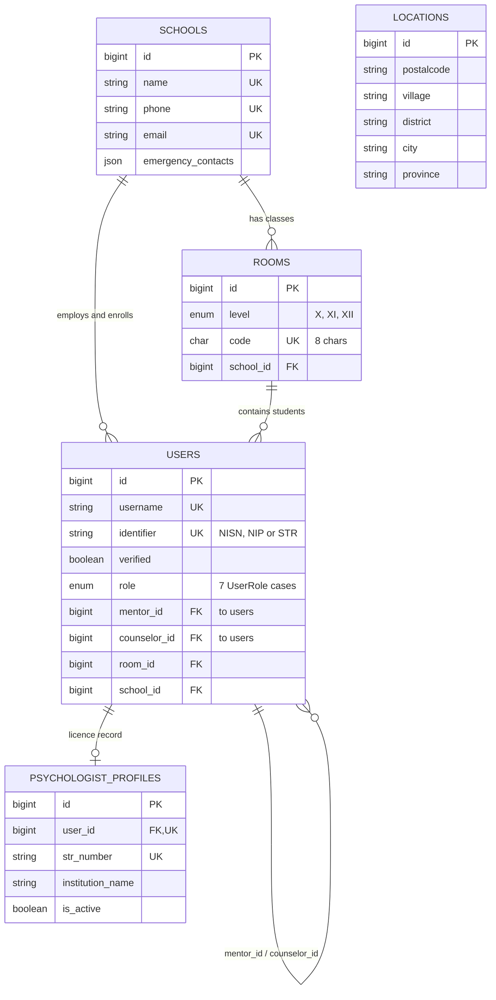

# 01 · Identity & Tenancy

<!-- verified: branch=dev commit=266f860 date=2026-10-09 scope=database/migrations,app/Models -->
> **Verified against:** `dev` @ `266f860` · 2026-10-09
> **Sources:** [`2025_08_25_221625_create_schools_table.php`](../../../database/migrations/2025_08_25_221625_create_schools_table.php) · [`2025_08_25_221626_create_users_table.php`](../../../database/migrations/2025_08_25_221626_create_users_table.php) · [`2026_06_12_120000_create_psychologist_profiles_table.php`](../../../database/migrations/2026_06_12_120000_create_psychologist_profiles_table.php)

Who exists in the system and which school they belong to. `users` is the hub that almost every other table points at.

`LOCATIONS` is drawn without relationships on purpose — see below.

---

## `schools`

| Column | Type | Null | Default | Notes |
|---|---|---|---|---|
| `id` | bigint | no | auto | |
| `name` | string | no | — | **unique** |
| `address` | string | no | — | |
| `phone` | string | no | — | **unique** |
| `email` | string | no | — | **unique** |
| `district`, `city`, `province` | string | no | — | Denormalised copies of `locations` values, stored as plain text |
| `emergency_contacts` | json | no | — | Cast to `array`. Shape: `[{name, number}]`. Seeder populates the Indonesian national hotline `119`. Returned to students alongside their counselor's phone when they submit a curhat. |
| `created_at`, `updated_at` | timestamp | yes | — | Hidden from API output by the model |
| `deleted_at` | timestamp | yes | null | Added by the soft-delete retrofit |

Deleting a school cascades to `rooms` and `users` at the database level.

**Relations** — [`School`](../../../app/Models/School.php): `rooms()`, `users()`, plus role-filtered conveniences `admins()`, `counselors()`, `teachers()`, `students()`, `psycologist()`, and `headteacher()` (`hasOne`). Also `videos()`, `articles()`, `quotes()`.

> `School::psycologist()` is misspelled in the model (one `o` missing). It works, but do not "fix" it without checking callers.

## `rooms`

| Column | Type | Null | Default | Notes |
|---|---|---|---|---|
| `id` | bigint | no | auto | |
| `name` | string | no | — | e.g. `IPA 1` |
| `level` | enum | no | — | `X` / `XI` / `XII` |
| `code` | char(8) | no | — | **unique**. This is what API callers pass when creating a student, not the numeric id. |
| `school_id` | bigint FK | no | — | → `schools.id`, cascade on delete |
| `created_at`, `updated_at` | timestamp | yes | — | |
| `deleted_at` | timestamp | yes | null | Retrofit |

**Relations** — [`Room`](../../../app/Models/Room.php): `school()`, and `students()` (`hasMany(User)` filtered to `role = student`).

The API display label is composed as `Kelas {level} {name}` by [`RoomResource`](../../../app/Http/Resources/RoomResource.php).

## `users`

| Column | Type | Null | Default | Notes |
|---|---|---|---|---|
| `id` | bigint | no | auto | |
| `name` | string | yes | null | |
| `phone` | string | yes | null | **unique** when present |
| `username` | string | no | — | **unique**. Login looks it up lowercased. |
| `identifier` | string | no | — | **unique**. NISN (10 digits) for students, NIP/NUPTK (18) for staff, 16–25 digits for admins, STR number for psychologists. |
| `password` | string | no | hash of `config('app.default_password')` | The default is set **in the migration**, so a row inserted without a password is still loginable with the shared default. Cast `hashed`. |
| `verified` | boolean | no | `false` | Becomes `true` only after first-login profile completion. Not email verification. |
| `role` | enum | no | `'student'` | Seven cases. `psychologist` was appended later by the psychologist-profiles migration. |
| `mentor_id` | bigint FK | yes | null | → `users.id` (Guru Wali), null on delete |
| `counselor_id` | bigint FK | yes | null | → `users.id` (Guru BK), null on delete |
| `room_id` | bigint FK | yes | null | → `rooms.id`, cascade |
| `school_id` | bigint FK | yes | null | → `schools.id`, cascade |
| `created_at`, `updated_at` | timestamp | yes | — | `updated_at` hidden from API |
| `deleted_at` | timestamp | yes | null | Retrofit |

**Relations** — [`User`](../../../app/Models/User.php):

| Method | Kind | Meaning |
|---|---|---|
| `room()`, `school()` | belongsTo | Tenancy |
| `mentor()`, `counselor()` | belongsTo (self) | The staff assigned to this student |
| `mentored()`, `counselored()` | hasMany (self) | The students assigned to this staff member — both filtered to `role = student` |
| `mood()` | hasMany | All `mood_records` |
| `lastmoodres()` | hasOne | Today's mood record only |
| `sharing()`, `report()` | hasMany | |
| `cloud()` | hasOne | Cirrus pet |
| `psychologistProfile()` | hasOne | Only for `role = psychologist` |

**Accessor `last_mood`** returns today's mood status string, or `null` if the student has not checked in. It drives two behaviours: which questionnaire bank is served, and whether a report may be created at all.

### Two things to know about `users`

**1. `$guarded = []`.** Every column is mass-assignable, including `role`, `school_id`, `counselor_id` and `verified`. Combined with `UserController::editProfile`, which calls `Auth::user()->update($request->all())`, any authenticated user can change their own role. Documented in [`03-authorization.md`](../03-authorization.md).

**2. JWT claims are injected at login, not by the model.** `User::getJWTCustomClaims()` returns an empty array. The claims the frontend reads (`name`, `username`, `identifier`, `role`, `verified`, `room`, `mentor`, `school`) are added by [`app/Actions/LoginAction.php`](../../../app/Actions/LoginAction.php) via `Auth::claims(...)->attempt(...)`. Any other code path that mints a token will produce one **without** those claims.

## `psychologist_profiles`

| Column | Type | Null | Default | Notes |
|---|---|---|---|---|
| `id` | bigint | no | auto | |
| `user_id` | bigint FK | no | — | → `users.id`, **unique**, cascade. One profile per user. |
| `str_number` | string | no | — | **unique + indexed**. Indonesian practice licence. |
| `specialization` | string | yes | null | e.g. `Psikologi Klinis Anak & Remaja` |
| `institution_name` | string | no | — | **indexed**. Also used as the session location shown to students for external counseling. |
| `phone_number` | string | yes | null | |
| `is_active` | boolean | no | `true` | Toggled by superadmin. Cast `boolean`. |
| `created_at`, `updated_at`, `deleted_at` | timestamp | yes | — | |

**Relations** — [`PsychologistProfile`](../../../app/Models/PsychologistProfile.php): `user()`, `slots()`, and `availableSlots()` (available + upcoming).

> `psychologist_slots.psychologist_id` points at **this table's** `id`, while `counselings.psychologist_id` points at `users.id`. See the audit section in [`README.md`](README.md).

## `locations`

| Column | Type | Null | Notes |
|---|---|---|---|
| `id` | bigint | no | |
| `postalcode`, `village`, `district`, `city`, `province` | string | no | Indonesian administrative hierarchy |
| `created_at`, `updated_at`, `deleted_at` | timestamp | yes | |

Read-only master data, bulk-imported from `public/database/seeder/location.sql` by `php artisan import:locations` ([`app/Console/Commands/ImportLocation.php`](../../../app/Console/Commands/ImportLocation.php)).

**No relationships at all.** [`Location`](../../../app/Models/Location.php) declares none, and nothing has a `location_id`. It backs the cascading province → city → district → village dropdowns (`GET /api/province` and friends); `schools` stores the chosen names as strings. Renaming a location row does not update any school.

---

## Lifecycle notes

- [`UserObserver`](../../../app/Observers/UserObserver.php) creates a `clouds` row (the Cirrus pet) for every newly created student.
- There is no registration endpoint. Accounts are provisioned top-down: superadmin creates admins, admins create staff and students (individually or by Excel import), superadmin creates psychologists. See [`05-user-flows.md`](../05-user-flows.md).
- Deleting a school cascades to rooms and users **at the database level**, bypassing Eloquent soft deletes and model events.
