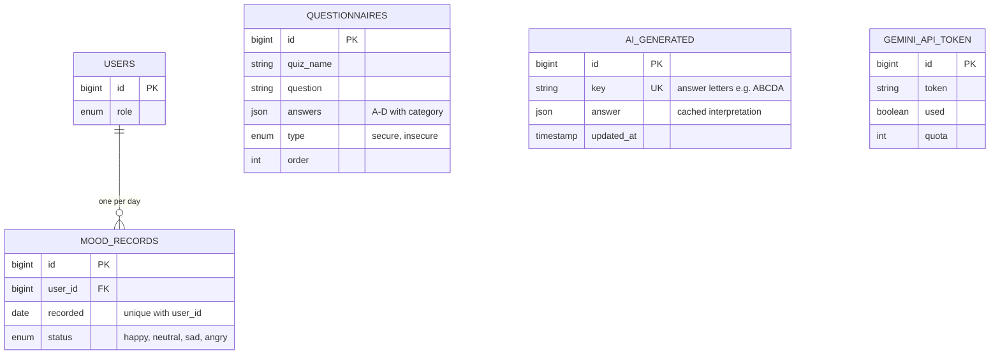

# 02 · Wellbeing & Assessment

<!-- verified: branch=dev commit=266f860 date=2026-10-09 scope=database/migrations,app/Actions,database/seeders/QuestionnaireSeeder.php -->
> **Verified against:** `dev` @ `266f860` · 2026-10-09
> **Sources:** [`2025_08_31_165623_create_mood_records_table.php`](../../../database/migrations/2025_08_31_165623_create_mood_records_table.php) · [`2025_09_01_165728_create_questionnaires_table.php`](../../../database/migrations/2025_09_01_165728_create_questionnaires_table.php) · [`2025_09_28_152909_ai_generated.php`](../../../database/migrations/2025_09_28_152909_ai_generated.php) · [`0001_01_01_000000_create_default_table.php`](../../../database/migrations/0001_01_01_000000_create_default_table.php)

The daily signal (`mood_records`) and the persona assessment built on top of it. The defining property of this slice: **the assessment stores the question bank and the AI output, but never the student's answers.**

`QUESTIONNAIRES`, `AI_GENERATED` and `GEMINI_API_TOKEN` have **no foreign keys and no relationships**. They are reference and cache tables, joined only in application code.

---

## `mood_records`

| Column | Type | Null | Default | Notes |
|---|---|---|---|---|
| `id` | bigint | no | auto | |
| `user_id` | bigint FK | no | — | → `users.id`, cascade |
| `recorded` | **date** | no | — | The check-in date. **Named `recorded`, not `date` or `recorded_at`.** |
| `status` | enum | no | — | `happy` / `neutral` / `sad` / `angry` — see [`MoodStatus`](../../../app/Enums/MoodStatus.php) |
| `created_at`, `updated_at` | timestamp | yes | — | Hidden from API along with `id` and `user_id` |
| `deleted_at` | timestamp | yes | null | Retrofit |

**Unique constraint on (`recorded`, `user_id`)** — one check-in per student per day, enforced by the database.

**Relations** — [`MoodRecord`](../../../app/Models/MoodRecord.php) has `user()`. Query scopes worth reusing instead of rewriting: `forUser()`, `today()`, `inMonth()`, `thisWeek()`.

### Why this table drives the rest of the system

`MoodStatus::isSecure()` splits the four statuses in two: `happy`/`neutral` are **secure** (label "Aman"), `sad`/`angry` are **insecure** (label "Tidak Aman"). That single boolean decides:

| Decision | Effect |
|---|---|
| Which questionnaire bank is served | `secure` bank (7 items) or `insecure` bank (10 items) |
| Which quote is served by `GET /api/quote/mood` | `quotes.type = secure` or `insecure` |
| Whether a report may be created at all | `POST /api/report` is allowed **only** when `last_mood` is `sad` or `angry` |

The accessor `User::last_mood` reads today's record. A student who has not checked in today has `last_mood = null`, which blocks the mood-gated paths.

> **`[SPEC-ONLY]`** The Figma design offers five mood options including `Takut` (afraid). The enum has four and no equivalent. An earlier UI spec ([`agent/screens/siswa_beranda.md`](../../../agent/screens/siswa_beranda.md)) also describes an optional `mood_note` free-text field and a table named `mood_checkins`. Neither exists.

## `questionnaires`

| Column | Type | Null | Notes |
|---|---|---|---|
| `id` | bigint | no | Hidden from API |
| `quiz_name` | string | no | Section title shown to the student |
| `question` | string | no | The prompt |
| `answers` | json | no | Cast to `array`. Shape: `{"A": {"text": "...", "category": "..."}, "B": {...}, ...}` — always options A–D, each carrying a psychometric `category` label. |
| `type` | enum | no | `secure` or `insecure` |
| `order` | integer | no | Cast to `int`. Position within the bank; the scoring code depends on it. |
| `deleted_at` | timestamp | yes | Retrofit |

> **This table has no `timestamps()`.** Only `deleted_at` was added later. Do not assume `created_at` exists.

### The item bank

Seeded by [`QuestionnaireSeeder`](../../../database/seeders/QuestionnaireSeeder.php) — 17 items in total:

| `type` | `quiz_name` | Items |
|---|---|---|
| `secure` | Kompas Nilai | 3 |
| `secure` | Peralatan Andalan | 2 |
| `secure` | Medan Petualangan | 2 |
| `insecure` | Kekuatan Super | 5 |
| `insecure` | Mode Belajar | 3 |
| `insecure` | Bahan Bakar Motivasi | 2 |

The `category` values are the psychometric signal — `Achievement`, `Helping Others`, `Freedom & Autonomy`, `Collaboration`, `Results-Driven`, `Innovation`, `Relationships`, and others. They are what the scoring logic tallies.

## `ai_generated`

| Column | Type | Null | Notes |
|---|---|---|---|
| `id` | bigint | no | |
| `key` | string | no | **unique**. The student's answer letters concatenated, e.g. `ABCDA`. |
| `answer` | json | yes | The cached interpretation. `null` means "not generated yet". |
| `updated_at` | timestamp | no | **The only timestamp column** — there is no `created_at`, and no soft deletes. |

Accessed exclusively through the query builder, never Eloquent — there is no model. Call sites: [`AnalyzeInsecurePersonaAction.php`](../../../app/Actions/AnalyzeInsecurePersonaAction.php), [`GenerateMissionAction.php`](../../../app/Actions/GenerateMissionAction.php), [`GenerateArchtype.php`](../../../app/Console/Commands/GenerateArchtype.php).

### Why no answers are stored

The flow is: student submits answer texts → [`ConvertAnswersToAlphabetAction`](../../../app/Actions/ConvertAnswersToAlphabetAction.php) maps them back to letters using `questionnaires` → the letter string becomes the cache key → the interpretation is read from or written to `ai_generated`.

Consequences worth understanding before changing anything here:

- **There is no per-student assessment history.** Nothing links a result to a user, so you cannot show a student their past results or track change over time without adding a new table.
- The cache is **shared across all students** who answered identically. That is what makes it cheap — each of the `4^n` combinations costs one Gemini call ever.
- `php artisan generate:archtype` pre-warms or refreshes entries. Its schedule entry in [`routes/console.php`](../../../routes/console.php) is currently commented out.
- `ai_generated` is preserved across `php artisan migrate:fresh-backup` ([`MigrateWithBackup.php`](../../../app/Console/Commands/MigrateWithBackup.php)), because regenerating it costs real API quota.

> **`[DEAD]`** [`database/seeders/AiGenerated.php`](../../../database/seeders/AiGenerated.php) inserts a `section` column that does not exist in the migration. It is commented out of `DatabaseSeeder` and would fail if run.

## `gemini_api_token`

Created in [`0001_01_01_000000_create_default_table.php`](../../../database/migrations/0001_01_01_000000_create_default_table.php) alongside the framework tables, not in its own migration.

| Column | Type | Null | Notes |
|---|---|---|---|
| `id` | bigint | no | |
| `token` | string | no | A Gemini API key |
| `used` | boolean | no | Exactly one row is expected to be `true` — the key currently in use |
| `quota` | integer | no | Accumulated token count spent on this key |

No timestamps, no soft deletes, no model.

This is a **hand-rolled multi-key rotation pool** that spreads load across free-tier Gemini keys:

1. [`CallGeminiAction`](../../../app/Actions/CallGeminiAction.php) reads the row where `used = true` and overrides `config('gemini.api_key')` at runtime.
2. After the call it counts tokens and dispatches `GeminiTokenUsed`.
3. [`RotateGeminiToken`](../../../app/Listeners/RotateGeminiToken.php) adds the usage to `quota`, sets `used = false`, and promotes the next row — wrapping around at the end.

Seeded from the `GEMINI_API_KEYS` environment variable by [`GeminiApi.php`](../../../database/seeders/GeminiApi.php). Also preserved by `migrate:fresh-backup`.

> This pool serves only the **persona/mission** path. The clinical referral summary uses `config('gemini.api_key')` directly — see [`10-architecture-and-integrations.md`](../10-architecture-and-integrations.md).

---

## Lifecycle notes

- Nothing observes `mood_records`. The downstream effects (questionnaire branch, quote selection, report gating) are all **read-time** decisions based on `User::last_mood`, not write-time side effects.
- No job or event fires on mood check-in. A student entering `angry` every day for a month triggers no alert — only a curhat does. The insecure-streak figure does exist, but only as a computed field inside the referral payload.
