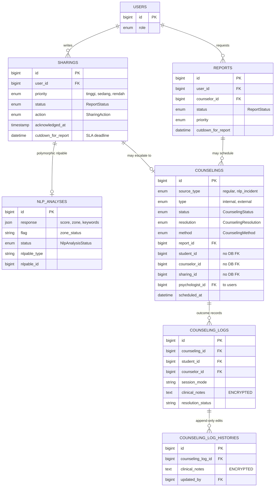

# 03 · Sharing, Triage & Counseling

<!-- verified: branch=dev commit=266f860 date=2026-10-09 scope=database/migrations,app/Models,app/Observers,app/Jobs -->
> **Verified against:** `dev` @ `266f860` · 2026-10-09
> **Sources:** [`2025_09_03_183237_create_sharings_table.php`](../../../database/migrations/2025_09_03_183237_create_sharings_table.php) · [`2025_09_04_010926_create_reports_table.php`](../../../database/migrations/2025_09_04_010926_create_reports_table.php) · [`2026_05_20_115200_create_nlp_analyses_table.php`](../../../database/migrations/2026_05_20_115200_create_nlp_analyses_table.php) · [`2026_05_26_101154_create_counseling_table.php`](../../../database/migrations/2026_05_26_101154_create_counseling_table.php) · [`2026_06_12_110002_create_counseling_logs_table.php`](../../../database/migrations/2026_06_12_110002_create_counseling_logs_table.php)

The operational heart of APPIKS. A student speaks (`sharings`) or asks for a meeting (`reports`); an external NLP service triages it (`nlp_analyses`); a counselor turns it into a session (`counselings`) and records the outcome under an immutable audit trail (`counseling_logs` + `counseling_log_histories`).

---

## `sharings` — "curhat"

| Column | Type | Null | Default | Notes |
|---|---|---|---|---|
| `id` | bigint | no | auto | |
| `user_id` | bigint FK | no | — | → `users.id`, cascade |
| `title` | string | yes | null | |
| `description` | text | no | — | The student's story. This is the text sent to the NLP service. |
| `reply` | text | yes | null | Counselor's answer. **Writable once only.** |
| `replied_at` | date | yes | null | Note: `date`, not `datetime` |
| `replied_by` | string | yes | null | A **name string**, not a foreign key |
| `action_notes` | string | yes | null | Free-text note on the chosen follow-up |
| `action_confirmed` | boolean | no | `false` | |
| `priority` | enum | no | `'rendah'` | `tinggi` / `sedang` / `rendah`. Originally only two values; `sedang` was added when NLP triage landed. Written by the NLP job. |
| `action` | enum | no | `'konseling_mandiri'` | [`SharingAction`](../../../app/Enums/SharingAction.php) |
| `status` | enum | no | `'Belum Ditinjau'` | [`ReportStatus`](../../../app/Enums/ReportStatus.php) — **cast to the enum** in the model |
| `acknowledged_at` | timestamp | yes | null | When the counselor first picked it up. Cast `datetime`. Drives the principal's SLA-breach flag. |
| `cutdown_for_report` | datetime | yes | null | SLA deadline, written by the NLP job |
| `created_at`, `updated_at` | timestamp | yes | — | `updated_at` hidden |
| `deleted_at` | timestamp | yes | null | |

**Relations** — [`Sharing`](../../../app/Models/Sharing.php): `user()`, `counseling()` (`hasOne`), `nlp()` (`morphOne`).

> `status` is cast to `ReportStatus`, so comparing it against `ReportStatus::X->value` is **always false**. This silently disabled a policy once (commit `26ac4b2`). Compare against the enum case.

## `nlp_analyses`

| Column | Type | Null | Notes |
|---|---|---|---|
| `id` | bigint | no | |
| `text` | text | no | A copy of the analysed text |
| `response` | json | yes | Cast `json`. Documented shape (see the model's docblock): `{total_score: int, zone_status: string, matched_keywords: [{stem, zone, weight}]}` |
| `flag` | string | yes | The `zone_status` value, denormalised for cheap filtering |
| `status` | enum | yes | [`NlpAnalysisStatus`](../../../app/Enums/NlpAnalysisStatus.php) — human verification of the model's accuracy, not a workflow state |
| `reason` | string | yes | Why a counselor judged it a false positive |
| `nlpable_type`, `nlpable_id` | nullable morphs | yes | Indexed together |
| `created_at`, `updated_at`, `deleted_at` | timestamp | yes | |

**Relations** — [`NlpAnalysis`](../../../app/Models/NlpAnalysis.php): `nlpable()` (`morphTo`). Only `Sharing` declares the inverse (`nlp()`). The polymorphic design anticipates attaching analyses to `Report` as well, but no such relation exists.

### The triage mapping

[`ProcessNlpAnalysisJob`](../../../app/Jobs/ProcessNlpAnalysisJob.php) calls the external Flask service and writes the result both here and onto the parent record:

| `zone_status` | `priority` written to parent | `cutdown_for_report` | Extra |
|---|---|---|---|
| `Red Zone` | `tinggi` | `now() + 2 hours` | — |
| `Yellow Zone` | `sedang` | `now() + 72 hours` | — |
| `No Trigger` | `rendah` | `now() + 0 hours` | Parent `status` → `Belum Ditanggapi` |

`cutdown_for_report` is nulled once elapsed by `php artisan cutdown:clear`, scheduled every 10 minutes.

`php artisan` is not required for the job to run, but a **queue worker is**: `QUEUE_CONNECTION=database`. Submission dispatches synchronously first and falls back to the queue on failure, so a curhat always saves even when the NLP service is down (fail-open).

## `reports` — meeting requests

| Column | Type | Null | Default | Notes |
|---|---|---|---|---|
| `id` | bigint | no | auto | |
| `user_id` | bigint FK | no | — | → `users.id`, cascade. The student. |
| `counselor_id` | bigint FK | yes | null | → `users.id`, null on delete |
| `topic` | string | no | — | |
| `room` | string | no | — | A **plain string**, not a `rooms` FK |
| `date` | date | no | — | Requested date |
| `time` | string | no | — | A **string**, not a time column |
| `status` | enum | no | `'Belum Ditinjau'` | [`ReportStatus`](../../../app/Enums/ReportStatus.php) — **not** cast in the model, unlike `sharings.status` |
| `priority` | enum | no | `'rendah'` | Same three values as `sharings` |
| `notes` | text | yes | null | |
| `result` | text | yes | null | |
| `cutdown_for_report` | datetime | yes | null | |
| `created_at`, `updated_at`, `deleted_at` | timestamp | yes | — | |

**Relations** — [`Report`](../../../app/Models/Report.php): `user()`, `counselor()`, `counselings()`.

> **`reports.status` is not cast to the enum, but `sharings.status` is.** The same enum behaves differently depending on which model you hold. This asymmetry is the root of several comparison bugs.

Creating a report is gated on mood: only allowed when the student's `last_mood` is `sad` or `angry`.

## `counselings` — the central aggregate

| Column | Type | Null | Default | Notes |
|---|---|---|---|---|
| `id` | bigint | no | auto | |
| `source_type` | enum | no | `'regular'` | `regular` (from a report) or `nlp_incident` (from a flagged curhat) |
| `report_id` | bigint FK | yes | null | → `reports.id`, null on delete. **Properly constrained.** |
| `student_id` | bigint | no | — | → `users.id` logically, **no database FK** |
| `counselor_id` | bigint | yes | null | → `users.id` logically, **no database FK** |
| `psychologist_id` | bigint FK | yes | null | → **`users.id`**, null on delete. Properly constrained. |
| `sharing_id` | bigint | no | — | → `sharings.id` logically, **no database FK**, and **not nullable** despite being conceptually optional |
| `room` | string | yes | null | Overridden with the psychologist's `institution_name` in API output when `type = external` |
| `notes` | string | yes | null | |
| `reason` | string | yes | null | Required when referring externally |
| `type` | enum | no | `'internal'` | `internal` or `external` |
| `resolution` | enum | yes | null | [`CounselingResolution`](../../../app/Enums/CounselingResolution.php). `'Perlu Rujukan Professional'` is the referral trigger. Cast to enum. |
| `method` | enum | yes | null | [`CounselingMethod`](../../../app/Enums/CounselingMethod.php) |
| `status` | enum | no | **`'dijadwalkan'`** | [`CounselingStatus`](../../../app/Enums/CounselingStatus.php). Cast to enum. Note the default is `dijadwalkan`, not `menunggu` — application code sets `menunggu` explicitly when it needs it. |
| `scheduled_at` | datetime | yes | null | Cast `datetime` |
| `cutdown_at` | datetime | yes | null | Cast `datetime` |
| `created_at`, `updated_at` | timestamp | yes | — | |
| `deleted_at` | timestamp | yes | null | Hidden from API |

**Relations** — [`Counseling`](../../../app/Models/Counseling.php):

| Method | Kind | Target |
|---|---|---|
| `student()`, `counselor()`, `psychologist()` | belongsTo | `users` via three different columns |
| `report()`, `sharing()` | belongsTo | The originating record |
| `logs()` | hasMany | `counseling_logs` |
| `consents()` / `latestConsent()` | hasMany / hasOne `latestOfMany` | `counseling_consents` |
| `clinicalSummary()` | hasOne | `clinical_summaries` |
| `bookingSchedule()` / `latestBookingSchedule()` | hasMany / hasOne `latestOfMany` | `booking_schedules` |

> Authorization decisions throughout the referral flow read `latestConsent`, not `consents`. If you add a second consent row, the newest one wins — there is no "active consent" flag.

## `counseling_logs`

| Column | Type | Null | Notes |
|---|---|---|---|
| `id` | bigint | no | |
| `counseling_id` | bigint FK | no | → `counselings.id`, cascade |
| `student_id` | bigint FK | no | → `users.id`, cascade |
| `counselor_id` | bigint FK | no | → `users.id`, cascade |
| `session_mode` | string | no | Holds a [`CounselingMethod`](../../../app/Enums/CounselingMethod.php) **value** as plain text, e.g. `"Tatap Muka"` — not an enum column |
| `clinical_notes` | text | no | **Cast `encrypted`.** Not queryable in SQL. |
| `resolution_status` | string | no | Holds a [`CounselingResolution`](../../../app/Enums/CounselingResolution.php) value as plain text |
| `created_at`, `updated_at`, `deleted_at` | timestamp | yes | |

**Relations** — [`CounselingLog`](../../../app/Models/CounselingLog.php): `counseling()`, `student()`, `counselor()`, `histories()`.

Unlike `counselings`, this table has full FK integrity on all three relation columns.

## `counseling_log_histories`

| Column | Type | Null | Notes |
|---|---|---|---|
| `id` | bigint | no | |
| `counseling_log_id` | bigint FK | no | → `counseling_logs.id`, cascade |
| `clinical_notes` | text | no | **Cast `encrypted`.** The *previous* value, not the new one. |
| `updated_by` | bigint FK | no | → `users.id` |
| `created_at`, `updated_at` | timestamp | yes | |

**No soft deletes — deliberately.** This is the append-only audit trail required by the counseling-record spec ([`docs/tasks/AND/AND-6 Catat Hasil Konseling (Audit Trail).md`](../../tasks/AND/)).

Rows are written automatically, never by a controller: [`CounselingLogObserver::updating`](../../../app/Observers/CounselingLogObserver.php) checks `isDirty('clinical_notes')` and snapshots `getOriginal('clinical_notes')` together with `Auth::id()` (falling back to the log's `counselor_id` when there is no authenticated user, e.g. in a seeder).

---

## Lifecycle notes

**[`CounselingObserver::created`](../../../app/Observers/CounselingObserver.php)** does two independent things — read the conditions carefully, they are not the same:

1. **If `type === 'external'`** → creates a `counseling_consents` row with status `pending`. This is what starts the consent flow; no controller does it.
2. **If `sharing_id` is not null** → sets the linked sharing's status to `Menunggu Persetujuan Siswa`. This happens for **internal counselings too**, not only referrals.

**No observer exists for `Sharing`.** [`AppServiceProvider`](../../../app/Providers/AppServiceProvider.php) imports `App\Observers\SharingObserver`, but that class does not exist — an unused import only. `[DEAD]`

**Encryption caveat.** Both `clinical_notes` columns are encrypted with `APP_KEY`. Rotating or losing that key makes every historical clinical note permanently unreadable, and no migration can recover them. There is no key-rotation strategy in the codebase.
