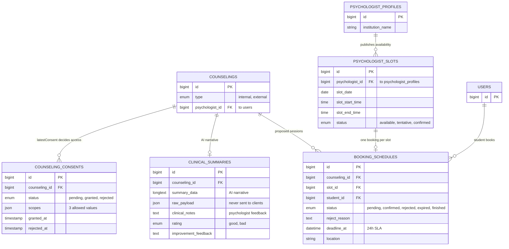

# 04 · Referral & Consent

<!-- verified: branch=dev commit=working-tree date=2026-10-10 scope=database/migrations,app/Models,app/Services/ReferralPayloadBuilder.php,app/Console/Commands -->
> **Verified against:** `dev` working tree · 2026-10-10
> **Sources:** [`2026_06_12_130000_create_counseling_consents_table.php`](../../../database/migrations/2026_06_12_130000_create_counseling_consents_table.php) · [`2026_06_12_130001_create_clinical_summaries_table.php`](../../../database/migrations/2026_06_12_130001_create_clinical_summaries_table.php) · [`2026_07_18_000001_create_psychologist_slots_table.php`](../../../database/migrations/2026_07_18_000001_create_psychologist_slots_table.php) · [`2026_07_18_000002_create_booking_schedules_table.php`](../../../database/migrations/2026_07_18_000002_create_booking_schedules_table.php)

What happens when a counselor decides a case needs an external professional. This slice carries the system's **privacy boundary**: nothing crosses from the school to the partner psychologist without an explicit, scoped grant from the student.

All four tables hang off `counselings`. None of them reference `schools` — psychologists work across schools.

---

## `counseling_consents`

| Column | Type | Null | Default | Notes |
|---|---|---|---|---|
| `id` | bigint | no | auto | |
| `counseling_id` | bigint FK | no | — | → `counselings.id`, cascade |
| `status` | enum | no | `'pending'` | [`ConsentStatus`](../../../app/Enums/ConsentStatus.php). Cast to enum. |
| `scopes` | json | yes | null | Cast `array`. Set on grant, **nulled on reject**. |
| `granted_at` | timestamp | yes | null | Cast `datetime` |
| `rejected_at` | timestamp | yes | null | Cast `datetime` |
| `created_at`, `updated_at`, `deleted_at` | timestamp | yes | — | |

**Relations** — [`CounselingConsent`](../../../app/Models/CounselingConsent.php): `counseling()`. This model uses `$fillable` rather than `$guarded = []`, unlike most of the codebase — appropriate, given what it controls.

### The three scopes

`scopes` is an array drawn from exactly three values. Enforced by [`UpdateConsentRequest`](../../../app/Http/Requests/UpdateConsentRequest.php), which also requires **at least one** when granting:

| Scope value | What it unlocks |
|---|---|
| `mood_history` | 30-day mood distribution and insecure-streak figures |
| `sharing_history` | 30-day curhat excerpts with their NLP zone |
| **`assesment_logs`** | Guru BK assessment notes and intervention history |

> The misspelling (`assesment`, one `s`) is used consistently across validation, seeders, the payload builder, and the summary controller. Correcting it is a breaking change.

### Where consent is actually enforced

Two places, and they are independent — changing one does not protect the other:

1. **[`ReferralPayloadBuilder`](../../../app/Services/ReferralPayloadBuilder.php)** gates each payload module. A scope the student withheld produces an empty array plus an entry in `not_shared_categories`.
2. **`PsychologistSummaryController::authorizeConsentScope`** gates the psychologist's recap endpoints, aborting 403 unless `latestConsent` is `granted` **and** contains the specific scope:

   | Endpoint | Required scope |
   |---|---|
   | `GET /api/psychologist/recap/{counseling}/monthly/mood` | `mood_history` |
   | `GET /api/psychologist/recap/{counseling}/monthly/sharing` | `sharing_history` |
   | `GET /api/psychologist/recap/{counseling}/monthly/counseling` | `assesment_logs` |

   The scope checks in the payload builder also accept legacy aliases (`mood_history_30d`, `journal_excerpts`, `sharings`, `incidents`, `bk_assessment_notes`, `counseling_logs`). Only the three canonical values can pass validation today, so the aliases are dead branches — but do not rely on them being unreachable.

Consent also governs **de-anonymisation**: the psychologist sees the student's real name, NISN and class only through the summary endpoint, which requires a granted consent.

> **`[SPEC-ONLY]` — revocation does not exist.** [`docs/tasks/AND/AND-1 Manajemen Persetujuan Data (Digital Consent Granular).md`](../../tasks/AND/) and [`agent/screens/siswa_kelola_persetujuan_data.md`](../../../agent/screens/siswa_kelola_persetujuan_data.md) both specify a revoke action with immediate ACL invalidation. There is no `revoked` case in `ConsentStatus`, no `revoked_at` column, and no route. Once granted, consent cannot be withdrawn through the API.

## `clinical_summaries`

| Column | Type | Null | Notes |
|---|---|---|---|
| `id` | bigint | no | |
| `counseling_id` | bigint FK | no | → `counselings.id`, cascade |
| `summary_data` | longtext | no | The AI narrative. **Representation is inconsistent**: plain prose in [`ReferralFlowSeeder`](../../../database/seeders/ReferralFlowSeeder.php), a JSON string in [`CounselingFlowSeeder`](../../../database/seeders/CounselingFlowSeeder.php). Consumers must tolerate both. |
| `raw_payload` | json | yes | Cast `array`. The exact scope-filtered input given to Gemini. |
| `clinical_notes` | text | yes | The psychologist's own notes, added after the session. **Not encrypted** — unlike `counseling_logs.clinical_notes`. |
| `rating` | enum | yes | `good` / `bad` — the psychologist's rating **of the AI summary**, not of the student |
| `improvement_feedback` | text | yes | Free-text feedback on the AI output |
| `created_at`, `updated_at`, `deleted_at` | timestamp | yes | |

**Relations** — [`ClinicalSummary`](../../../app/Models/ClinicalSummary.php): `counseling()`. Uses `$fillable`.

`raw_payload` is **stripped from API responses** by [`ClinicalSummaryResource`](../../../app/Http/Resources/ClinicalSummaryResource.php). It exists for auditability — so you can reconstruct what the model was told — not for display.

### `raw_payload` shape

Built by [`ReferralPayloadBuilder::buildPayload`](../../../app/Services/ReferralPayloadBuilder.php). Always present:

| Key | Value |
|---|---|
| `referral_id` | `ref_` + first 8 chars of `md5(counseling.id)` |
| `anonymous_student_id` | `stu_` + first 8 chars of `md5(student.id)`, or `stu_anonymous` |
| `student_grade` | The student's room level (`X` / `XI` / `XII`), or `N/A` |
| `referral_severity` | The linked sharing's `priority`, defaulting to `sedang` |
| `consent_scope` | The granted scopes |
| `not_shared_categories` | Human-readable list of what was withheld |

Then, **only for granted scopes**: `mood_distribution_30d` with streak figures; `journal_excerpts` as `[{date, masked_text, zone}]` plus `red_zone_count_30d` / `yellow_zone_count_30d`; `bk_assessment_notes` and `active_intervention_history`.

> **`[PARTIAL]` — PII masking is disabled.** The method `maskDynamicNlpKeywords()` exists (it replaces NLP-matched stems and a hardcoded self-harm word list with `[MASKED:keyword]`), but its call site is **commented out** at [`ReferralPayloadBuilder.php:81`](../../../app/Services/ReferralPayloadBuilder.php). The field is still named `masked_text`, yet it currently holds the student's verbatim curhat. This is intentional and consistent with the current Gemini system prompt, which instructs the model to summarise "tanpa melakukan penyamaran kata sensitif" — but the field name is now misleading.

## `psychologist_slots`

| Column | Type | Null | Default | Notes |
|---|---|---|---|---|
| `id` | bigint | no | auto | |
| `psychologist_id` | bigint FK | no | — | → **`psychologist_profiles.id`**, cascade. **Not `users.id`.** |
| `slot_date` | date | no | — | Cast `date` |
| `slot_start_time` | time | no | — | Cast `datetime:H:i` |
| `slot_end_time` | time | no | — | Cast `datetime:H:i` |
| `status` | enum | no | `'available'` | [`SlotStatus`](../../../app/Enums/SlotStatus.php). Cast to enum. |
| `created_at`, `updated_at`, `deleted_at` | timestamp | yes | — | |

**Relations** — [`PsychologistSlot`](../../../app/Models/PsychologistSlot.php): `psychologistProfile()`, `bookingSchedule()` (`hasOne`). Scopes: `available()`, `upcoming()` (`slot_date >= today`).

Slot status tracks reservation, not the session: `available` → `tentative` (a booking is pending on it) → `confirmed` (the psychologist accepted). An expired or rejected booking reverts the slot to `available`. `tentative` is written by [`CreateBookingScheduleAction`](../../../app/Actions/CreateBookingScheduleAction.php) — together with `BookingStatus::holdsSlotValues()` it is what stops two students claiming the same hour.

## `booking_schedules`

| Column | Type | Null | Default | Notes |
|---|---|---|---|---|
| `id` | bigint | no | auto | |
| `counseling_id` | bigint FK | no | — | → `counselings.id`, cascade |
| `slot_id` | bigint FK | no | — | → `psychologist_slots.id`, cascade |
| `student_id` | bigint FK | no | — | → `users.id`, cascade |
| `status` | enum | no | `'pending'` | [`BookingStatus`](../../../app/Enums/BookingStatus.php) — **6 values**: `pending`, `confirmed`, `rescheduled`, `rejected`, `expired`, `finished`. Cast to enum. |
| `reject_reason` | text | yes | null | Filled when the psychologist proposes a different time |
| `deadline_at` | datetime | no | — | **Not nullable.** `now() + 24 hours` at creation. Cast `datetime`. |
| `location` | string | yes | null | Derived from the psychologist's `institution_name` on confirmation |
| `created_at`, `updated_at`, `deleted_at` | timestamp | yes | — | |

**Relations** — [`BookingSchedule`](../../../app/Models/BookingSchedule.php): `counseling()`, `slot()`, `student()`. Scopes: `pending()`, `expired()` (`status = pending AND deadline_at <= now()`).

---

## Lifecycle notes

**Consent is created by an observer, not a controller.** [`CounselingObserver::created`](../../../app/Observers/CounselingObserver.php) inserts a `pending` consent for every `type = external` counseling. A counselor can re-send it via `POST /api/counseling/{counseling}/consent`.

**Booking creation takes a pessimistic lock.** [`CreateBookingScheduleAction`](../../../app/Actions/CreateBookingScheduleAction.php) calls `lockForUpdate()` on the slot row before inserting, so two students cannot claim the same slot concurrently.

**Slots are only offered from two days out.** `GetAvailableDatesAction` filters `slot_date >= now() + 2 days`, excludes slots that already have a pending or confirmed booking, and groups results by date with Indonesian labels.

**The 24-hour SLA is enforced by a scheduled command.** `php artisan referrals:expire-pending` ([`ExpirePendingReferrals`](../../../app/Console/Commands/ExpirePendingReferrals.php)) runs every 15 minutes, flips elapsed pending bookings to `expired`, reverts their slots to `available`, and fires `BookingExpired`. That event has **no listener**, so nothing notifies the student.

**Confirmation triggers the AI summary.** `PATCH /api/psychologist/referrals/{booking}/decide` with `action = confirm` dispatches [`GenerateGeminiReferralSummaryJob`](../../../app/Jobs/GenerateGeminiReferralSummaryJob.php), which hard-aborts unless `latestConsent->status === ConsentStatus::GRANTED`.

**`action = reschedule`** marks the original booking `rescheduled` (not `rejected`), releases its slot, and creates a replacement booking already `confirmed` on the slot the psychologist chose, with the session time as its `deadline_at`. **This is deliberate**: the product rule is auto-approval — the student is informed, not asked. The design screen `Psikolog mengajukan perubahan jadwal` (`#5609:39677`) carries no accept/decline button, only "Lihat Detail", which confirms it.

**`action = reject`** declines the referral outright: booking `rejected` with a reason, slot released, and the counseling returns to `menunggu_jadwal` so the student can choose another time. This is the only writer of `rejected`; before the state machine was reworked, `rejected` was produced as a side effect of rescheduling, which made the "Ditolak" filter show moved appointments.

**Closing the loop.** `POST /api/psychologist/referrals/{counseling}/feedback` sets booking → `finished`, counseling → `selesai`, and the linked sharing → `Diselesaikan`, while saving the psychologist's notes and rating onto `clinical_summaries`.
