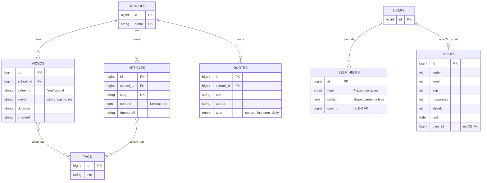

# 05 · Content & Engagement

<!-- verified: branch=dev commit=266f860 date=2026-10-09 scope=database/migrations,app/Models,database/factories/SelfHelpFactory.php,app/Observers -->
> **Verified against:** `dev` @ `266f860` · 2026-10-09
> **Sources:** [`2025_09_01_215340_create_content_tables.php`](../../../database/migrations/2025_09_01_215340_create_content_tables.php) · [`2025_09_10_011301_create_quotes_table.php`](../../../database/migrations/2025_09_10_011301_create_quotes_table.php) · [`2025_10_12_215130_self_help.php`](../../../database/migrations/2025_10_12_215130_self_help.php) · [`2025_10_13_201831_game_tables.php`](../../../database/migrations/2025_10_13_201831_game_tables.php)

Everything that keeps a student coming back when nothing is wrong: the school's educational library, mood-matched quotes, self-guided exercises, and the Cirrus pet.

Two different ownership models sit side by side here. Content (`videos`, `articles`, `quotes`) belongs to a **school**. Engagement (`self_helps`, `clouds`) belongs to a **user**.

---

## `videos`

| Column | Type | Null | Notes |
|---|---|---|---|
| `id` | bigint | no | |
| `school_id` | bigint FK | no | → `schools.id`, cascade. Hidden from API output. |
| `title` | string | no | |
| `description` | text | no | |
| `thumbnail` | string | no | |
| `duration` | string | no | |
| `channel` | string | no | |
| `views` | **string** | no | Stored as a string in the database, **cast to `integer`** in the model. A YouTube API artefact. |
| `video_id` | string | no | The YouTube video id. Content is embedded, not hosted. Also the route key for `GET /api/video/{video:video_id}`. |
| `created_at`, `updated_at`, `deleted_at` | timestamp | yes | `updated_at` hidden |

**Relations** — [`Video`](../../../app/Models/Video.php): `school()`, `tags()` (belongsToMany via `video_tag`).

Metadata is fetched from the YouTube Data API by [`FetchYoutubeMetaAction`](../../../app/Actions/FetchYoutubeMetaAction.php) at creation time, so an admin only supplies the video id. Requires `YOUTUBE_API_KEY`.

## `articles`

| Column | Type | Null | Notes |
|---|---|---|---|
| `id` | bigint | no | |
| `school_id` | bigint FK | no | → `schools.id`, cascade. Hidden. |
| `title` | string | no | |
| `slug` | string | no | **unique**. Route key for `GET /api/article/{article}`. |
| `description` | text | no | |
| `thumbnail` | string | no | Path on the `public` disk |
| `content` | json | no | Cast to `array`. **A Lexical editor tree, not HTML** — `root.children[].children[]` with `format`, `mode`, `style`, `type`, `version`. See [`ArticleFactory`](../../../database/factories/ArticleFactory.php) for a concrete example. Rendering it requires a Lexical-compatible renderer on the client. |
| `created_at`, `updated_at`, `deleted_at` | timestamp | yes | |

**Relations** — [`Article`](../../../app/Models/Article.php): `school()`, `tags()` (via `article_tag`).

The model hooks `deleting` to remove the thumbnail file from the `public` disk. Because the model uses soft deletes, this means **the file is deleted while the row is only soft-deleted** — restoring the row leaves a broken thumbnail.

Thumbnails are compressed through an external image-compressor API (`image_compress_url` / `image_compress_key` in [`config/app.php`](../../../config/app.php)) by [`CompressThumbnail`](../../../app/Console/Commands/CompressThumbnail.php).

## `tags`, `video_tag`, `article_tag`

`tags`: `id`, `title`, `deleted_at`. **No timestamps.**

[`Tag`](../../../app/Models/Tag.php) has `videos()` and `articles()`, and hides the `pivot` key from output.

Both pivot tables have the same shape: a surrogate `id`, two cascading foreign keys, **no timestamps, and no composite unique constraint**. The same tag can therefore be attached to the same video more than once; nothing in the schema prevents duplicates.

Four tags are seeded by [`TagSeeder`](../../../database/seeders/TagSeeder.php): `Self Awareness`, `Mindfulness`, `Mental Health`, `Bullying`.

## `quotes`

| Column | Type | Null | Notes |
|---|---|---|---|
| `id` | bigint | no | |
| `school_id` | bigint FK | no | → `schools.id`, cascade |
| `text` | string | no | |
| `author` | string | no | |
| `type` | enum | no | `secure` / `insecure` / `daily` |
| `created_at`, `updated_at`, `deleted_at` | timestamp | yes | |

**Relations** — [`Quote`](../../../app/Models/Quote.php): `school()`.

`GET /api/quote/mood` selects by the student's mood for today — `secure` for happy/neutral, `insecure` for sad/angry — and **requires a mood to have been recorded**. `GET /api/quote/daily` serves `type = daily` with no precondition.

## `self_helps`

| Column | Type | Null | Notes |
|---|---|---|---|
| `id` | bigint | no | |
| `type` | enum | no | Exactly four values: `'Daily Journaling'`, `'Gratitude Journal'`, `'Grounding Technique'`, `'Sensory Relaxation'` |
| `content` | json | no | Cast `json`. **Shape differs per `type`** — see below. |
| `user_id` | bigint | no | → `users.id` logically, **no database foreign key** |
| `created_at`, `updated_at`, `deleted_at` | timestamp | yes | |

**Relations** — [`SelfHelp`](../../../app/Models/SelfHelp.php): `user()`. There is **no inverse relation on `User`**; query this table directly.

### `content` shapes per type

The authoritative reference is [`SelfHelpFactory`](../../../database/factories/SelfHelpFactory.php), which defines one state per type. There is no schema validation on the JSON, so a malformed payload is stored as-is.

| `type` | Keys |
|---|---|
| `Daily Journaling` | `category` (string), `emotions` (array), `story` (text), `mind` (text) |
| `Gratitude Journal` | `achievement` (array), `apreciation` (string — **note the spelling**), `progress` (array) |
| `Grounding Technique` | `five`, `four`, `three`, `two` (arrays of that length), `one` (string) — the 5-4-3-2-1 grounding exercise |
| `Sensory Relaxation` | `activity` (array), `reflection` (string) |

Each type has its own endpoint (`POST /api/self-help/daily-journaling` and so on) rather than one generic one.

> **`[SPEC-ONLY]`** The Figma design shows **eight** self-help activities, grouped as Emotional / Mindfulness / Physical. The four above exist; `Latihan Pernapasan` (breathing), `Pelukan Kupu-Kupu` (butterfly hug), `Aktivitas Fisik` (physical activity, with a 10/15/20-minute timer) and `Afirmasi Diri` (self-affirmation) have no `type` value, no endpoint, and no storage. Consistently, the Guru Wali "Riwayat Self Help" tab in the design lists only the four implemented ones.

## `clouds` — the "Cirrus" pet

| Column | Type | Null | Default | Notes |
|---|---|---|---|---|
| `id` | bigint | no | auto | |
| `water` | integer | no | `0` | In-game currency. UI calls it "Tetesan Air" / "tetesan embun". |
| `level` | integer | no | `1` | |
| `exp` | integer | no | `0` | |
| `happiness` | integer | no | `0` | |
| `streak` | integer | no | `1` | Daily check-in streak **for the game** — distinct from the mood streak computed off `mood_records` |
| `last_in` | date | no | `now()` at migration time | Last claim date. Note the default was evaluated when the migration ran. |
| `user_id` | bigint | no | — | → `users.id` logically, **no database foreign key** |
| `created_at`, `updated_at`, `deleted_at` | timestamp | yes | — | |

**Relations** — [`Cloud`](../../../app/Models/Cloud.php): `user()`.

Served by `GET /api/cirrus`, with `POST /api/buy` (spend water on food) and `POST /api/claim` (daily reward, capped at a 7-day streak).

---

## Lifecycle notes

- [`UserObserver`](../../../app/Observers/UserObserver.php) creates the `clouds` row for every new student. A student without one will break the Cirrus endpoints — relevant when inserting users directly via SQL.
- [`CloudObserver::updated`](../../../app/Observers/CloudObserver.php) auto-levels the pet: when `exp >= 100` it increments `level`, subtracts 100 from `exp`, and saves again. Because it saves inside `updated`, a single large XP gain levels up **once**, not repeatedly — 250 XP yields one level and leaves 150 XP, which then levels again on the next update.
- Nothing observes `self_helps`. Journaling produces no notification, no NLP analysis, and no effect on priority or SLA — even though the text is free-form and could contain exactly the signals the NLP service looks for in a curhat. Worth knowing before assuming journals are monitored.
