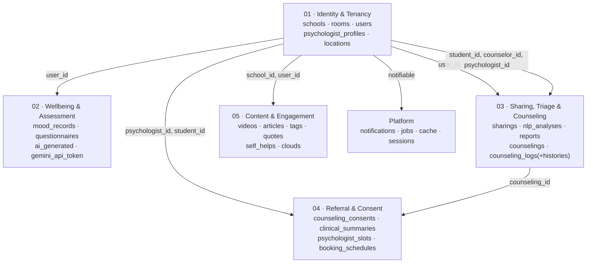

# Data Model — Domain Map & Table Index

<!-- verified: branch=dev commit=working-tree date=2026-10-10 scope=database/migrations,app/Models -->
> **Verified against:** `dev` working tree · 2026-10-10
> **Sources:** [`database/migrations/`](../../../database/migrations/) (31 files) · [`app/Models/`](../../../app/Models/) (23 models)

**37 tables total: 28 domain tables + 9 platform tables.** There is deliberately **no single whole-schema ERD** — at this size it would be unreadable and would carry no domain meaning. Instead: one domain map below, then five ERD slices of at most ten entities each.

Diagrams carry *shape*. The per-table dictionaries inside each slice carry *detail*.

---

## Domain map

`users` and `counselings` are the two hubs. Everything that matters passes through one of them.

---

## Table index

Legend for **FK integrity**: ✅ all relation columns are real database foreign keys · ⚠️ some relation columns have no database constraint · — no relation columns.

### 01 · Identity & Tenancy → [`01-identity-and-tenancy.md`](01-identity-and-tenancy.md)

| Table | Model | Soft deletes | FK integrity |
|---|---|---|---|
| `schools` | [`School`](../../../app/Models/School.php) | ✅ | — |
| `rooms` | [`Room`](../../../app/Models/Room.php) | ✅ | ✅ |
| `users` | [`User`](../../../app/Models/User.php) | ✅ | ✅ |
| `psychologist_profiles` | [`PsychologistProfile`](../../../app/Models/PsychologistProfile.php) | ✅ | ✅ |
| `locations` | [`Location`](../../../app/Models/Location.php) | ✅ | — |

### 02 · Wellbeing & Assessment → [`02-wellbeing-and-assessment.md`](02-wellbeing-and-assessment.md)

| Table | Model | Soft deletes | FK integrity |
|---|---|---|---|
| `mood_records` | [`MoodRecord`](../../../app/Models/MoodRecord.php) | ✅ | ✅ |
| `questionnaires` | [`Questionnaire`](../../../app/Models/Questionnaire.php) | ✅ (no `timestamps`) | — |
| `ai_generated` | none — raw queries only | ❌ | — |
| `gemini_api_token` | none — raw queries only | ❌ | — |

### 03 · Sharing, Triage & Counseling → [`03-sharing-triage-and-counseling.md`](03-sharing-triage-and-counseling.md)

| Table | Model | Soft deletes | FK integrity |
|---|---|---|---|
| `sharings` | [`Sharing`](../../../app/Models/Sharing.php) | ✅ | ✅ |
| `nlp_analyses` | [`NlpAnalysis`](../../../app/Models/NlpAnalysis.php) | ✅ | — (polymorphic) |
| `reports` | [`Report`](../../../app/Models/Report.php) | ✅ | ✅ |
| `counselings` | [`Counseling`](../../../app/Models/Counseling.php) | ✅ | ⚠️ `student_id`, `counselor_id`, `sharing_id` |
| `counseling_logs` | [`CounselingLog`](../../../app/Models/CounselingLog.php) | ✅ | ✅ |
| `counseling_log_histories` | [`CounselingLogHistory`](../../../app/Models/CounselingLogHistory.php) | ❌ **by design — append-only** | ✅ |
| `case_events` | [`CaseEvent`](../../../app/Models/CaseEvent.php) | ❌ **by design — append-only** | ✅ |

### 04 · Referral & Consent → [`04-referral-and-consent.md`](04-referral-and-consent.md)

| Table | Model | Soft deletes | FK integrity |
|---|---|---|---|
| `counseling_consents` | [`CounselingConsent`](../../../app/Models/CounselingConsent.php) | ✅ | ✅ |
| `clinical_summaries` | [`ClinicalSummary`](../../../app/Models/ClinicalSummary.php) | ✅ | ✅ |
| `psychologist_slots` | [`PsychologistSlot`](../../../app/Models/PsychologistSlot.php) | ✅ | ✅ |
| `booking_schedules` | [`BookingSchedule`](../../../app/Models/BookingSchedule.php) | ✅ | ✅ |

### 05 · Content & Engagement → [`05-content-and-engagement.md`](05-content-and-engagement.md)

| Table | Model | Soft deletes | FK integrity |
|---|---|---|---|
| `videos` | [`Video`](../../../app/Models/Video.php) | ✅ | ✅ |
| `articles` | [`Article`](../../../app/Models/Article.php) | ✅ | ✅ |
| `tags` | [`Tag`](../../../app/Models/Tag.php) | ✅ (no `timestamps`) | — |
| `video_tag` | pivot, no model | ❌ | ✅ |
| `article_tag` | pivot, no model | ❌ | ✅ |
| `quotes` | [`Quote`](../../../app/Models/Quote.php) | ✅ | ✅ |
| `self_helps` | [`SelfHelp`](../../../app/Models/SelfHelp.php) | ✅ | ⚠️ `user_id` |
| `clouds` | [`Cloud`](../../../app/Models/Cloud.php) | ✅ | ⚠️ `user_id` |

### Platform tables

Standard Laravel infrastructure. No ERD — nothing domain-specific depends on their shape.

| Table | Purpose | Notes |
|---|---|---|
| `notifications` | Laravel database notifications | **`id` is a UUID** — the only UUID primary key in the whole schema. Written by [`RedZoneAlertNotification`](../../../app/Notifications/RedZoneAlertNotification.php). |
| `jobs`, `job_batches`, `failed_jobs` | Queue backend | `QUEUE_CONNECTION=database`. Without a running worker, NLP analysis and AI summaries never execute. |
| `cache`, `cache_locks` | Cache store | Database driver. |
| `sessions` | Session store | `user_id` is indexed but has **no** foreign key. |
| `password_reset_tokens` | Laravel default | **Unused** — there is no password-reset flow in the API. |

There is **no `personal_access_tokens` table**: `laravel/sanctum` is installed but never migrated or used. The API guard is JWT.

---

## Conventions

**Primary keys.** All `bigIncrements` integers, except `notifications.id` (UUID).

**Soft deletes.** Near-universal, but added in two different ways — original table migrations for newer tables, and one retrofit migration ([`2026_05_12_000000_add_soft_deletes_to_all_major_tables.php`](../../../database/migrations/2026_05_12_000000_add_soft_deletes_to_all_major_tables.php)) for the fourteen older ones. The retrofit is guarded by `hasColumn`, so re-running it is safe.

Tables **without** soft deletes: `ai_generated`, `gemini_api_token`, `video_tag`, `article_tag`, `counseling_log_histories` (deliberate — append-only audit trail), plus all platform tables.

**Tenancy.** `school_id` appears on `users`, `rooms`, `videos`, `articles`, `quotes`. Tables reached through a user (`sharings`, `reports`, `counselings`, `mood_records`, `self_helps`, `clouds`) carry no `school_id`.

> **There is no global scope anywhere** (`grep -rn addGlobalScope app/` returns nothing). Every controller must filter by school itself. A missing filter leaks another school's data. This is the single most important thing to remember when adding an endpoint.

**Encrypted columns.** `counseling_logs.clinical_notes` and `counseling_log_histories.clinical_notes` use Eloquent's `encrypted` cast. They are encrypted at the application layer, so they **cannot be filtered, searched, sorted or aggregated in SQL**. Rotating `APP_KEY` makes existing values unreadable.

**JSON columns.** `schools.emergency_contacts`, `questionnaires.answers`, `self_helps.content`, `articles.content` (Lexical editor tree, not HTML), `nlp_analyses.response`, `counseling_consents.scopes`, `clinical_summaries.raw_payload`, `ai_generated.answer`.

**Mass assignment.** Every model except `CounselingConsent` and `ClinicalSummary` uses `protected $guarded = []`. On `User` this is a live privilege-escalation surface, because `role` and `school_id` become mass-assignable — see [`03-authorization.md`](../03-authorization.md).

**Enum columns.** Declared three different ways across migrations: enum case objects passed directly (`MoodStatus::cases()`), `array_column(..., 'value')`, and plain string arrays. Functionally equivalent, cosmetically inconsistent.

---

## Foreign key integrity audit

Five relation columns were created with `foreignIdFor(...)` **without** `->constrained()`. The Eloquent relationships work, but the database enforces nothing: orphan rows are possible, and deleting a parent leaves dangling references.

| Column | Should point at | Migration |
|---|---|---|
| `counselings.student_id` | `users.id` | [`2026_05_26_101154_create_counseling_table.php`](../../../database/migrations/2026_05_26_101154_create_counseling_table.php) |
| `counselings.counselor_id` | `users.id` | same |
| `counselings.sharing_id` | `sharings.id` | same |
| `self_helps.user_id` | `users.id` | [`2025_10_12_215130_self_help.php`](../../../database/migrations/2025_10_12_215130_self_help.php) |
| `clouds.user_id` | `users.id` | [`2025_10_13_201831_game_tables.php`](../../../database/migrations/2025_10_13_201831_game_tables.php) |

In the same table, `counselings.report_id` and `counselings.psychologist_id` **do** have proper constraints — they were added by later migrations. So `counselings` is only half-constrained.

### Two different meanings of `psychologist_id`

| Column | Points at |
|---|---|
| `counselings.psychologist_id` | **`users.id`** |
| `psychologist_slots.psychologist_id` | **`psychologist_profiles.id`** |

Joining one as if it were the other is a silent data-corruption bug. Always check which table you are in.

---

## Rollback is not clean

Two `down()` methods are incomplete. `migrate:rollback` will leave tables behind:

- [`2025_09_01_215340_create_content_tables.php`](../../../database/migrations/2025_09_01_215340_create_content_tables.php) drops only `videos`, `tags`, `video_tag` — `articles` and `article_tag` survive.
- [`2025_10_13_201831_game_tables.php`](../../../database/migrations/2025_10_13_201831_game_tables.php) has an empty `down()`.

Use `php artisan migrate:fresh` rather than `rollback` when iterating locally. For a reset that preserves the AI tables, see `migrate:fresh-backup` in [`11-environment-and-runbook.md`](../11-environment-and-runbook.md).
