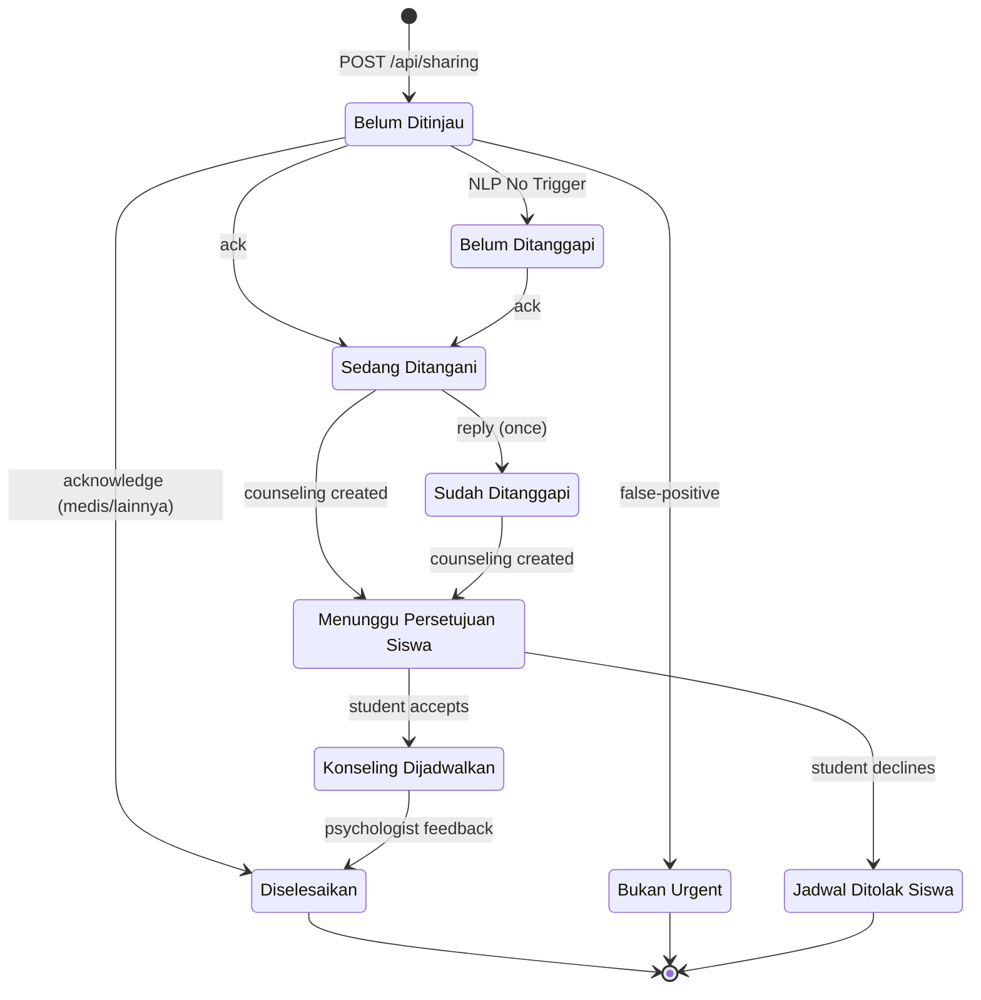
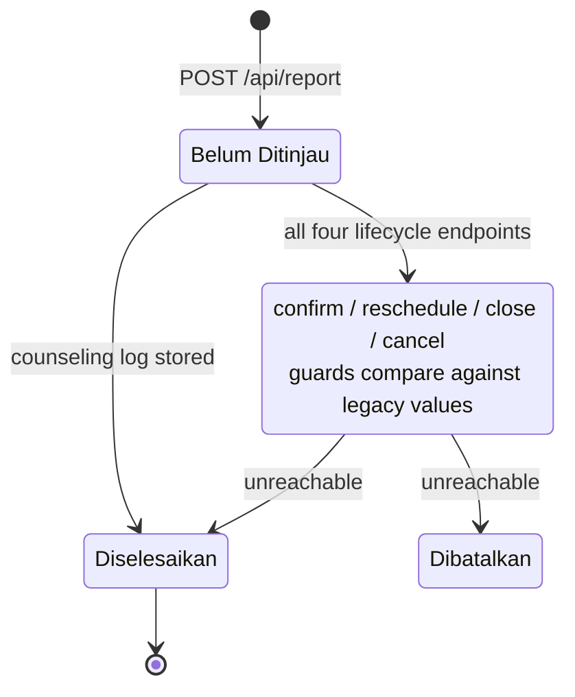
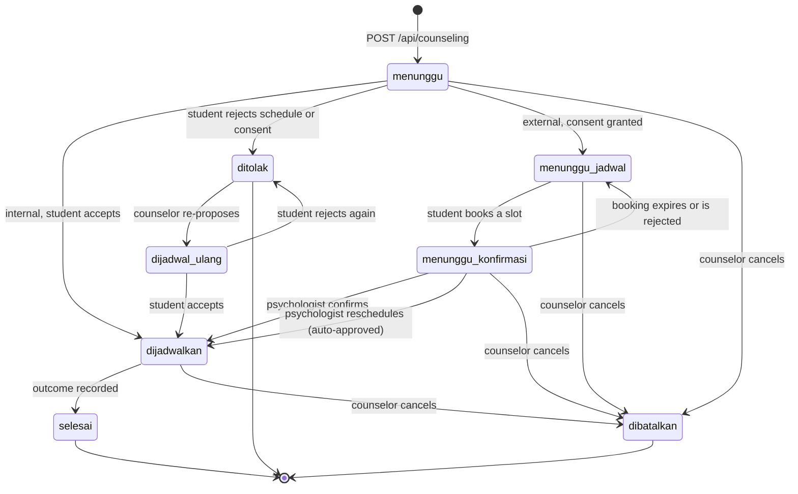
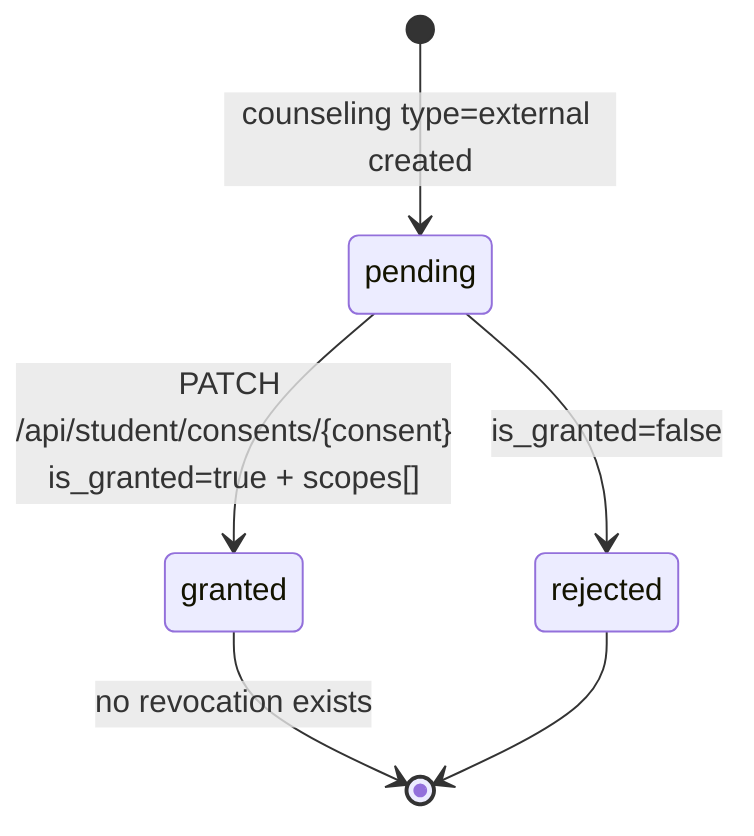
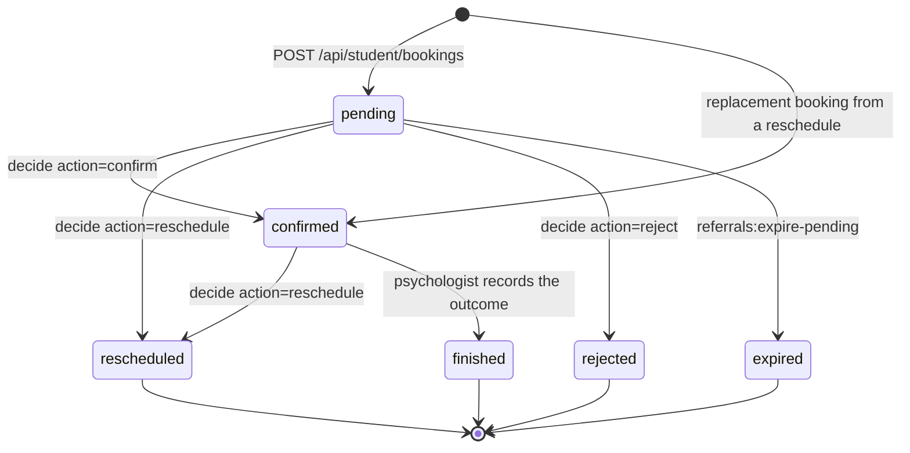
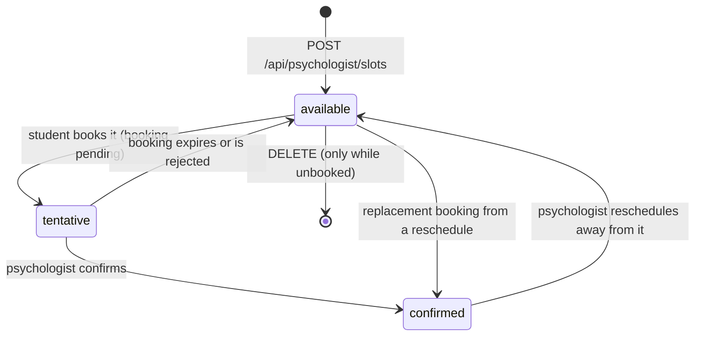

# State Machines

<!-- verified: branch=dev commit=working-tree date=2026-10-10 scope=app/Enums,app/Http/Controllers,app/Actions,app/Jobs,app/Observers,app/Console/Commands,app/Http/Requests -->
> **Verified against:** `dev` working tree · 2026-10-10 (counseling & booking state machines reworked)
> **Sources:** [`app/Enums/`](../../app/Enums/) · every write site found with `grep -rn "ReportStatus::\|CounselingStatus::\|ConsentStatus::\|BookingStatus::\|SlotStatus::" app/`

Six status enums govern the workflow. Each diagram below shows only transitions that **exist in code**; unreachable states and dead guards are called out explicitly.

Enum values are Indonesian strings and are stored verbatim in the database. For the UI copy that corresponds to each, see [`12-ui-contract.md`](12-ui-contract.md).

---

## `ReportStatus` — used by two tables

[`ReportStatus`](../../app/Enums/ReportStatus.php) has ten cases and is the `status` column of **both** `sharings` and `reports`. The two tables reach different subsets, and the enum is **cast on `Sharing` but not on `Report`**. Treat them as two machines that happen to share a vocabulary.

| Case | Value |
|---|---|
| `MENUNGGU_TINJAUAN` | `Belum Ditinjau` |
| `DITINJAU` | `Sedang Ditangani` |
| `DITANGGAPI` | `Sudah Ditanggapi` |
| `MENUNGGU_TANGGAPAN` | `Belum Ditanggapi` |
| `MENUNGGU_PERSETUJUAN` | `Menunggu Persetujuan Siswa` |
| `DIJADWALKAN` | `Konseling Dijadwalkan` |
| `SELESAI` | `Diselesaikan` |
| `DIBATALKAN` | `Dibatalkan` |
| `DITOLAK` | `Jadwal Ditolak Siswa` |
| `BUKAN_URGENT` | `Bukan Urgent` |

### As `sharings.status`

| From | To | Trigger | Actor | Guard | Side effects | Source |
|---|---|---|---|---|---|---|
| — | `Belum Ditinjau` | `POST /api/sharing` | student | `SharingPolicy::create` | Creates `nlp_analyses` row; dispatches `ProcessNlpAnalysisJob` | [`SharingController`](../../app/Http/Controllers/SharingController.php) |
| `Belum Ditinjau` | `Belum Ditanggapi` | NLP returns `No Trigger` | system | — | Also writes `priority=rendah`, `cutdown_for_report=now()` | [`ProcessNlpAnalysisJob:60`](../../app/Jobs/ProcessNlpAnalysisJob.php) |
| any | `Sedang Ditangani` | `PATCH /api/sharing/ack/{sharing}` | counselor | — | Sets `acknowledged_at` (stops the principal's SLA clock) | [`SharingController:213`](../../app/Http/Controllers/SharingController.php) |
| any | `Sedang Ditangani` | `PATCH /api/sharing/acknowledge/{sharing}` with `action=konseling_mandiri` | counselor | — | Writes `action`, `action_notes`, `action_confirmed` | [`SharingController:234`](../../app/Http/Controllers/SharingController.php) |
| any | `Diselesaikan` | same endpoint with `action=penanganan_medis` or `lainnya` | counselor | — | Closes the case without a counseling session | same |
| any | `Sudah Ditanggapi` | `PATCH /api/sharing/reply/{sharing}` | counselor | `SharingPolicy::update` **and** `reply` is still null | Writes `reply`, `replied_at`, `replied_by` (a name string) | [`ReplySharingRequest::passedValidation`](../../app/Http/Requests/ReplySharingRequest.php) |
| `Belum Ditinjau` | `Bukan Urgent` | `PATCH /api/sharing/false-positive/{sharing}` | counselor | `SharingPolicy::falsePositive` — **status must be `Belum Ditinjau`** | `priority → rendah`, SLA cleared, `nlp_analyses.status → false-positive` + `reason` | [`SharingController:256`](../../app/Http/Controllers/SharingController.php) |
| any | `Menunggu Persetujuan Siswa` | a `Counseling` is created with a `sharing_id` | counselor (indirect) | — | **Fires for internal counselings too**, not only referrals | [`CounselingObserver:27`](../../app/Observers/CounselingObserver.php) |
| any | `Menunggu Persetujuan Siswa` | `POST /api/counseling/{counseling}/consent` | counselor | `CounselingPolicy::storeLog` | Creates a fresh `pending` consent | [`CounselingController:62`](../../app/Http/Controllers/CounselingController.php) |
| `Menunggu Persetujuan Siswa` | `Konseling Dijadwalkan` | `PATCH /api/student/counselings/{counseling}/acknowledge` `type=accept` | student | **none — see holes below** | Counseling → `dijadwalkan` | [`CounselingController:94`](../../app/Http/Controllers/CounselingController.php) |
| `Menunggu Persetujuan Siswa` | `Jadwal Ditolak Siswa` | same endpoint, `type=decline` | student | same | Counseling → `ditolak` | [`CounselingController:99`](../../app/Http/Controllers/CounselingController.php) |
| any | `Diselesaikan` | `POST /api/psychologist/referrals/{counseling}/feedback` | psychologist | assigned + confirmed booking | Booking → `finished`, counseling → `selesai` | [`PsychologistSummaryController:187`](../../app/Http/Controllers/PsychologistSummaryController.php) |

**Not reachable on `sharings`:** `Dibatalkan`. Nothing writes it to this table.

> Transitions are **not guarded by the current state** except for `false-positive`. A counselor can reply to an already-closed curhat, and `ack` works from any state. The diagram shows typical paths, not enforced ones.

### As `reports.status`

| From | To | Trigger | Guard | Status |
|---|---|---|---|---|
| — | `Belum Ditinjau` | `POST /api/report` | `ReportPolicy::create` — student with `last_mood ∈ {sad, angry}` | works. Fires `ReportCreated` |
| any | `Diselesaikan` | `POST /api/counseling-logs` | `CounselingPolicy::storeLog` | **works** — the only live path to closing a report |
| `menunggu` | `disetujui` | `PATCH /api/report/confirm/{report}` | `$report->status == 'menunggu'` | `[DEAD]` |
| `disetujui` | `dijadwalkan` | `PATCH /api/report/reschedule/{report}` | `$report->status == 'disetujui'` | `[DEAD]` |
| `disetujui`/`dijadwalkan` | `Diselesaikan` | `PATCH /api/report/close/{report}` | `in_array($status, ['disetujui','dijadwalkan'])` | `[DEAD]` |
| `disetujui`/`dijadwalkan` | `Dibatalkan` | `PATCH /api/report/cancel/{report}` | reuses `CloseReportRequest` | `[DEAD]` |

> **`[DEAD]` — the whole report lifecycle is unreachable.** [`ConfirmReportRequest`](../../app/Http/Requests/ConfirmReportRequest.php), [`RescheduleReportRequest`](../../app/Http/Requests/RescheduleReportRequest.php) and [`CloseReportRequest`](../../app/Http/Requests/CloseReportRequest.php) authorize against `'menunggu'`, `'disetujui'` and `'dijadwalkan'` — a **legacy status vocabulary** that predates `ReportStatus` and contains none of its values. A report's default status is `Belum Ditinjau`, so `authorize()` returns false and every one of the four endpoints responds 403 regardless of who calls it.
>
> Worse, `ConfirmReportRequest::passedValidation` merges `status => 'disetujui'` and `RescheduleReportRequest` merges `'dijadwalkan'` — values the MySQL enum column would reject even if the guard passed.
>
> In practice a report moves forward via `POST /api/report/{report}/schedule-meeting` (which creates a `Counseling` and leaves the report's status untouched) and is closed by `POST /api/counseling-logs`.

**Side effect on report creation.** `ReportCreated` → [`UpdateRelatedSharingPriority`](../../app/Listeners/UpdateRelatedSharingPriority.php) sets `priority = 'tinggi'` on **every** curhat the same student wrote **today**. Note it writes the literal string, bypassing the enum, and does not touch `cutdown_for_report` — so a curhat can become high priority without an SLA deadline.

---

## `CounselingStatus`

[`CounselingStatus`](../../app/Enums/CounselingStatus.php) — **8 cases**, cast to the enum on the model. **Column default is `menunggu`.**

| Case | Value | Meaning |
|---|---|---|
| `MENUNGGU` | `menunggu` | Created by the counselor; waiting on the student — schedule approval (internal) or data consent (external) |
| `MENUNGGU_JADWAL` | `menunggu_jadwal` | Consent granted; the student must pick a slot. **Also the state a referral returns to after its booking expires or is rejected** |
| `MENUNGGU_KONFIRMASI` | `menunggu_konfirmasi` | A booking was submitted; waiting on the psychologist |
| `DIJADWALKAN` | `dijadwalkan` | Confirmed; the session is ready to run |
| `DIJADWAL_ULANG` | `dijadwal_ulang` | The counselor re-proposed a schedule after the student rejected one; waiting on the student again |
| `SELESAI` | `selesai` | Outcome recorded |
| `DITOLAK` | `ditolak` | The student rejected the schedule, or rejected consent |
| `DIBATALKAN` | `dibatalkan` | The counselor cancelled |

Helpers on the enum, used instead of hardcoded allowlists: `isActive()`, `isTerminal()`, `needsStudentAction()`, `activeValues()`, `terminalValues()`.

> **`dijadwal_ulang` is the internal path only.** On the psychologist path a reschedule is auto-approved, so the counseling goes straight to `dijadwalkan` and the "schedule was moved" trace lives at booking level as `BookingStatus::RESCHEDULED`. Using one value for both would make it ambiguous — "waiting on the student" internally versus "already scheduled" externally. It has exactly one meaning: **a new schedule has been proposed and the student must respond.**

| From | To | Trigger | Actor | Guard | Side effects | Source |
|---|---|---|---|---|---|---|
| — | `menunggu` | `POST /api/counseling` | counselor | `CreateCounselingRequest` | Observer: pending consent if `type=external`; linked sharing → `Menunggu Persetujuan Siswa` | [`CreateCounselingRequest:61`](../../app/Http/Requests/CreateCounselingRequest.php) |
| — | `menunggu` | `POST /api/report/{report}/schedule-meeting` | super/admin/headteacher/assigned counselor | `ReportPolicy::scheduleMeeting` | Creates counseling `type=internal`, `source_type=nlp_incident`; fires `CounselingScheduled` | [`ScheduleReportCounselingAction`](../../app/Actions/ScheduleReportCounselingAction.php) |
| `menunggu` | `menunggu_jadwal` | `PATCH /api/student/consents/{consent}` granted | student | `CounselingConsentPolicy::update`; only when `type=external` | Consent `granted` + scopes | [`UpdateConsentAction`](../../app/Actions/UpdateConsentAction.php) |
| any active | `ditolak` | same endpoint, rejected | student | same | Consent `rejected`, scopes nulled | same |
| `menunggu_jadwal` | `menunggu_konfirmasi` | `POST /api/student/bookings` | student | own counseling, `type=external`, no live booking | Booking `pending` (+24h), **slot → `tentative`** | [`CreateBookingScheduleAction`](../../app/Actions/CreateBookingScheduleAction.php) |
| `menunggu_konfirmasi` | `dijadwalkan` | `decide` `action=confirm` | psychologist | `BookingSchedulePolicy::decide`, booking must be `pending` | Booking + slot `confirmed`; AI summary job | [`DecideReferralAction`](../../app/Actions/Psychologist/DecideReferralAction.php) |
| `menunggu_konfirmasi` | `dijadwalkan` | `decide` `action=reschedule` | psychologist | booking `pending` or `confirmed` | Old booking `rescheduled`, old slot released, new booking `confirmed`; AI summary job | same |
| `menunggu_konfirmasi` | `menunggu_jadwal` | `referrals:expire-pending` | system | booking `pending` and past `deadline_at` | Booking `expired`, slot `available`; fires `BookingExpired` | [`ExpirePendingReferrals`](../../app/Console/Commands/ExpirePendingReferrals.php) |
| `menunggu_konfirmasi` | `menunggu_jadwal` | `decide` `action=reject` | psychologist | booking must be `pending` | Booking `rejected` + reason, slot released | [`DecideReferralAction`](../../app/Actions/Psychologist/DecideReferralAction.php) |
| `menunggu` / `dijadwal_ulang` | `dijadwalkan` | `PATCH /api/student/counselings/{counseling}/acknowledge` `accept` | student | `CounselingPolicy::acknowledge` + `needsStudentAction()` | Sharing → `Konseling Dijadwalkan` | [`CounselingController`](../../app/Http/Controllers/CounselingController.php) |
| `menunggu` / `dijadwal_ulang` | `ditolak` | same, `decline` | student | same | Sharing → `Jadwal Ditolak Siswa` | same |
| `ditolak` | `dijadwal_ulang` | `PATCH /api/counseling/{counseling}/repropose` | assigned counselor | `CounselingPolicy::manageSchedule`, status must be `ditolak` | New `scheduled_at`; sharing → `Menunggu Persetujuan Siswa` | same |
| any active | `dibatalkan` | `PATCH /api/counseling/{counseling}/cancel` | assigned counselor | `CounselingPolicy::manageSchedule`, status must not be terminal | Sharing → `Dibatalkan` | same |
| `dijadwalkan` | `selesai` | `POST /api/counseling-logs` | assigned counselor | `CounselingPolicy::storeLog` | Writes `resolution` + `method`; closes linked report; creates `CounselingLog`; fires `CounselingLogStored` | [`StoreCounselingLogAction`](../../app/Actions/StoreCounselingLogAction.php) |
| `dijadwalkan` | `selesai` | `POST /api/psychologist/referrals/{counseling}/feedback` | psychologist | assigned + booking `confirmed`/`finished` | Booking → `finished`, sharing → `Diselesaikan` | [`PsychologistSummaryController`](../../app/Http/Controllers/PsychologistSummaryController.php) |

Transitions out of a terminal status are blocked in code: `UpdateConsentAction` and `ExpirePendingReferrals` check `isTerminal()` / `isActive()` first, and `cancel` refuses a closed session.

---

## `ConsentStatus`

[`ConsentStatus`](../../app/Enums/ConsentStatus.php): `pending`, `granted`, `rejected`. Cast to the enum.

| From | To | Trigger | Actor | Guard | Side effects |
|---|---|---|---|---|---|
| — | `pending` | a `Counseling` with `type=external` is created | counselor (indirect) | — | Created by [`CounselingObserver`](../../app/Observers/CounselingObserver.php), never by a controller |
| — | `pending` | `POST /api/counseling/{counseling}/consent` | counselor | `CounselingPolicy::storeLog` | A **new** consent row; `latestConsent` now points at it |
| `pending` | `granted` | `PATCH /api/student/consents/{consent}` | student | `CounselingConsentPolicy::update` + at least one valid scope | Sets `scopes`, `granted_at` |
| `pending` | `rejected` | same, `is_granted=false` | student | same | **Nulls `scopes`**, sets `rejected_at` |

> **`[SPEC-ONLY]` — there is no `revoked` state.** Once granted, consent cannot be withdrawn through the API. `AND-1` and the student-facing design both require revocation with immediate access invalidation. The nearest workaround today is for a counselor to issue a new consent request, since authorization reads `latestConsent` — but that is a side effect, not a feature.

Transitions out of `granted` or `rejected` are not blocked in code; `UpdateConsentAction` will happily re-grant a rejected consent. Only the policy (student ownership) is checked.

---

## `BookingStatus`

[`BookingStatus`](../../app/Enums/BookingStatus.php) — **6 cases**, cast to the enum. The five original values map 1:1 onto the designer's `STATUS RUJUKAN` annotation (Figma `#5499:12621`); `rescheduled` was added so that a moved appointment is no longer recorded as a rejection.

| Case | Value | Meaning |
|---|---|---|
| `PENDING` | `pending` | Submitted by the student; the psychologist has 24 hours to respond |
| `CONFIRMED` | `confirmed` | Accepted; the session will run |
| `RESCHEDULED` | `rescheduled` | The psychologist moved this appointment. A replacement booking is created already `confirmed` — reschedule is auto-approved, the student is only informed |
| `REJECTED` | `rejected` | The psychologist declined the referral outright |
| `EXPIRED` | `expired` | The 24-hour window elapsed without a decision |
| `FINISHED` | `finished` | The psychologist recorded the outcome |

Helpers: `holdsSlot()` / `holdsSlotValues()` (`pending`, `confirmed`, `finished` — these reserve the slot) and `isActionable()` / `actionableValues()` (`confirmed`, `finished` — these grant the psychologist access to clinical data).

| From | To | Trigger | Actor | Guard | Side effects |
|---|---|---|---|---|---|
| — | `pending` | `POST /api/student/bookings` | student | own counseling, `type=external`, **no booking already holding a slot** | `lockForUpdate()` on the slot; `deadline_at = now()+24h`; slot → `tentative`; counseling → `menunggu_konfirmasi`; fires `BookingScheduleCreated` |
| `pending` | `confirmed` | `decide` `action=confirm` | psychologist | `BookingSchedulePolicy::decide` **and** status `pending` | Slot → `confirmed`; counseling → `dijadwalkan`; dispatches `GenerateGeminiReferralSummaryJob` |
| `pending` / `confirmed` | `rescheduled` | `decide` `action=reschedule` | psychologist | `decide`, status `pending` or `confirmed`, `slot_id` + reason required | Writes `reject_reason`; old slot → `available`; a **new booking is created already `confirmed`** on the chosen slot with the session time as its `deadline_at`; counseling → `dijadwalkan`; AI summary job dispatched |
| `pending` | `rejected` | `decide` `action=reject` | psychologist | `decide`, status `pending`, reason required | Slot → `available`; counseling → `menunggu_jadwal` so the student can choose again |
| `pending` | `expired` | `php artisan referrals:expire-pending` | system | `deadline_at <= now()` | Slot → `available`; counseling → `menunggu_jadwal`; fires `BookingExpired` (**no listener**) |
| `confirmed` | `finished` | `POST /api/psychologist/referrals/{counseling}/feedback` | psychologist | assigned + booking `confirmed`/`finished` | Counseling → `selesai`, sharing → `Diselesaikan`; saves notes + rating |

**Reschedule is deliberately one-way.** The product rule is auto-approval: the student is informed, not asked. The design's `Perubahan Jadwal` badge has no counterpart in `BookingStatus` because it is derived — the latest booking is `confirmed` **and** an earlier booking on the same counseling is `rescheduled`. The API exposes that as `latest_booking.was_rescheduled`; see [`09-api-surface.md`](09-api-surface.md).

**Expiry is both a status and a derived flag.** The scheduled command runs every 15 minutes, so there is a window in which a booking is past `deadline_at` but still reads `pending`. The API therefore also returns `latest_booking.is_expired`, computed as `status = expired` **or** (`status = pending` and `deadline_at` has passed). This mirrors how the designer treats `BATAS WAKTU` (Figma `#5499:12648`) as a dimension separate from status.

---

## `SlotStatus`

[`SlotStatus`](../../app/Enums/SlotStatus.php): `available`, `tentative`, `confirmed`. Cast to the enum.

| From | To | Trigger | Source |
|---|---|---|---|
| — | `available` | `POST /api/psychologist/slots` (optionally repeating weekly for up to a year) | [`CreatePsychologistSlotAction`](../../app/Actions/Psychologist/CreatePsychologistSlotAction.php) |
| `available` | `tentative` | a student submits a booking on it | [`CreateBookingScheduleAction`](../../app/Actions/CreateBookingScheduleAction.php) |
| `tentative` | `confirmed` | psychologist confirms the booking | [`DecideReferralAction`](../../app/Actions/Psychologist/DecideReferralAction.php) |
| `tentative` | `available` | the booking expires, or the psychologist rejects it | [`ExpirePendingReferrals`](../../app/Console/Commands/ExpirePendingReferrals.php) · `DecideReferralAction` |
| `available` | `confirmed` | the replacement slot chosen during a reschedule | `DecideReferralAction` |
| `confirmed` | `available` | the psychologist reschedules away from this slot | same |

`tentative` means **held while the psychologist decides**. Together with `BookingStatus::holdsSlotValues()` it is what prevents two students from claiming the same hour, and `GetAvailableDatesAction` / `GetAvailableSlotsAction` both filter on `status = available` plus a second check for a booking that still holds the slot.

Slot deletion is guarded: `PsychologistSlotPolicy::delete` requires ownership, and the controller refuses to delete a slot with an active booking.

---

## `NlpAnalysisStatus`

[`NlpAnalysisStatus`](../../app/Enums/NlpAnalysisStatus.php): `false-positive`, `false-negative`, `true-positive`, `true-negative`. Cast to the enum.

This is **not a workflow state** — it records a human verdict on whether the NLP model was right, as training feedback. It is nullable and stays null for most rows.

| From | To | Trigger | Notes |
|---|---|---|---|
| `null` | `false-positive` | `PATCH /api/sharing/false-positive/{sharing}` | The only transition written by the application. Also stores `reason`. |
| `null` | any of the four | [`NlpAnalysisSeeder`](../../database/seeders/NlpAnalysisSeeder.php) | Demo data only |

There is no endpoint for marking a **false negative** — the case where the model missed a real crisis. That verdict can only be set by a seeder, so the feedback loop is one-sided in production.

---

## Cross-machine synchronisation

Some actions move several machines at once. These fan-outs are the ones to remember:

| Action | `sharings.status` | `counselings.status` | `booking_schedules.status` | `psychologist_slots.status` | Other |
|---|---|---|---|---|---|
| Counseling created (with `sharing_id`) | → `Menunggu Persetujuan Siswa` | `menunggu` | — | — | Consent `pending` if `type=external` |
| Student grants consent (external) | — | → `menunggu_jadwal` | — | — | Consent `granted` + scopes |
| Student rejects consent | — | → `ditolak` | — | — | Consent `rejected`, scopes nulled |
| Student books a slot | — | → `menunggu_konfirmasi` | → `pending` | → `tentative` | `deadline_at = now()+24h` |
| Psychologist confirms | — | → `dijadwalkan` | → `confirmed` | → `confirmed` | AI summary job |
| Psychologist reschedules | — | → `dijadwalkan` | old → `rescheduled`, new → `confirmed` | old → `available`, new → `confirmed` | AI summary job; student informed only |
| Psychologist rejects | — | → `menunggu_jadwal` | → `rejected` | → `available` | `reject_reason` saved |
| Booking expires | — | → `menunggu_jadwal` | → `expired` | → `available` | `BookingExpired` (no listener) |
| Student acknowledges `accept` | → `Konseling Dijadwalkan` | → `dijadwalkan` | — | — | — |
| Student acknowledges `decline` | → `Jadwal Ditolak Siswa` | → `ditolak` | — | — | — |
| Counselor re-proposes | → `Menunggu Persetujuan Siswa` | → `dijadwal_ulang` | — | — | New `scheduled_at` |
| Counselor cancels | → `Dibatalkan` | → `dibatalkan` | — | — | — |
| Counselor stores counseling log | — | → `selesai` | — | — | `reports.status` → `Diselesaikan`; `CounselingLog` created |
| **Psychologist submits feedback** | → `Diselesaikan` | → `selesai` | → `finished` | — | Saves notes + rating on `clinical_summaries` |

The last row is the widest fan-out in the system: one request closes four records. It is also the only place where a psychologist writes to a `sharings` row.

---

## `Priority` — declared, never used

[`Priority`](../../app/Enums/Priority.php) defines `tinggi`, `sedang`, `rendah`, but the `priority` columns on `sharings` and `reports` are plain MySQL enums and are written as raw strings by [`ProcessNlpAnalysisJob`](../../app/Jobs/ProcessNlpAnalysisJob.php) and [`UpdateRelatedSharingPriority`](../../app/Listeners/UpdateRelatedSharingPriority.php). The enum is referenced only by [`GetSharingRequest`](../../app/Http/Requests/GetSharingRequest.php) for query-parameter validation. Do not expect `$sharing->priority` to be an enum instance.
