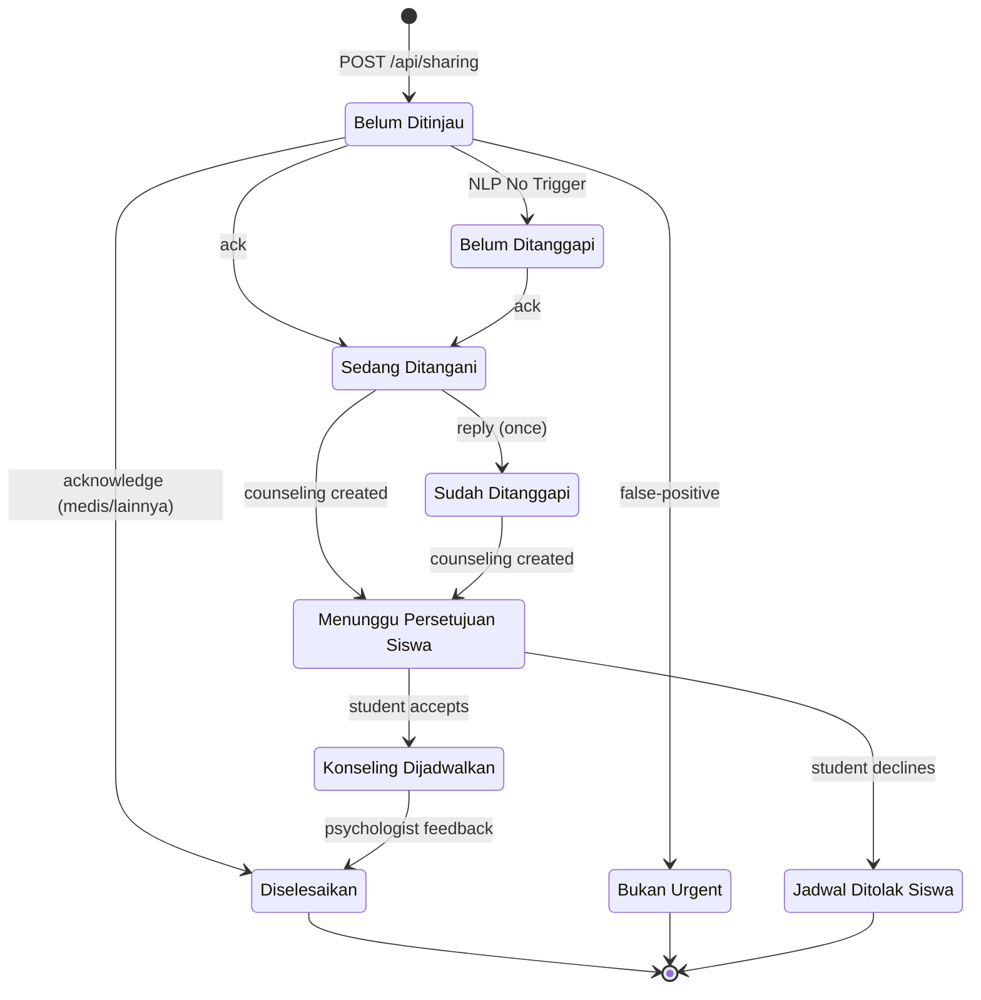
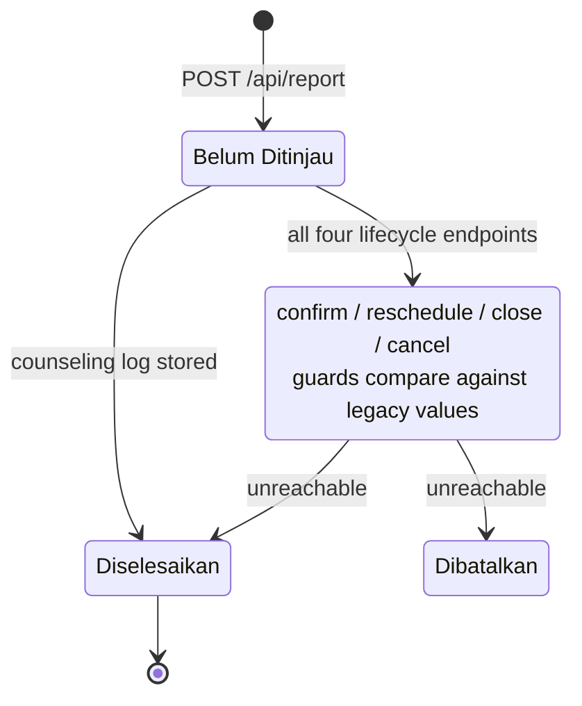
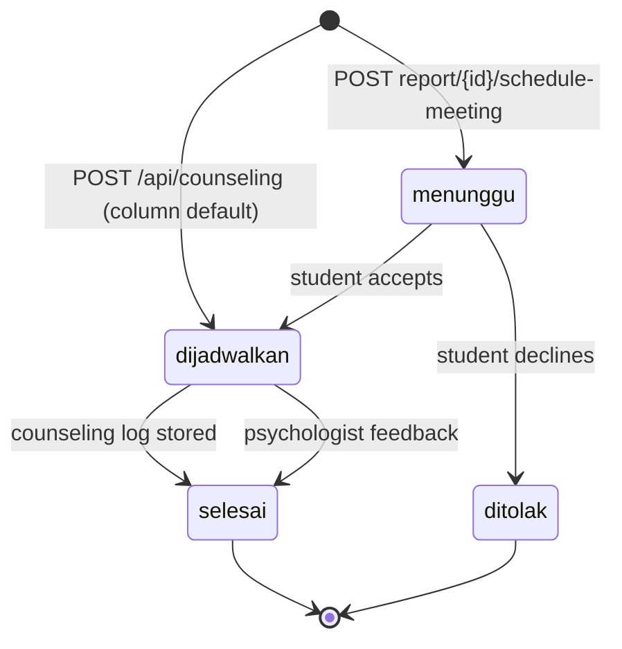
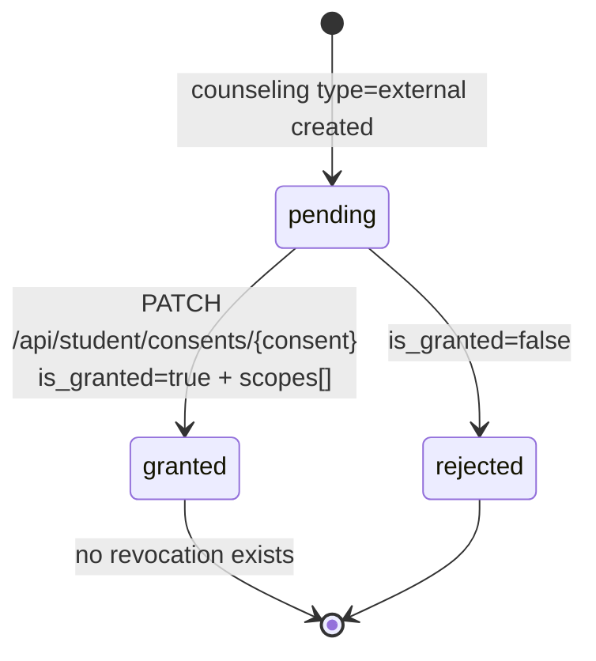
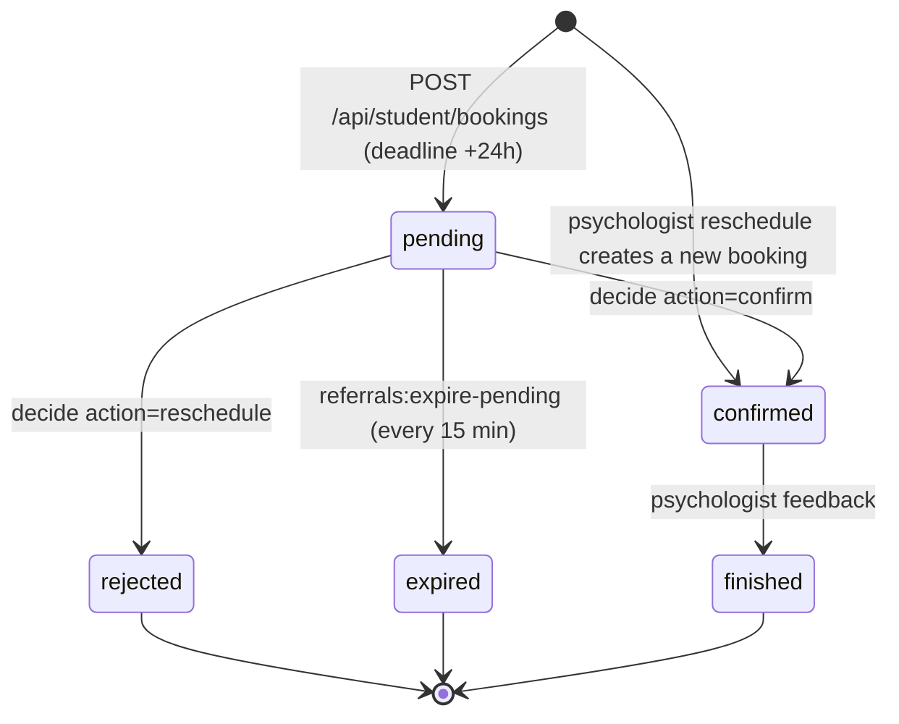
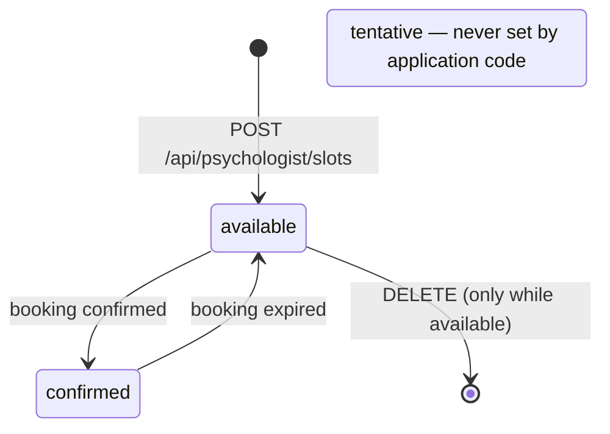

# State Machines

<!-- verified: branch=dev commit=266f860 date=2026-10-09 scope=app/Enums,app/Http/Controllers,app/Actions,app/Jobs,app/Observers,app/Console/Commands,app/Http/Requests -->
> **Verified against:** `dev` @ `266f860` · 2026-10-09
> **Sources:** [`app/Enums/`](../../app/Enums/) · every write site found with `grep -rn "ReportStatus::\|CounselingStatus::\|ConsentStatus::\|BookingStatus::\|SlotStatus::" app/`

Six status enums govern the workflow. Each diagram below shows only transitions that **exist in code**; unreachable states and dead guards are called out explicitly.

Enum values are Indonesian strings and are stored verbatim in the database. For the UI copy that corresponds to each, see [`12-ui-contract.md`](12-ui-contract.md).

---

## `ReportStatus` — used by two tables

[`ReportStatus`](../../app/Enums/ReportStatus.php) has ten cases and is the `status` column of **both** `sharings` and `reports`. The two tables reach different subsets, and the enum is **cast on `Sharing` but not on `Report`**. Treat them as two machines that happen to share a vocabulary.

| Case | Value |
|---|---|
| `MENUNGGU_TINJAUAN` | `Belum Ditinjau` |
| `DITINJAU` | `Sedang Ditangani` |
| `DITANGGAPI` | `Sudah Ditanggapi` |
| `MENUNGGU_TANGGAPAN` | `Belum Ditanggapi` |
| `MENUNGGU_PERSETUJUAN` | `Menunggu Persetujuan Siswa` |
| `DIJADWALKAN` | `Konseling Dijadwalkan` |
| `SELESAI` | `Diselesaikan` |
| `DIBATALKAN` | `Dibatalkan` |
| `DITOLAK` | `Jadwal Ditolak Siswa` |
| `BUKAN_URGENT` | `Bukan Urgent` |

### As `sharings.status`

| From | To | Trigger | Actor | Guard | Side effects | Source |
|---|---|---|---|---|---|---|
| — | `Belum Ditinjau` | `POST /api/sharing` | student | `SharingPolicy::create` | Creates `nlp_analyses` row; dispatches `ProcessNlpAnalysisJob` | [`SharingController`](../../app/Http/Controllers/SharingController.php) |
| `Belum Ditinjau` | `Belum Ditanggapi` | NLP returns `No Trigger` | system | — | Also writes `priority=rendah`, `cutdown_for_report=now()` | [`ProcessNlpAnalysisJob:60`](../../app/Jobs/ProcessNlpAnalysisJob.php) |
| any | `Sedang Ditangani` | `PATCH /api/sharing/ack/{sharing}` | counselor | — | Sets `acknowledged_at` (stops the principal's SLA clock) | [`SharingController:213`](../../app/Http/Controllers/SharingController.php) |
| any | `Sedang Ditangani` | `PATCH /api/sharing/acknowledge/{sharing}` with `action=konseling_mandiri` | counselor | — | Writes `action`, `action_notes`, `action_confirmed` | [`SharingController:234`](../../app/Http/Controllers/SharingController.php) |
| any | `Diselesaikan` | same endpoint with `action=penanganan_medis` or `lainnya` | counselor | — | Closes the case without a counseling session | same |
| any | `Sudah Ditanggapi` | `PATCH /api/sharing/reply/{sharing}` | counselor | `SharingPolicy::update` **and** `reply` is still null | Writes `reply`, `replied_at`, `replied_by` (a name string) | [`ReplySharingRequest::passedValidation`](../../app/Http/Requests/ReplySharingRequest.php) |
| `Belum Ditinjau` | `Bukan Urgent` | `PATCH /api/sharing/false-positive/{sharing}` | counselor | `SharingPolicy::falsePositive` — **status must be `Belum Ditinjau`** | `priority → rendah`, SLA cleared, `nlp_analyses.status → false-positive` + `reason` | [`SharingController:256`](../../app/Http/Controllers/SharingController.php) |
| any | `Menunggu Persetujuan Siswa` | a `Counseling` is created with a `sharing_id` | counselor (indirect) | — | **Fires for internal counselings too**, not only referrals | [`CounselingObserver:27`](../../app/Observers/CounselingObserver.php) |
| any | `Menunggu Persetujuan Siswa` | `POST /api/counseling/{counseling}/consent` | counselor | `CounselingPolicy::storeLog` | Creates a fresh `pending` consent | [`CounselingController:62`](../../app/Http/Controllers/CounselingController.php) |
| `Menunggu Persetujuan Siswa` | `Konseling Dijadwalkan` | `PATCH /api/student/counselings/{counseling}/acknowledge` `type=accept` | student | **none — see holes below** | Counseling → `dijadwalkan` | [`CounselingController:94`](../../app/Http/Controllers/CounselingController.php) |
| `Menunggu Persetujuan Siswa` | `Jadwal Ditolak Siswa` | same endpoint, `type=decline` | student | same | Counseling → `ditolak` | [`CounselingController:99`](../../app/Http/Controllers/CounselingController.php) |
| any | `Diselesaikan` | `POST /api/psychologist/referrals/{counseling}/feedback` | psychologist | assigned + confirmed booking | Booking → `finished`, counseling → `selesai` | [`PsychologistSummaryController:187`](../../app/Http/Controllers/PsychologistSummaryController.php) |

**Not reachable on `sharings`:** `Dibatalkan`. Nothing writes it to this table.

> Transitions are **not guarded by the current state** except for `false-positive`. A counselor can reply to an already-closed curhat, and `ack` works from any state. The diagram shows typical paths, not enforced ones.

### As `reports.status`

| From | To | Trigger | Guard | Status |
|---|---|---|---|---|
| — | `Belum Ditinjau` | `POST /api/report` | `ReportPolicy::create` — student with `last_mood ∈ {sad, angry}` | works. Fires `ReportCreated` |
| any | `Diselesaikan` | `POST /api/counseling-logs` | `CounselingPolicy::storeLog` | **works** — the only live path to closing a report |
| `menunggu` | `disetujui` | `PATCH /api/report/confirm/{report}` | `$report->status == 'menunggu'` | `[DEAD]` |
| `disetujui` | `dijadwalkan` | `PATCH /api/report/reschedule/{report}` | `$report->status == 'disetujui'` | `[DEAD]` |
| `disetujui`/`dijadwalkan` | `Diselesaikan` | `PATCH /api/report/close/{report}` | `in_array($status, ['disetujui','dijadwalkan'])` | `[DEAD]` |
| `disetujui`/`dijadwalkan` | `Dibatalkan` | `PATCH /api/report/cancel/{report}` | reuses `CloseReportRequest` | `[DEAD]` |

> **`[DEAD]` — the whole report lifecycle is unreachable.** [`ConfirmReportRequest`](../../app/Http/Requests/ConfirmReportRequest.php), [`RescheduleReportRequest`](../../app/Http/Requests/RescheduleReportRequest.php) and [`CloseReportRequest`](../../app/Http/Requests/CloseReportRequest.php) authorize against `'menunggu'`, `'disetujui'` and `'dijadwalkan'` — a **legacy status vocabulary** that predates `ReportStatus` and contains none of its values. A report's default status is `Belum Ditinjau`, so `authorize()` returns false and every one of the four endpoints responds 403 regardless of who calls it.
>
> Worse, `ConfirmReportRequest::passedValidation` merges `status => 'disetujui'` and `RescheduleReportRequest` merges `'dijadwalkan'` — values the MySQL enum column would reject even if the guard passed.
>
> In practice a report moves forward via `POST /api/report/{report}/schedule-meeting` (which creates a `Counseling` and leaves the report's status untouched) and is closed by `POST /api/counseling-logs`.

**Side effect on report creation.** `ReportCreated` → [`UpdateRelatedSharingPriority`](../../app/Listeners/UpdateRelatedSharingPriority.php) sets `priority = 'tinggi'` on **every** curhat the same student wrote **today**. Note it writes the literal string, bypassing the enum, and does not touch `cutdown_for_report` — so a curhat can become high priority without an SLA deadline.

---

## `CounselingStatus`

[`CounselingStatus`](../../app/Enums/CounselingStatus.php): `dijadwalkan`, `menunggu`, `selesai`, `ditolak`. Cast to the enum on the model. **Column default is `dijadwalkan`.**

| From | To | Trigger | Actor | Side effects | Source |
|---|---|---|---|---|---|
| — | `dijadwalkan` | `POST /api/counseling` | counselor | Observer: pending consent if `type=external`; linked sharing → `Menunggu Persetujuan Siswa` | column default + [`CounselingObserver`](../../app/Observers/CounselingObserver.php) |
| — | `menunggu` | `POST /api/report/{report}/schedule-meeting` | super/admin/headteacher/assigned counselor | Creates counseling with `source_type=nlp_incident`, `type=internal`; fires `CounselingScheduled` | [`ScheduleReportCounselingAction`](../../app/Actions/ScheduleReportCounselingAction.php) |
| `menunggu` | `dijadwalkan` | acknowledge `accept` | student | Sharing → `Konseling Dijadwalkan` | [`CounselingController`](../../app/Http/Controllers/CounselingController.php) |
| `menunggu` | `ditolak` | acknowledge `decline` | student | Sharing → `Jadwal Ditolak Siswa` | same |
| any | `selesai` | `POST /api/counseling-logs` | assigned counselor | Writes `resolution` + `method`; closes linked report; creates `CounselingLog`; fires `CounselingLogStored` | [`StoreCounselingLogAction`](../../app/Actions/StoreCounselingLogAction.php) |
| any | `selesai` | psychologist feedback | psychologist | Booking → `finished`, sharing → `Diselesaikan` | [`PsychologistSummaryController`](../../app/Http/Controllers/PsychologistSummaryController.php) |

Note the two creation paths disagree: a counselor-created counseling starts at `dijadwalkan` (the column default, with nothing setting it explicitly), while a report-scheduled one starts at `menunggu` and therefore waits for the student. A referral created directly via `POST /api/counseling` is already `dijadwalkan` even though its consent is still `pending`.

---

## `ConsentStatus`

[`ConsentStatus`](../../app/Enums/ConsentStatus.php): `pending`, `granted`, `rejected`. Cast to the enum.

| From | To | Trigger | Actor | Guard | Side effects |
|---|---|---|---|---|---|
| — | `pending` | a `Counseling` with `type=external` is created | counselor (indirect) | — | Created by [`CounselingObserver`](../../app/Observers/CounselingObserver.php), never by a controller |
| — | `pending` | `POST /api/counseling/{counseling}/consent` | counselor | `CounselingPolicy::storeLog` | A **new** consent row; `latestConsent` now points at it |
| `pending` | `granted` | `PATCH /api/student/consents/{consent}` | student | `CounselingConsentPolicy::update` + at least one valid scope | Sets `scopes`, `granted_at` |
| `pending` | `rejected` | same, `is_granted=false` | student | same | **Nulls `scopes`**, sets `rejected_at` |

> **`[SPEC-ONLY]` — there is no `revoked` state.** Once granted, consent cannot be withdrawn through the API. `AND-1` and the student-facing design both require revocation with immediate access invalidation. The nearest workaround today is for a counselor to issue a new consent request, since authorization reads `latestConsent` — but that is a side effect, not a feature.

Transitions out of `granted` or `rejected` are not blocked in code; `UpdateConsentAction` will happily re-grant a rejected consent. Only the policy (student ownership) is checked.

---

## `BookingStatus`

[`BookingStatus`](../../app/Enums/BookingStatus.php): `pending`, `finished`, `confirmed`, `rejected`, `expired`. Cast to the enum.

| From | To | Trigger | Actor | Guard | Side effects |
|---|---|---|---|---|---|
| — | `pending` | `POST /api/student/bookings` | student | own counseling, `type=external` | `lockForUpdate()` on the slot; `deadline_at = now()+24h`; fires `BookingScheduleCreated` |
| `pending` | `confirmed` | `PATCH /api/psychologist/referrals/{booking}/decide` `action=confirm` | psychologist | `BookingSchedulePolicy::decide` **and** `status === pending` | Slot → `confirmed`; dispatches `GenerateGeminiReferralSummaryJob` |
| `pending` | `rejected` | same, `action=reschedule` | psychologist | `decide` | Writes `reject_reason`; then **creates a new booking already `confirmed`** on the psychologist's chosen slot, with `deadline_at = now()-2 days` |
| `pending` | `expired` | `php artisan referrals:expire-pending` | system | `deadline_at <= now()` | Slot reverted to `available`; fires `BookingExpired` |
| `confirmed` | `finished` | `POST /api/psychologist/referrals/{counseling}/feedback` | psychologist | assigned + confirmed booking | Counseling → `selesai`, sharing → `Diselesaikan`, saves notes + rating |

> **`[GAP]`** The reschedule path bypasses the student entirely — the replacement booking is created as `confirmed`, so the student never approves the new time. Its `deadline_at` is set to `now() - 2 days`, i.e. deliberately in the past so the expiry job skips it (the job only looks at `pending` rows anyway). The design specifies a two-way handshake; the backend does not implement one.
>
> `BookingScheduleCreated` and `BookingExpired` are dispatched but have **no listeners**, so neither creation nor expiry notifies anyone.

---

## `SlotStatus`

[`SlotStatus`](../../app/Enums/SlotStatus.php): `available`, `tentative`, `confirmed`. Cast to the enum.

| From | To | Trigger | Source |
|---|---|---|---|
| — | `available` | `POST /api/psychologist/slots` (optionally repeating weekly for up to a year) | [`CreatePsychologistSlotAction`](../../app/Actions/Psychologist/CreatePsychologistSlotAction.php) |
| `available` | `confirmed` | psychologist confirms a booking on it | [`DecideReferralAction`](../../app/Actions/Psychologist/DecideReferralAction.php) |
| `confirmed` | `available` | the booking expires | [`ExpirePendingReferrals`](../../app/Console/Commands/ExpirePendingReferrals.php) |

> **`[DEAD]` — `tentative` is never written by application code.** The only writes are in [`ReferralFlowSeeder`](../../database/seeders/ReferralFlowSeeder.php) (lines 255 and 321). [`CreateBookingScheduleAction`](../../app/Actions/CreateBookingScheduleAction.php) locks the slot and creates the booking but **does not change the slot's status**, so a slot with a pending booking stays `available`.
>
> This does not cause double-booking, because `GetAvailableDatesAction` and `GetAvailableSlotsAction` exclude slots that already have a `pending` or `confirmed` booking. But it does mean **slot status alone is not a reliable indicator of availability** — you must check for an associated booking. Code or UI that filters on `status = available` will show slots that are already claimed. The seeded demo data, which does set `tentative`, therefore does not match what the running application produces.

Slot deletion is guarded: `PsychologistSlotPolicy::delete` requires ownership, and the controller refuses to delete a slot with an active booking.

---

## `NlpAnalysisStatus`

[`NlpAnalysisStatus`](../../app/Enums/NlpAnalysisStatus.php): `false-positive`, `false-negative`, `true-positive`, `true-negative`. Cast to the enum.

This is **not a workflow state** — it records a human verdict on whether the NLP model was right, as training feedback. It is nullable and stays null for most rows.

| From | To | Trigger | Notes |
|---|---|---|---|
| `null` | `false-positive` | `PATCH /api/sharing/false-positive/{sharing}` | The only transition written by the application. Also stores `reason`. |
| `null` | any of the four | [`NlpAnalysisSeeder`](../../database/seeders/NlpAnalysisSeeder.php) | Demo data only |

There is no endpoint for marking a **false negative** — the case where the model missed a real crisis. That verdict can only be set by a seeder, so the feedback loop is one-sided in production.

---

## Cross-machine synchronisation

Some actions move several machines at once. These fan-outs are the ones to remember:

| Action | `sharings.status` | `counselings.status` | `booking_schedules.status` | `psychologist_slots.status` | Other |
|---|---|---|---|---|---|
| Counseling created (with `sharing_id`) | → `Menunggu Persetujuan Siswa` | `dijadwalkan` (default) | — | — | Consent `pending` if `type=external` |
| Student acknowledges `accept` | → `Konseling Dijadwalkan` | → `dijadwalkan` | — | — | — |
| Student acknowledges `decline` | → `Jadwal Ditolak Siswa` | → `ditolak` | — | — | — |
| Counselor stores counseling log | — | → `selesai` | — | — | `reports.status` → `Diselesaikan`; `CounselingLog` created |
| Psychologist confirms booking | — | — | → `confirmed` | → `confirmed` | AI summary job dispatched |
| Booking expires | — | — | → `expired` | → `available` | `BookingExpired` (no listener) |
| **Psychologist submits feedback** | → `Diselesaikan` | → `selesai` | → `finished` | — | Saves notes + rating on `clinical_summaries` |

The last row is the widest fan-out in the system: one request closes four records. It is also the only place where a psychologist writes to a `sharings` row.

---

## `Priority` — declared, never used

[`Priority`](../../app/Enums/Priority.php) defines `tinggi`, `sedang`, `rendah`, but the `priority` columns on `sharings` and `reports` are plain MySQL enums and are written as raw strings by [`ProcessNlpAnalysisJob`](../../app/Jobs/ProcessNlpAnalysisJob.php) and [`UpdateRelatedSharingPriority`](../../app/Listeners/UpdateRelatedSharingPriority.php). The enum is referenced only by [`GetSharingRequest`](../../app/Http/Requests/GetSharingRequest.php) for query-parameter validation. Do not expect `$sharing->priority` to be an enum instance.
