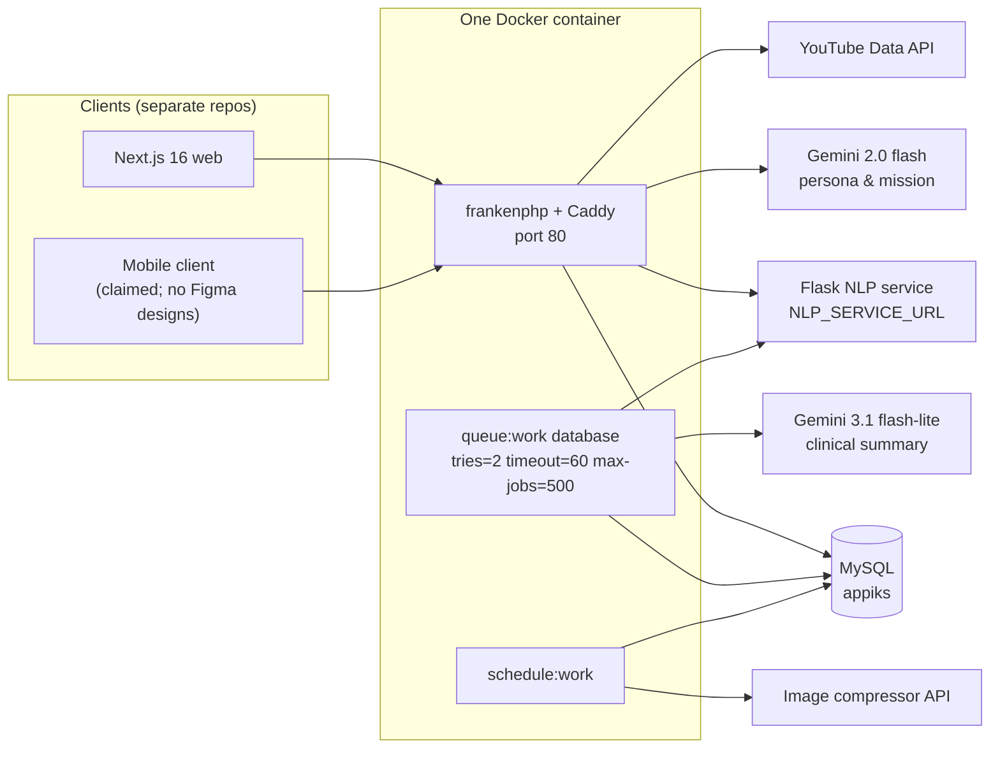

# Architecture & Integrations

<!-- verified: branch=dev commit=266f860 date=2026-10-09 scope=Dockerfile,supervisord.conf,routes/console.php,config,app/Jobs,app/Events,app/Listeners,app/Observers,app/Services -->
> **Verified against:** `dev` @ `266f860` · 2026-10-09
> **Sources:** [`Dockerfile`](../../Dockerfile) · [`supervisord.conf`](../../supervisord.conf) · [`routes/console.php`](../../routes/console.php) · [`config/`](../../config/) · [`app/Jobs/`](../../app/Jobs/) · [`app/Providers/AppServiceProvider.php`](../../app/Providers/AppServiceProvider.php)

## Container view



**One container, three processes**, managed by supervisord with priorities 10/20/30:

| Process | Command | Dies → |
|---|---|---|
| `frankenphp` | `frankenphp run --config /app/Caddyfile` | API is down |
| `queue` | `php artisan queue:work database --sleep=2 --tries=2 --timeout=60 --max-jobs=500` | NLP retries and all AI summaries stop silently |
| `scheduler` | `php artisan schedule:work` | Bookings never expire, SLA timers never clear |

PHP 8.4 on FrankenPHP. `--max-jobs=500` makes the worker exit and be restarted by supervisord after 500 jobs — a deliberate guard against memory leaks, not a bug.

## Request lifecycle

```
Route (routes/api.php)
  → middleware: api, and auth:api for all but 9 endpoints
  → FormRequest::authorize() + rules()         ← authorization may happen here
  → Controller                                  ← or here, via Gate::allowIf / Gate::authorize / abort(403)
  → Action class (app/Actions/, 32 of them)     ← business logic
  → Eloquent model                              ← Observers fire here
  → API Resource (app/Http/Resources/, 20)      ← output shaping, field stripping
  → ApiResponder trait                          ← {success, message, data}
```

**There is no `app/Http/Middleware` directory.** `bootstrap/app.php` calls `withMiddleware()` with an empty closure — no global middleware, no aliases, no role middleware. There is also no `RouteServiceProvider`; routes load directly from `bootstrap/app.php`.

The only registered provider is `AppServiceProvider`, which does five things: configures Scramble's bearer security scheme, defines the single `dashboard-data` Gate, registers three policies explicitly, binds two event listeners, and attaches four observers.

## Asynchronous map

### Jobs — [`app/Jobs/`](../../app/Jobs/)

| Job | Dispatched by | What it does |
|---|---|---|
| [`ProcessNlpAnalysisJob`](../../app/Jobs/ProcessNlpAnalysisJob.php) | `SharingController::store` — `dispatchSync` first, queue on failure | Calls the NLP service; writes zone, priority, and SLA deadline |
| [`GenerateGeminiReferralSummaryJob`](../../app/Jobs/GenerateGeminiReferralSummaryJob.php) | `DecideReferralAction` on `confirm` | Builds the consent-filtered payload, calls Gemini, upserts `clinical_summaries` |
| [`ZoneNotificationDispatcher`](../../app/Jobs/ZoneNotificationDispatcher.php) | **nothing** | `[PARTIAL]` Would notify the assigned counselor and all headteachers of the school |

### Events and listeners

Only **two** listeners are bound, both in `AppServiceProvider`:

| Event | Listener | Effect |
|---|---|---|
| `ReportCreated` | [`UpdateRelatedSharingPriority`](../../app/Listeners/UpdateRelatedSharingPriority.php) | Sets `priority = 'tinggi'` on every sharing the student wrote today |
| `GeminiTokenUsed` | [`RotateGeminiToken`](../../app/Listeners/RotateGeminiToken.php) | Accumulates quota, deactivates the key, promotes the next one |

**Four events are dispatched with no listener at all:** `BookingScheduleCreated`, `BookingExpired`, `CounselingScheduled`, `CounselingLogStored`. The code comment in `CreateBookingScheduleAction` says "listeners attached in future tickets". Consequence: **nothing in the referral flow notifies anyone of anything.**

### Observers

| Observer | Model | Trigger | Effect |
|---|---|---|---|
| [`UserObserver`](../../app/Observers/UserObserver.php) | `User` | created | Creates a `clouds` row for students |
| [`CloudObserver`](../../app/Observers/CloudObserver.php) | `Cloud` | updated | Levels up when `exp >= 100` |
| [`CounselingObserver`](../../app/Observers/CounselingObserver.php) | `Counseling` | created | Pending consent if `type=external`; linked sharing → `Menunggu Persetujuan Siswa` |
| [`CounselingLogObserver`](../../app/Observers/CounselingLogObserver.php) | `CounselingLog` | updating | Appends the previous `clinical_notes` to the audit trail |

> `[DEAD]` `AppServiceProvider` imports `App\Observers\SharingObserver`, which does not exist. It is never attached — an unused import that will become a fatal error if anyone adds `Sharing::observe(SharingObserver::class)`.

### Scheduler — [`routes/console.php`](../../routes/console.php)

| Command | Interval | Effect |
|---|---|---|
| `cutdown:clear` | every 10 minutes | Nulls `cutdown_for_report` on sharings and reports once elapsed |
| `referrals:expire-pending` | every 15 minutes | Pending bookings past `deadline_at` → `expired`; slot → `available` |
| ~~`generate:archtype`~~ | **commented out** | Would pre-warm the `ai_generated` cache hourly |
| ~~`compress:thumbnail`~~ | **commented out** | Every ten seconds — presumably why it was disabled |

### Console commands — [`app/Console/Commands/`](../../app/Console/Commands/)

`ClearCutdown` · `ExpirePendingReferrals` · `GenerateArchtype` · `CompressThumbnail` · `ImportLocation` (`import:locations`) · `LowercaseUsername` · `MigrateWithBackup` (`migrate:fresh-backup`, preserves `gemini_api_token` and `ai_generated`).

---

## Integration 1 — Flask NLP service

**Not an LLM.** A separate Python/Flask service doing weighted keyword and stem scoring on Indonesian text.

| Aspect | Detail |
|---|---|
| Config | `config/services.php` → `nlp.url` (`NLP_SERVICE_URL`), `nlp.key` (`NLP_SERVICE_API_KEY`) |
| Client | [`CallNlpAction`](../../app/Actions/CallNlpAction.php) |
| Endpoint | `POST {NLP_SERVICE_URL}/api/analyze` |
| Header | `X-APPIKS-NLP-KEY` |
| Request | `{"text": "..."}` |
| Response | `{total_score: int, zone_status: string, matched_keywords: [{stem, zone, weight}]}` |
| TLS | `withoutVerifying()` on `local` and `testing` environments only |

**Zone mapping** (in `ProcessNlpAnalysisJob`, not in the service):

| `zone_status` | `priority` | SLA |
|---|---|---|
| `Red Zone` | `tinggi` | 2 hours |
| `Yellow Zone` | `sedang` | 72 hours |
| `No Trigger` | `rendah` | none; parent status → `Belum Ditanggapi` |

### How failure actually behaves

`CallNlpAction` logs and **rethrows**. The job therefore throws. The fail-open guarantee lives one level up, in `SharingController::store`:

```
try   { ProcessNlpAnalysisJob::dispatchSync($nlpAnalysis); }
catch { ProcessNlpAnalysisJob::dispatch($nlpAnalysis); }
```

So when the NLP service is unreachable:

1. The student's curhat **is saved**, and the response (including emergency contacts) is returned normally.
2. The job is queued and retried twice (`--tries=2`), then lands in `failed_jobs`.
3. The sharing keeps `priority = 'rendah'` (the column default) and **`cutdown_for_report = null`**.

**A genuine Red Zone case can therefore enter the queue with no priority and no deadline, indistinguishable from a harmless one.** Nothing surfaces the failure to a human — only `failed_jobs` and the log record it. If you monitor one thing in this system, monitor that table.

Note also that `dispatchSync` runs **inside the HTTP request**, so the student waits for the NLP service to respond.

---

## Integration 2 — Google Gemini, two independent paths

Package `google-gemini-php/laravel ^2.0`. `config/gemini.php` reads `GEMINI_API_KEY`, `GEMINI_BASE_URL`, 30-second timeout.

The two paths share no code, use different models, and obtain their API key differently.

### Path A — clinical referral summary

| Aspect | Detail |
|---|---|
| Model | `gemini-3.1-flash-lite`, hardcoded in [`InteractsWithGemini`](../../app/Traits/InteractsWithGemini.php) |
| Key | `config('gemini.api_key')` directly — **does not use the rotation pool** |
| Caller | [`GenerateGeminiReferralSummaryJob`](../../app/Jobs/GenerateGeminiReferralSummaryJob.php) |
| Payload | [`ReferralPayloadBuilder::buildPayload`](../../app/Services/ReferralPayloadBuilder.php) |
| Failure mode | Fail-soft: returns `null` if the key is empty, catches and logs every exception |

**Hard consent gate:** the job aborts before building anything unless `latestConsent->status === ConsentStatus::GRANTED`.

**The system prompt** ([`GenerateGeminiReferralSummaryJob.php:35-56`](../../app/Jobs/GenerateGeminiReferralSummaryJob.php)) is Indonesian and has five numbered rules:

1. **Factual data only** — evaluate which keys exist in the payload, summarise only what is there, never invent or guess.
2. **Curate excerpts** — summarise **only** Yellow Zone and Red Zone entries, skip Green Zone, and present the text as-is **"tanpa melakukan penyamaran kata sensitif"** (without masking sensitive words).
3. **No diagnosis, no recommendations** — forbidden to make a formal psychological diagnosis or name a disorder; forbidden to recommend actions, interventions, or therapy, with CBT named explicitly.
4. **Mandatory disclaimer** — every summary must end with: *"Catatan: Ringkasan ini dibuat secara otomatis oleh sistem AI APPIKS untuk membantu rujukan dan bukan merupakan diagnosis psikologis resmi."*
5. **Format** — exactly one flowing paragraph, no bullets, always opening with `"Siswa kelas [Tingkat], dirujuk Guru BK dengan tingkat keparahan [Tingkat Keparahan]."`

Output is truncated to 200 words in a **disclaimer-aware** way: the disclaimer is stripped, the narrative is cut to `200 − len(disclaimer)` words, then the disclaimer is re-appended. Post-processing is skipped when Gemini returns `null`.

> `llm_provider` is **hardcoded** as `'gemini-3.1-flash-lite'` in the API response rather than read from config. Changing the model requires editing two places.

### Path B — persona and mission generation

| Aspect | Detail |
|---|---|
| Model | `models/gemini-2.0-flash` |
| Key | **Rotation pool** in table `gemini_api_token` |
| Caller | [`CallGeminiAction`](../../app/Actions/CallGeminiAction.php) |
| Cache | Table `ai_generated`, keyed by the answer-letter string |

How the rotation works: `CallGeminiAction` reads the row where `used = true`, overrides `config('gemini.api_key')` at runtime, calls `generateContent` with a `maxOutputTokens` limit, counts the tokens used, and dispatches `GeminiTokenUsed`. [`RotateGeminiToken`](../../app/Listeners/RotateGeminiToken.php) then adds the usage to `quota`, sets `used = false`, and promotes the next row, wrapping around at the end.

This is a hand-rolled free-tier quota spreader. It has no locking, so two concurrent requests can read the same active key and both rotate — harmless in practice, but the `quota` figure is approximate.

### AI safety invariants

> These are product guarantees, not implementation details. Changing any of them changes what APPIKS is.
>
> - The AI **never** diagnoses or names a mental-health disorder.
> - The AI **never** recommends treatment, intervention, or therapy.
> - The AI uses **only** facts present in the payload — no inference, no filling gaps.
> - Every AI output carries the disclaimer stating it is not a formal diagnosis.
> - No AI call happens for a referral without a granted consent.

---

## Integration 3 — YouTube Data API

`config/services.php` → `youtube.key` (`YOUTUBE_API_KEY`), package `google/apiclient`. [`FetchYoutubeMetaAction`](../../app/Actions/FetchYoutubeMetaAction.php) fetches title, description, duration, channel, thumbnail, and view count when an admin submits a video id. Without the key, video creation cannot populate metadata.

## Integration 4 — external image compressor

`config/app.php` → `image_compress_url`, `image_compress_key`. Used by [`CompressThumbnail`](../../app/Console/Commands/CompressThumbnail.php) on article thumbnails. Its scheduler entry is commented out, so it runs only when invoked manually.

## Mail and notifications

| Aspect | State |
|---|---|
| Driver | Defaults to `log` — nothing is actually delivered |
| Notification classes | Exactly one: [`RedZoneAlertNotification`](../../app/Notifications/RedZoneAlertNotification.php), channels `['database', 'mail']`, `ShouldQueue` |
| Payload | Deliberately minimal: `incident_id`, `message`, `created_at` — **no student content**, for privacy |
| Mail body | A plain `MailMessage` linking to `/headteacher/dashboard` |
| Read receipts | Work, via Laravel's `notifications` table and `markAsRead()` |
| Push / FCM / WhatsApp / SMS | **None.** `config/services.php` has a stock `slack` block that is never used |

`[PARTIAL]` The dispatcher job that would send this notification is never called. See [`05-user-flows.md`](05-user-flows.md) FLOW-7.

---

## Privacy posture

| Mechanism | Where | State |
|---|---|---|
| Questionnaire answers never stored | by design — only a letter key and a shared cache | ✅ |
| Clinical notes encrypted at rest | `encrypted` cast on `counseling_logs` and `counseling_log_histories` | ✅ |
| Append-only clinical audit trail | `CounselingLogObserver` + no soft deletes | ✅ |
| Consent-gated de-anonymisation | `PsychologistSummaryController` + `ReferralPayloadBuilder` | ✅ |
| Principal sees metadata only | `PrincipalDashboardController` column selection | ✅ |
| Notification payload carries no content | `RedZoneAlertNotification` | ✅ |
| Pseudonymised ids in AI payload | `ref_` / `stu_` + md5 prefix | ✅ |
| **Sensitive-keyword masking** | `maskDynamicNlpKeywords()` | ❌ `[PARTIAL]` — call site commented out at [`ReferralPayloadBuilder.php:81`](../../app/Services/ReferralPayloadBuilder.php); the field is still named `masked_text` but holds verbatim text |
| **Consent revocation** | — | ❌ `[SPEC-ONLY]` |

Encryption caveat worth stating plainly: clinical notes are encrypted with `APP_KEY`. **Rotating or losing that key makes every historical clinical note permanently unreadable**, and no migration can recover them. There is no key-rotation strategy in the codebase.

---

## Environment variables

Names only — **never record values here.**

| Variable | Used by | Required? | Without it |
|---|---|---|---|
| `APP_KEY` | framework + encrypted casts | **yes** | Clinical notes unreadable |
| `DB_*` | `config/database.php` | yes | Nothing works |
| `JWT_SECRET` | `config/jwt.php` | yes | No authentication |
| `JWT_TTL`, `JWT_REFRESH_TTL` | same | no | Framework defaults |
| `AUTH_GUARD` | `config/auth.php` | no | Set to `api` in the shipped env |
| `QUEUE_CONNECTION` | `config/queue.php` | no | Must be `database` for jobs to persist |
| `DEFAULT_PASSWORD` | `users` migration default, seeders | no | Falls back to `password` |
| `NLP_SERVICE_URL`, `NLP_SERVICE_API_KEY` | `CallNlpAction` | for triage | Curhat saved without priority or SLA |
| `GEMINI_API_KEY` | Path A | for AI summaries | `generateClinicalSummary` returns `null` |
| `GEMINI_API_KEYS` | `GeminiApi` seeder → rotation pool | for Path B | Persona/mission generation fails |
| `GEMINI_BASE_URL` | `config/gemini.php` | no | Default endpoint |
| `YOUTUBE_API_KEY` | `FetchYoutubeMetaAction` | for video CMS | Metadata not fetched |
| `IMAGE_COMPRESS_URL`, `IMAGE_COMPRESS_KEY` | `CompressThumbnail` | no | Thumbnails stay uncompressed |
| `RESET_AUTH_USER`, `RESET_AUTH_PASSWORD` | `GET /reset` closure | **set these** | Falls back to `novaren` / `secret` on a route that wipes the database |
| `MAIL_*` | `config/mail.php` | no | Driver `log`; nothing delivered |

## Deployment

| Aspect | Detail |
|---|---|
| Image | [`Dockerfile`](../../Dockerfile) — FrankenPHP, PHP 8.4, supervisord running the three processes |
| CI/CD | [`.github/workflows/dev.yml`](../../.github/workflows/dev.yml) — push to `dev` → build → Docker Hub tag `dev` → SSH, `docker compose up` on the VPS. [`prod.yml`](../../.github/workflows/prod.yml) — push to `main` → tag `latest` |
| Triggers | **Both are `push`-only.** There is no `pull_request` workflow, so nothing runs on a PR |
| Health check | `GET /up` |
| API docs | `GET /docs`, `GET /api/docs.json` — generated at runtime |

**What deployment does not do:**

- **Migrations do not run automatically.** They have to be executed manually after a deploy.
- Nothing runs tests — there are none, and no PR workflow exists to run them.
- Queue and scheduler restart with the container, so a deploy drops in-flight jobs (they are retried from the `jobs` table).

---

## Technical debt recorded elsewhere

Facts, each documented where it is relevant rather than collected into a register:

| Item | Documented in |
|---|---|
| Red Zone notification never dispatched | [`05-user-flows.md`](05-user-flows.md) FLOW-7 |
| Four events without listeners | this page, "Events and listeners" |
| PII masking call site commented out | this page, "Privacy posture" |
| `SharingObserver` imported but missing | this page, "Observers" |
| Consent revocation missing | [`07-data-model/04-referral-and-consent.md`](07-data-model/04-referral-and-consent.md) |
| Report lifecycle endpoints unreachable | [`08-state-machines.md`](08-state-machines.md) |
| `tentative` slot status never written | [`08-state-machines.md`](08-state-machines.md) |
| Authorization holes | [`03-authorization.md`](03-authorization.md) |
| Missing database foreign keys | [`07-data-model/README.md`](07-data-model/README.md) |
| No tests since `266f860` | [`11-environment-and-runbook.md`](11-environment-and-runbook.md) |
